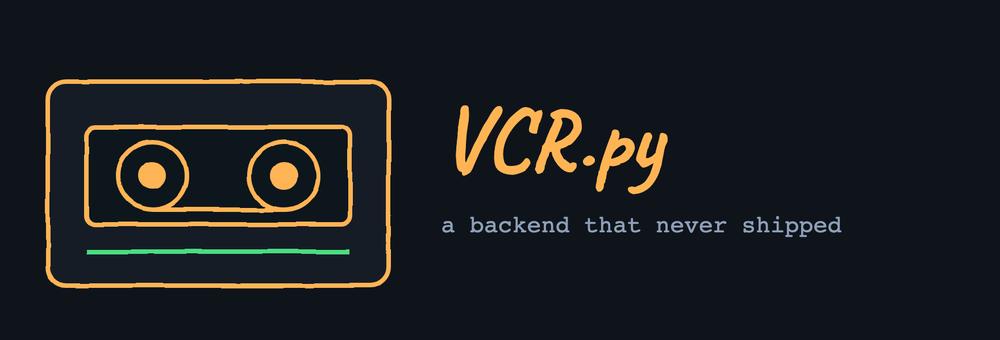
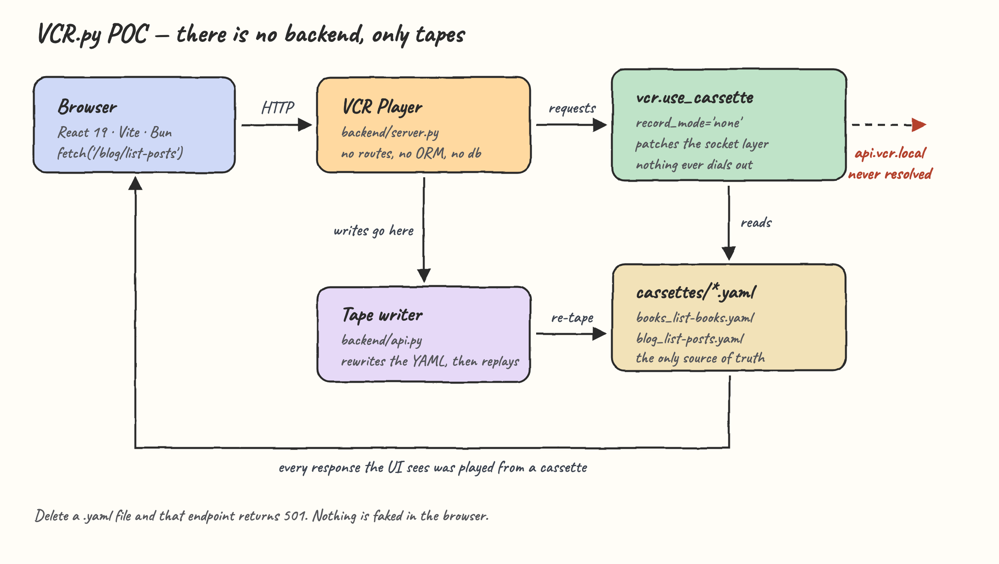
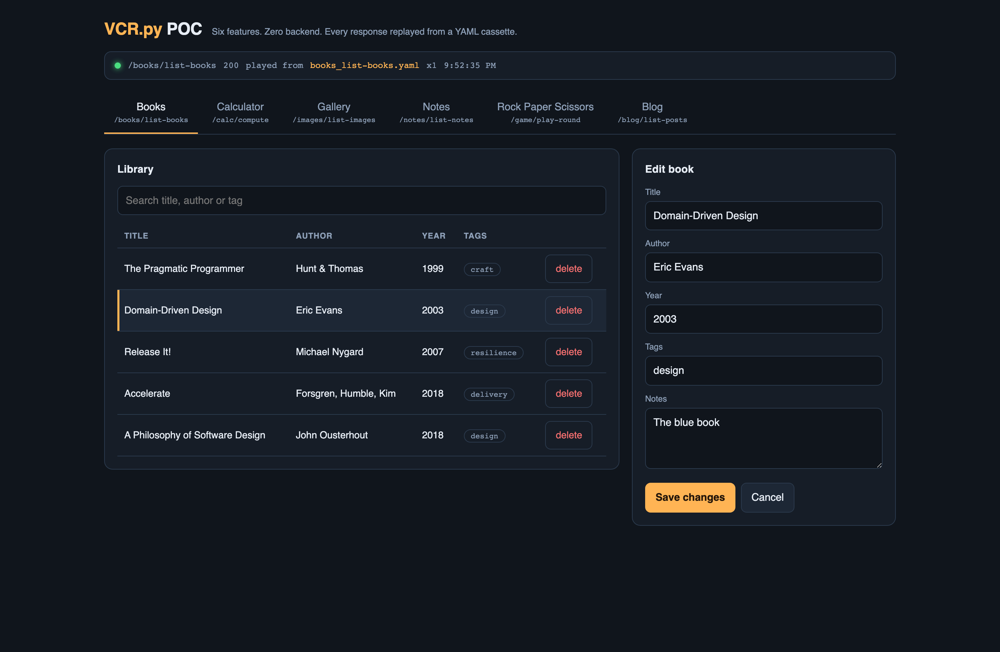
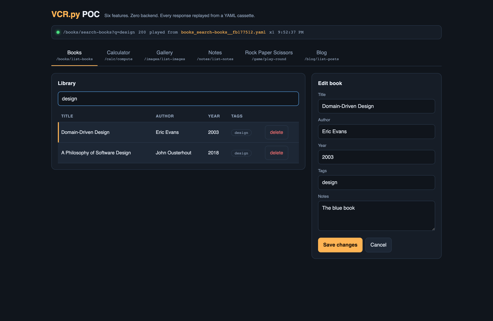
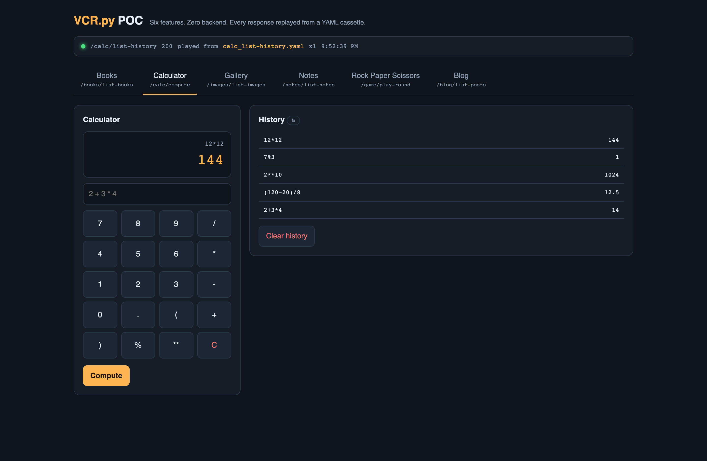
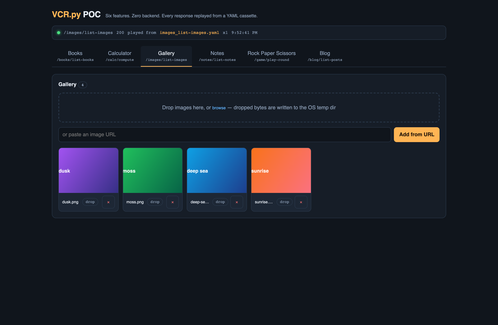
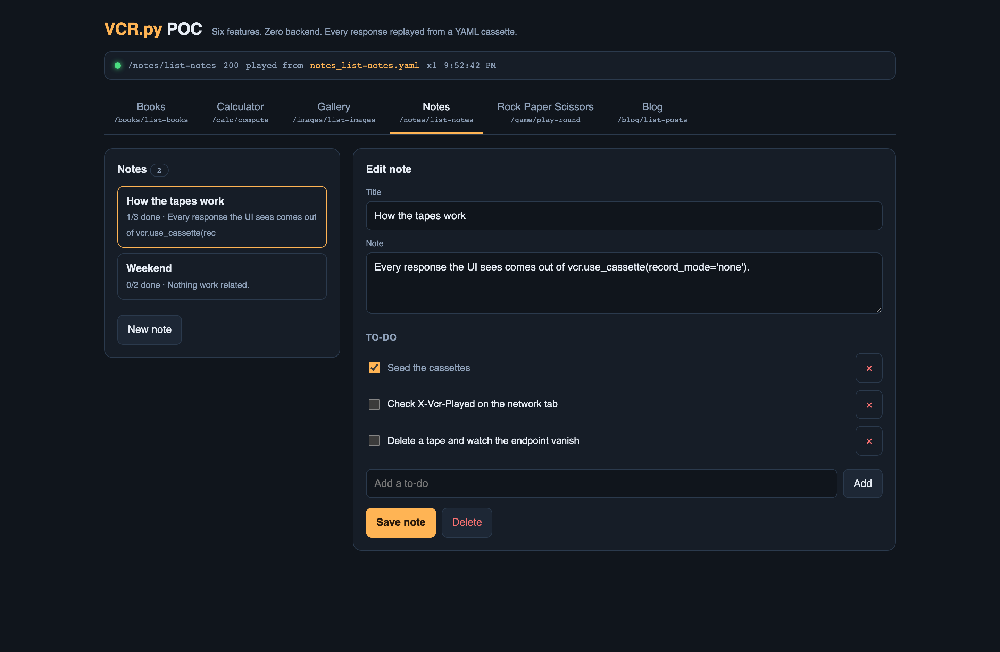
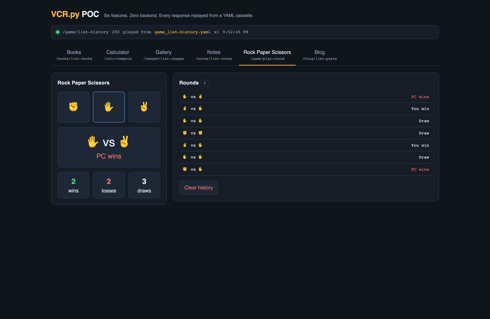
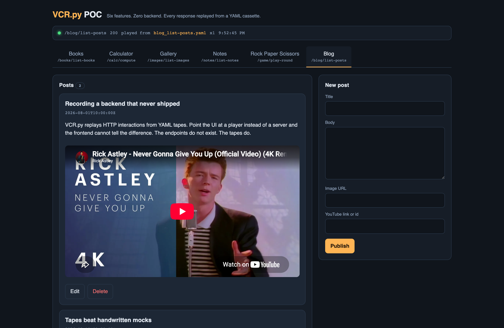

A six-tab React 19 website whose backend does not exist. Every endpoint the UI calls — `/blog/list-posts`, `/books/create-book`, `/game/play-round` — is answered by [VCR.py](https://github.com/kevin1024/vcrpy) replaying a YAML cassette. No API server, no database, no ORM, no route handlers behind the wire. Just tapes.

## How it Works

VCR.py patches Python's socket/connection layer, not the browser's. So the browser talks to a tiny **player** (`backend/server.py`), and the player turns every incoming call into a `requests` call aimed at `http://api.vcr.local` — a host that does not resolve — inside `vcr.use_cassette(record_mode='none')`.

If a cassette matches, VCR answers from the YAML file and no socket is ever opened. If no cassette matches, the request cannot go anywhere, and the player returns `501 no cassette for this endpoint`. That is the whole trick: **the tape is the only thing that can answer.**

Reads replay directly. Writes are handled by the **tape writer** (`backend/api.py`): it loads the affected cassette, applies the change, rewrites the YAML, then writes and replays a cassette for the write's own response. So a `POST /books/create-book` response is *also* played back from a cassette — the frontend never receives a byte that did not come out of `vcr.use_cassette`.

The cassettes are the database. Delete `cassettes/books_list-books.yaml` and the Books tab's endpoint stops existing.

## Architecture



Every response carries the proof back to the browser as headers, which the UI prints in the tape monitor strip:

```
X-Vcr-Cassette: books_list-books.yaml
X-Vcr-Played:   1
X-Vcr-Retaped:  books_list-books.yaml,-books_search-books__fb177512.yaml
```

`X-Vcr-Played` is VCR's own `cassette.play_count`. A `0` there would mean something reached the network.

## Features

- **Books CRUD** — searchable grid, click a row to load it into the editor, create / edit / delete. Proves the tape model survives a real list-detail-mutate loop.
- **Calculator with history** — every computation is appended to a history tape. The expression is parsed with `ast`, so `__import__('os')` is rejected instead of evaluated.
- **Image gallery** — drag and drop from the desktop or paste a URL, then delete. Dropped bytes go to the OS temp dir; only metadata is taped.
- **Notes with to-dos** — Notion-style note = title + body + a checklist. Ticking a box on a saved note persists immediately; title and body save on submit.
- **Rock paper scissors** — the PC move is generated at tape-write time, so each round produces a fresh cassette and the score is recomputed from the whole history.
- **Mini blog** — posts with an image and an embedded YouTube video, editable and deletable.
- **Tape monitor** — a strip above the tabs naming the exact cassette that answered the last call, so the mechanism is visible while you click. It turns red and names the reason when a call fails, so nothing ever fails silently.

## Stack

- **VCR.py 8.3** — the point of the POC: it replays recorded HTTP interactions, which is what lets the backend be absent.
- **Python 3.13 stdlib `http.server`** — the player needs to accept HTTP and call `requests`; a framework would add nothing.
- **`requests`** — the client VCR patches. VCR needs a real HTTP client to intercept.
- **PyYAML** — cassettes are hand-written YAML, so the tape writer needs to emit and read that format.
- **React 19 + Vite 7 + Bun** — fast dev server, no state library needed for six self-contained tabs.
- **pytest** — 20 tests covering the tape mechanics and all six features.

No frontend dependencies beyond React. No backend dependencies beyond VCR.py and what it needs.

## Contracts / APIs

RPC-style endpoints. Reads are `GET`, writes are `POST` with a JSON body. Everything returns JSON.

| Endpoint | Method | Body | Returns |
| --- | --- | --- | --- |
| `/books/list-books` | GET | — | `{items, total}` |
| `/books/search-books?q=` | GET | — | `{items, total, q}` |
| `/books/create-book` | POST | `{title, author, year, tags, notes}` | the book |
| `/books/update-book` | POST | `{id, ...fields}` | the book |
| `/books/delete-book` | POST | `{id}` | `{deleted}` |
| `/calc/compute` | POST | `{expression}` | `{id, expression, result, ok, at}` |
| `/calc/list-history` | GET | — | `{items, total}` |
| `/calc/clear-history` | POST | `{}` | `{cleared}` |
| `/images/list-images` | GET | — | `{items, total}` |
| `/images/upload-image` | POST | `{name, dataUrl}` or `{url}` | the image |
| `/images/delete-image` | POST | `{id}` | `{deleted}` |
| `/images/raw/<id>` | GET | — | the image bytes |
| `/notes/list-notes` | GET | — | `{items, total}` |
| `/notes/create-note` | POST | `{title, body, todos[]}` | the note |
| `/notes/update-note` | POST | `{id, ...fields}` | the note |
| `/notes/delete-note` | POST | `{id}` | `{deleted}` |
| `/game/play-round` | POST | `{move}` | `{player, pc, outcome, score}` |
| `/game/list-history` | GET | — | `{items, total, score}` |
| `/game/clear-history` | POST | `{}` | `{cleared}` |
| `/blog/list-posts` | GET | — | `{items, total}` |
| `/blog/create-post` | POST | `{title, body, image, youtube}` | the post |
| `/blog/update-post` | POST | `{id, ...fields}` | the post |
| `/blog/delete-post` | POST | `{id}` | `{deleted}` |
| `/tapes/list-tapes` | GET | — | every cassette on disk |

Status codes: `200` played from tape, `400` bad input, `404` record not in the tape, `501` **no cassette exists for this endpoint**.

## Key data structures and design decisions

**A cassette is the unit of storage.** One endpoint, one YAML file, one recorded interaction:

```yaml
version: 1
interactions:
- request:
    method: GET
    uri: http://api.vcr.local/game/list-history
    body: null
    headers:
      Accept: [application/json]
  response:
    status: {code: 200, message: OK}
    headers:
      Content-Type: [application/json]
      X-Taped-Endpoint: [/game/list-history]
    body:
      string: '{"items": [], "total": 0, "score": {"win": 0, "loss": 0, "draw": 0}}'
```

**`match_on = ["method", "path"]`.** The recorded `uri` names a host that will never exist, so matching deliberately ignores host and port. That is what makes a hand-written tape indistinguishable from a recorded one.

**Writes rewrite the tape, they never replay it.** Replaying a write would mean `create-book` returns the same id forever. The tape writer mutates the YAML and then plays back a freshly written response cassette.

**Search results get their own tape, keyed by a hash of the query string** (`books_search-books__fb177512.yaml`), and every write to `/books/*` ejects them. Without that, a stale search tape would keep answering after the library changed.

**Image bytes are the one thing not on tape.** They live in `$TMPDIR/vcr-poc-images/` and are streamed straight from disk by `/images/raw/<id>`. Base64-ing megabytes of PNG into YAML would make the cassettes unreadable, which would defeat the point of using cassettes. Only image metadata is taped.

**`cassettes/` is gitignored.** It is mutable state — a database, not source. `scripts/record.sh` lays down a fresh set from the fixtures in `backend/api.py`.

## How to run

```bash
./scripts/build.sh    # venv + python deps + bun install + vite build
./scripts/start.sh    # player on :7500, website on :5173
./scripts/test.sh     # 20 pytest tests
./scripts/stop.sh     # stop both
./scripts/record.sh   # wipe and re-lay the seed cassettes
```

Then open http://localhost:5173.

`start.sh` records the seed tapes and runs `bun install` on first use, so it works from a clean checkout on its own. It refuses to start if :7500 or :5173 is already taken, and it aborts with the log if either process fails to bind — it never reports a startup that did not happen. `stop.sh` kills the vite grandchild as well as the bun wrapper, then verifies both ports are actually free before reporting success.

To see the mechanism fail on purpose:

```bash
rm cassettes/books_list-books.yaml
curl -s localhost:7500/books/list-books
# {"error": "no cassette for this endpoint", "endpoint": "/books/list-books", ...}
```

### Tests

```
20 passed
```

The tests encode why the design holds, not just that it responds. `test_a_taped_endpoint_answers_without_resolving_the_host` monkeypatches `socket.getaddrinfo` to raise, then asserts the endpoint still returns 200 — if DNS were ever touched, the response did not come off the tape. Others cover retaping on write, search-tape ejection, the calculator refusing non-arithmetic, image bytes staying out of the YAML, and a missing cassette answering 501 instead of pretending.

## Printscreens

### Tab 1 — Books



The grid is populated from `books_list-books.yaml`; the monitor strip at the top confirms it (`played from books_list-books.yaml x1`). "Domain-Driven Design" has been clicked, which loads it into the editor on the right for an in-place edit. Each row has its own delete.



Typing `design` filters to the two matching books. This request went to `/books/search-books?q=design`, which minted its own query-keyed cassette. Any create/update/delete on books deletes these search tapes so they cannot go stale.

### Tab 2 — Calculator



`12*12` has just been computed, showing `144` in the readout. The history panel on the right lists every earlier operation, each one read back from `calc_list-history.yaml`. Expressions are parsed as an AST, so only arithmetic evaluates.

### Tab 3 — Gallery



Four images added by drag-and-drop, each tagged `drop`. Their bytes were written to the OS temp dir and are served by `/images/raw/<id>`; the gallery listing itself comes off `images_list-images.yaml`. The URL field adds a remote image by reference instead, and `×` deletes both the record and the file.

### Tab 4 — Notes



The note list is on the left, the selected note open on the right. A note is a title, a body, and a Notion-style checklist — ticking a box, adding an item, and editing the text are all saved together in one tape rewrite.

### Tab 5 — Rock Paper Scissors



Seven rounds played. The large panel shows the last round (paper beats rock — "You win") and the running 5/1/1 tally. Every round appends to `game_list-history.yaml`, and the score is recomputed from the full tape rather than incremented, so it always matches the history beside it.

### Tab 6 — Blog



A post rendered with its embedded YouTube video; the second post below carries a cover image instead. The form on the right creates a post or edits the one loaded by "Edit". The video is a real iframe to YouTube — the only thing on the page that touches the network, because it is the browser loading it, not the API.
