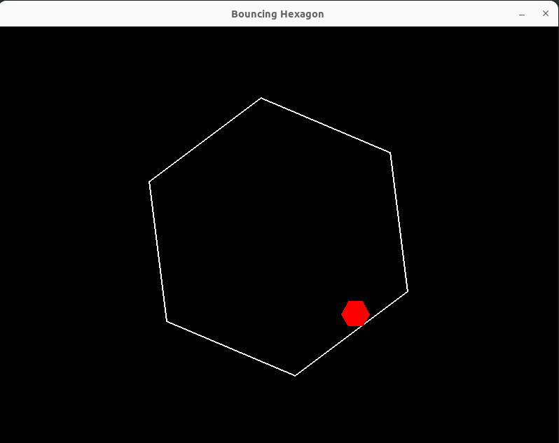

### Intall dependencies

```bash
./install-deps.sh
```

### Run

```bash
./run.sh
```

### Result

1. Asked Cloud Sonnet 3.5 to create a hexagon spining with a bouncing ball.
2. It worked but had to make 3 prompts.


