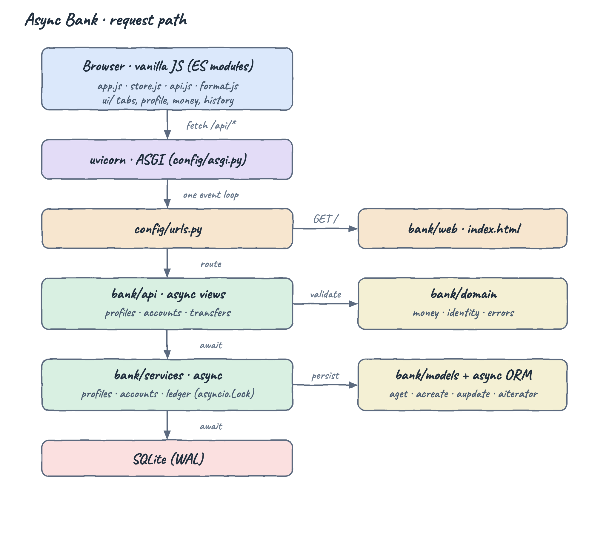
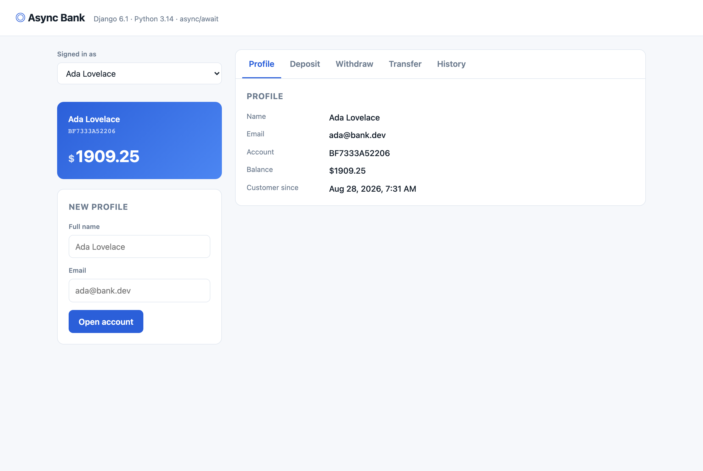
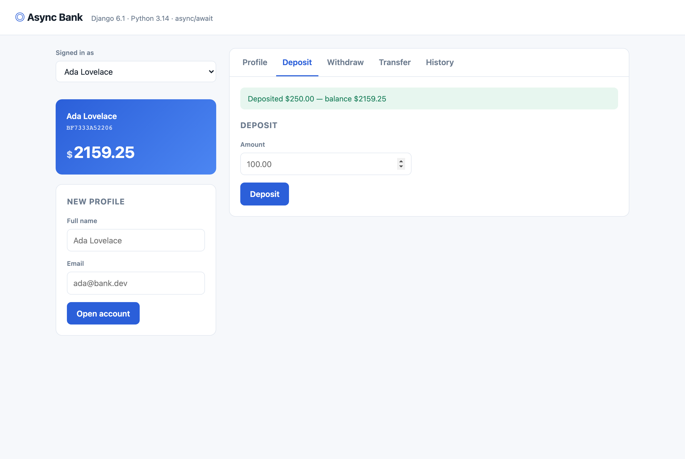
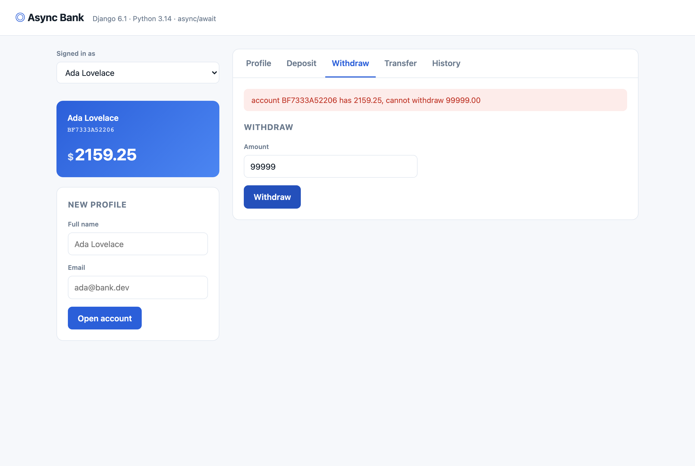
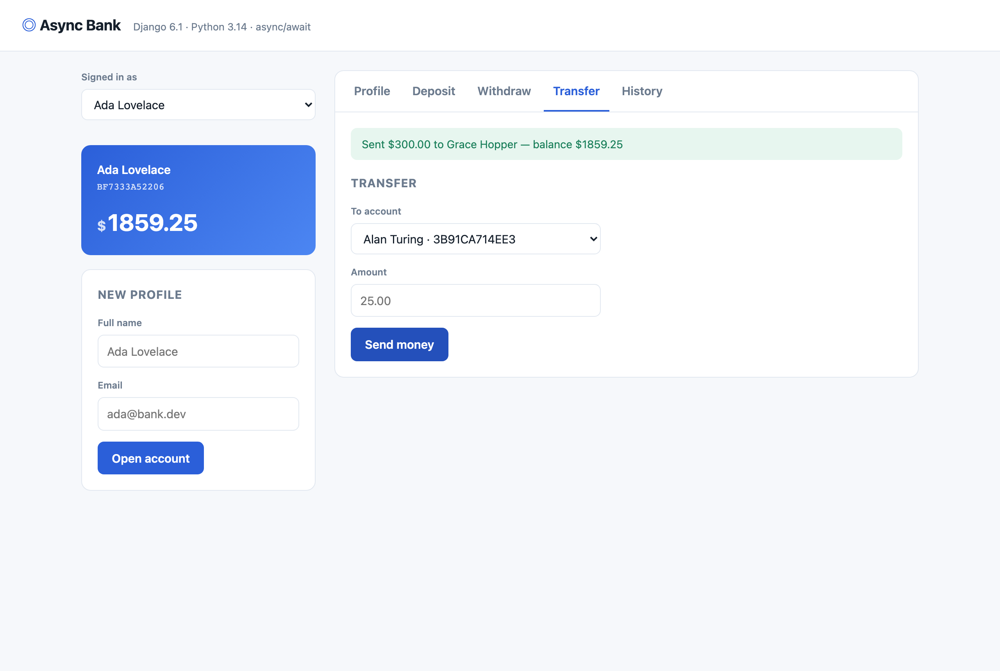
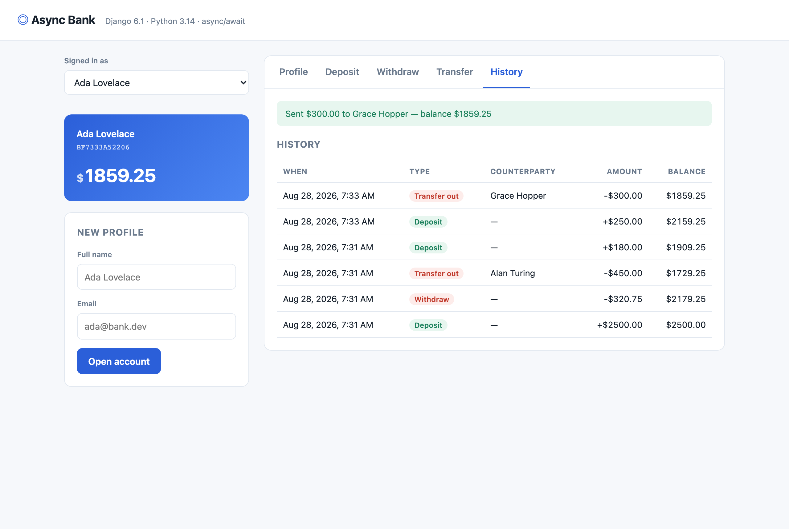

# Async Bank

A small retail-banking app: open a profile, deposit, withdraw, transfer money between accounts and read your statement. Every layer of the backend is `async`/`await` — async ASGI views calling async services calling Django's async ORM — with a vanilla-JS single-page UI on top.

## How it Works?

The browser loads one Django template and a handful of vanilla-JS ES modules. All state changes go through `fetch` calls to a JSON API; there are no full page reloads and no frontend framework.

Every request is served by uvicorn on a single event loop. A URL resolves to an `async def` view, which validates input against the pure-Python `bank/domain` layer, then awaits a service in `bank/services`. Services talk to the database through Django's async ORM (`aget`, `acreate`, `aupdate`, `aiterator`) — never through a thread pool.

Money movement lives in one place: `bank/services/ledger.py`. It holds an `asyncio.Lock` for the duration of a deposit, withdrawal or transfer, and debits with a conditional `UPDATE ... WHERE balance >= amount` so an overdraft is rejected by the database itself rather than by a read-then-write race.

Every movement appends a `Transaction` row carrying the balance *after* it, so the statement is a replayable audit trail instead of a derived guess.

## Architecture



The dependency arrows only ever point downward and to the right: views know about services, services know about domain and models, and nothing in `domain` imports Django. That is what keeps `bank/domain` testable with `SimpleTestCase` and no database at all.

```
config/                 django project: settings, asgi entrypoint, root urls
bank/domain/            pure python rules, zero django imports
  errors.py             the exception hierarchy, each carrying its HTTP status
  money.py              amount parsing, cent rounding, upper bound
  identity.py           name/email normalisation, account number generation
bank/models/            one model per file
  profile.py            Profile
  account.py            Account
  transaction.py        Transaction + Kind
bank/services/          async use cases
  profiles.py           open a profile and its account
  accounts.py           account lookups
  ledger.py             deposit, withdraw, transfer, statement
bank/api/               json api
  http.py               body parsing, field checks, the @endpoint decorator
  presenters.py         model -> dict, the only place amounts are formatted
  views/                profiles.py, accounts.py, transfers.py
  urls.py               api routes
bank/web/               the html page
bank/templates/bank/    index.html
bank/static/bank/       app.css + js modules
tests/                  domain, ledger and api suites
```

## Features

* **Profiles** — opening a profile also opens its account in the same call, so an account never exists without an owner.
* **Deposit** — credits the account and appends a ledger row with the resulting balance.
* **Withdraw** — refused with `409` when funds are short; the balance check is part of the `UPDATE`, so it cannot be raced.
* **Transfer** — debits and credits under one lock and writes both sides of the movement, so a statement always shows the counterparty by name.
* **Statement** — newest-first history with running balances, so past rows explain how today's number was reached.
* **Overdraft protection** — a single invariant enforced in one function rather than sprinkled across views.
* **Typed errors** — every domain exception carries its own HTTP status, so views never map error strings to codes.

## Stack

* **Python 3.14.6** — the runtime the whole project is pinned to.
* **Django 6.1** — its async ORM (`aget`/`acreate`/`aupdate`) is what makes an all-async backend possible without a second data layer.
* **uvicorn** — ASGI server; `runserver` would not exercise the async path the same way.
* **SQLite (WAL)** — zero setup, ships with Python, enough for a single-process ledger.
* **Vanilla JS (ES modules)** — no build step, no bundler, no framework to keep current.

## APIs

All endpoints speak JSON. Unsafe methods require Django's CSRF token (`X-CSRFToken`), which the page sets as a cookie.

| Method | Path | Body | Returns |
| --- | --- | --- | --- |
| `GET` | `/api/profiles/` | — | every profile with its account |
| `POST` | `/api/profiles/` | `{full_name, email}` | `201` the created profile + account |
| `GET` | `/api/profiles/<id>/` | — | one profile |
| `GET` | `/api/accounts/` | — | every account |
| `GET` | `/api/accounts/<id>/` | — | one account |
| `POST` | `/api/accounts/<id>/deposit/` | `{amount}` | `201` the ledger entry |
| `POST` | `/api/accounts/<id>/withdraw/` | `{amount}` | `201` the ledger entry |
| `GET` | `/api/accounts/<id>/transactions/` | `?limit=25` | newest-first statement |
| `POST` | `/api/transfers/` | `{source_account_id, target_account_id, amount}` | `201` `{sent, received}` |

Status codes: `422` invalid or missing input, `404` unknown account or profile, `409` insufficient funds or duplicate email, `405` wrong method.

```bash
curl -X POST http://127.0.0.1:8000/api/transfers/ \
  -H 'Content-Type: application/json' \
  -d '{"source_account_id":1,"target_account_id":2,"amount":"450.00"}'
```

```json
{
  "sent": {
    "kind": "TRANSFER_OUT",
    "amount": "450.00",
    "balance_after": "1729.25",
    "counterparty": "Alan Turing"
  },
  "received": {
    "kind": "TRANSFER_IN",
    "amount": "450.00",
    "balance_after": "450.00",
    "counterparty": "Ada Lovelace"
  }
}
```

## Key Data Structures and Design Decisions

**Money is `Decimal`, never `float`.** Amounts are parsed once at the edge by `domain/money.parse_amount`, quantized to cents, and stored in a `DecimalField(18, 2)`. Formatting back to a string happens once, in `api/presenters.py`.

**The ledger is append-only.** `Transaction` stores `balance_after`, so the statement is history rather than a recomputation. `Kind` distinguishes `TRANSFER_IN` from `TRANSFER_OUT`, which is why both sides of a transfer read correctly from either account.

**Overdraft is a database predicate.** The debit is `filter(pk=..., balance__gte=amount).aupdate(balance=F("balance") - amount)`. Zero rows updated means insufficient funds. There is no read-then-write window to lose.

**Serialisation via `asyncio.Lock`, not `transaction.atomic`.** Django 6.1 ships async querysets but no async `atomic()` — the only way to get one is to bounce the whole unit of work into a thread with `sync_to_async`, which would break the all-async requirement. The lock plus the conditional `UPDATE` gives correct behaviour under concurrent requests in one process, which is what this app runs as. The honest limit: it does not survive a process crash mid-transfer, and it does not serialise across multiple worker processes. Moving to PostgreSQL with `SELECT ... FOR UPDATE` is the next step if this ever needed more than one worker.

**Errors carry their status.** `BankError` subclasses declare `status`, and the `@endpoint` decorator turns any of them into the right JSON response. Views contain no error mapping.

## Build

```bash
./build.sh
```

Creates `.venv` with Python 3.14, installs `requirements.txt` and applies migrations.

```
build done
```

## Run

```bash
./run.sh
```

```
Async Bank on http://127.0.0.1:8000
INFO:     Uvicorn running on http://127.0.0.1:8000 (Press CTRL+C to quit)
```

## Test

```bash
./test.sh
```

29 tests across three suites: `tests/test_domain.py` (no database), `tests/test_ledger.py` (async services) and `tests/test_api.py` (async HTTP client).

```
Found 29 test(s).
test_creating_a_profile_returns_the_account_it_opened ... ok
test_deposit_then_withdraw_reports_running_balances ... ok
test_overdraft_is_rejected_with_conflict_not_a_server_error ... ok
test_transfer_reports_both_sides_of_the_movement ... ok
test_concurrent_withdrawals_never_overdraw_the_account ... ok
test_transfer_moves_money_without_creating_or_destroying_any ... ok
test_failed_transfer_leaves_both_sides_untouched ... ok
...
----------------------------------------------------------------------
Ran 29 tests in 0.092s

OK
```

## Stop

```bash
./stop.sh
```

## Screens

### Profile



The landing tab. The sidebar carries the profile picker, the balance card for the selected account, and the form that opens a new one. The Profile pane on the right shows Ada Lovelace's account number `BF7333A52206` and a balance of `$1909.25`. Switching the picker reloads the card, the transfer targets and the statement in one pass.

### Deposit


A single amount field. The form posts to `/api/accounts/1/deposit/` and nothing else on the page needs to know about it.



After a `$250.00` deposit the green flash reports the movement and the resulting balance, and the balance card has already climbed to `$2159.25` — the store refetches profiles, accounts and the statement together, so every part of the page stays consistent.

### Withdraw — overdraft refused



Asking for `99999` against a `$2159.25` balance returns `409` and the API's own message is shown verbatim: *account BF7333A52206 has 2159.25, cannot withdraw 99999.00*. The balance card is untouched — the conditional `UPDATE` matched zero rows, so nothing was written.

### Transfer



The target dropdown lists every account except your own, labelled by owner and number. Sending `$300.00` to Grace Hopper debits the sender and credits the receiver under one lock.

### History



The statement, newest first, with inflows in green and outflows in red. Reading down the balance column replays the account: `$2500.00` deposited, `$320.75` withdrawn, `$450.00` out to Alan Turing, `$180.00` in, `$250.00` in, `$300.00` out to Grace Hopper — ending at the `$1859.25` on the card.
