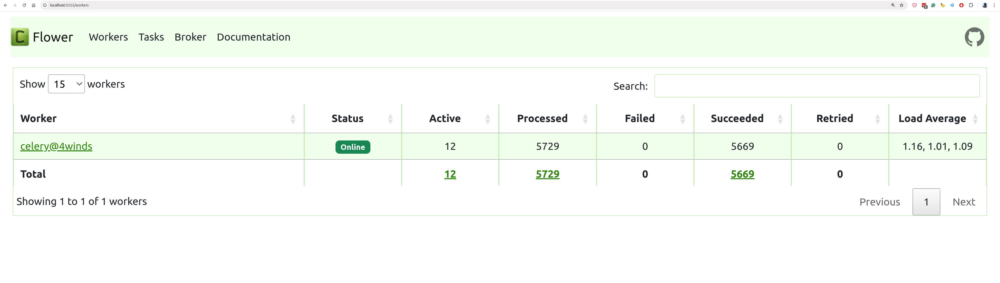
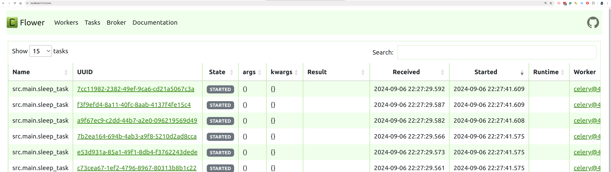
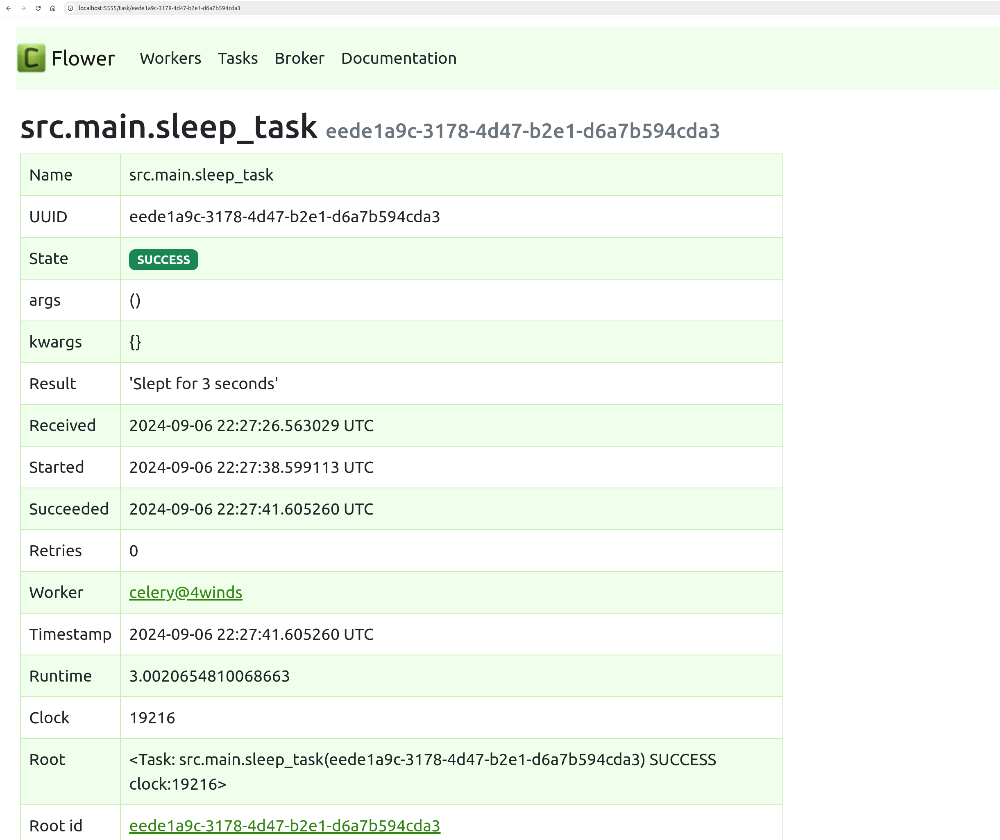
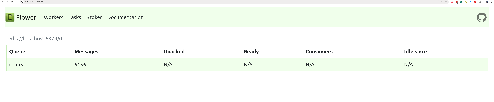
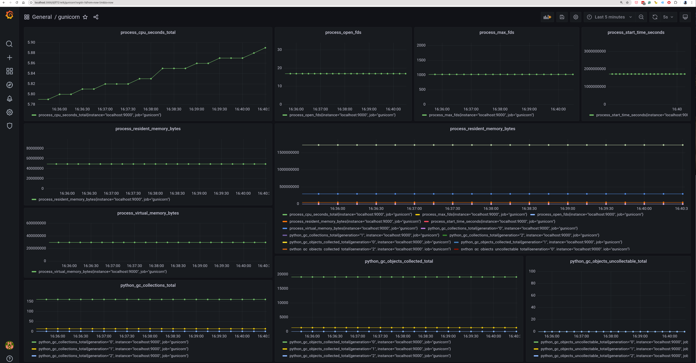
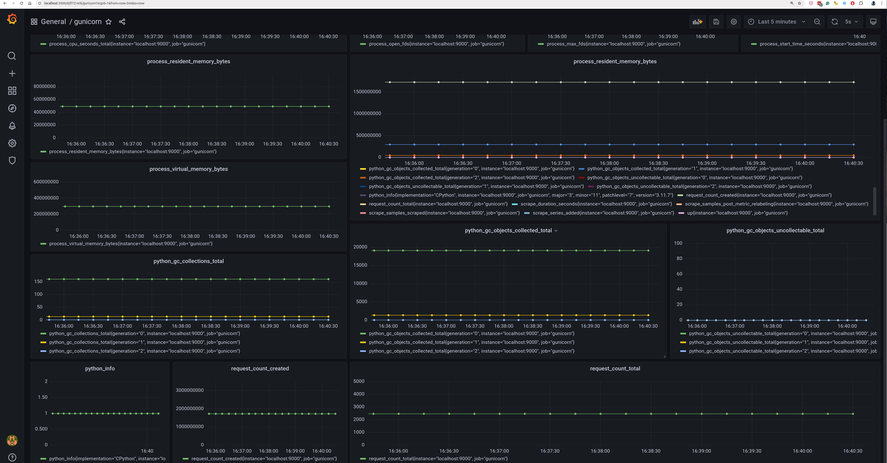

## Results

### Run
```
./run.sh
```
```
./run-flower.sh
```
```
./stress.sh
```

### Dashboard (flower)

go to http://localhost:5555

### Prometheus metrics

go to http://localhost:9000/metrics

### Results

Flower Celery Workers <br/>

<br/>

Flower Celery Tasks <br/>

<br/>

Flower Celery Task <br/>

<br/>

Flower Broker <br/>

<br/>

### Prometheus / Grafana

```
./run-grafana.sh
```
```
./run-prometheus.sh
```

http://4winds:9000/metrics
```
# HELP python_gc_objects_collected_total Objects collected during gc
# TYPE python_gc_objects_collected_total counter
python_gc_objects_collected_total{generation="0"} 19088.0
python_gc_objects_collected_total{generation="1"} 1370.0
python_gc_objects_collected_total{generation="2"} 10.0
# HELP python_gc_objects_uncollectable_total Uncollectable objects found during GC
# TYPE python_gc_objects_uncollectable_total counter
python_gc_objects_uncollectable_total{generation="0"} 0.0
python_gc_objects_uncollectable_total{generation="1"} 0.0
python_gc_objects_uncollectable_total{generation="2"} 0.0
# HELP python_gc_collections_total Number of times this generation was collected
# TYPE python_gc_collections_total counter
python_gc_collections_total{generation="0"} 161.0
python_gc_collections_total{generation="1"} 14.0
python_gc_collections_total{generation="2"} 1.0
# HELP python_info Python platform information
# TYPE python_info gauge
python_info{implementation="CPython",major="3",minor="11",patchlevel="7",version="3.11.7"} 1.0
# HELP process_virtual_memory_bytes Virtual memory size in bytes.
# TYPE process_virtual_memory_bytes gauge
process_virtual_memory_bytes 2.96906752e+08
# HELP process_resident_memory_bytes Resident memory size in bytes.
# TYPE process_resident_memory_bytes gauge
process_resident_memory_bytes 4.9180672e+07
# HELP process_start_time_seconds Start time of the process since unix epoch in seconds.
# TYPE process_start_time_seconds gauge
process_start_time_seconds 1.72566518118e+09
# HELP process_cpu_seconds_total Total user and system CPU time spent in seconds.
# TYPE process_cpu_seconds_total counter
process_cpu_seconds_total 5.640000000000001
# HELP process_open_fds Number of open file descriptors.
# TYPE process_open_fds gauge
process_open_fds 18.0
# HELP process_max_fds Maximum number of open file descriptors.
# TYPE process_max_fds gauge
process_max_fds 1024.0
# HELP request_count_total Total number of requests
# TYPE request_count_total counter
request_count_total 2468.0
# HELP request_count_created Total number of requests
# TYPE request_count_created gauge
request_count_created 1.7256651822205915e+09
```

Grafana / Prometheus dashboard on gunicorn <br/>


Grafana / Prometheus dashboard on gunicorn <br/>
