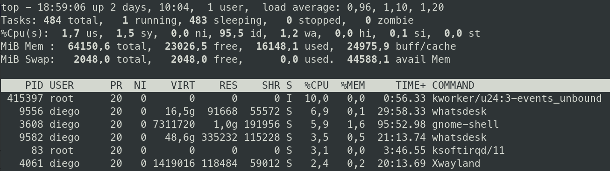

### Simulate

Terminal #1
```bash
./run.sh
```
```
[2023-11-30 18:55:06 -0800] [467856] [INFO] Starting gunicorn 21.2.0
[2023-11-30 18:55:06 -0800] [467856] [INFO] Listening at: http://127.0.0.1:8000 (467856)
[2023-11-30 18:55:06 -0800] [467856] [INFO] Using worker: sync
[2023-11-30 18:55:06 -0800] [467857] [INFO] Booting worker with pid: 467857
[2023-11-30 18:55:06 -0800] [467858] [INFO] Booting worker with pid: 467858
```

Terminal #2
```bash
./stress.sh
```
```
❯ ./stress.sh
This is ApacheBench, Version 2.3 <$Revision: 1879490 $>
Copyright 1996 Adam Twiss, Zeus Technology Ltd, http://www.zeustech.net/
Licensed to The Apache Software Foundation, http://www.apache.org/

Benchmarking 127.0.0.1 (be patient)

```

### Monitor 
```bash
./monitor.sh
```
```
TCP.ABORT.ON.OVERFLOW : 0
TCP.SYNACK.RETRIES    : 5
TCP.MAXSYN.BACKLOG    : 40000
WAITING               : 2000
TIME_WAITING          : 64
RECV-Q                : 998
TCP_DROPS             : 0
```

CPU is around ~10%
</img>