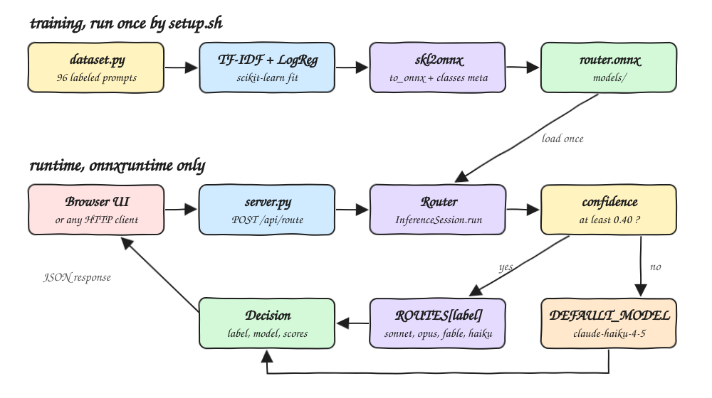
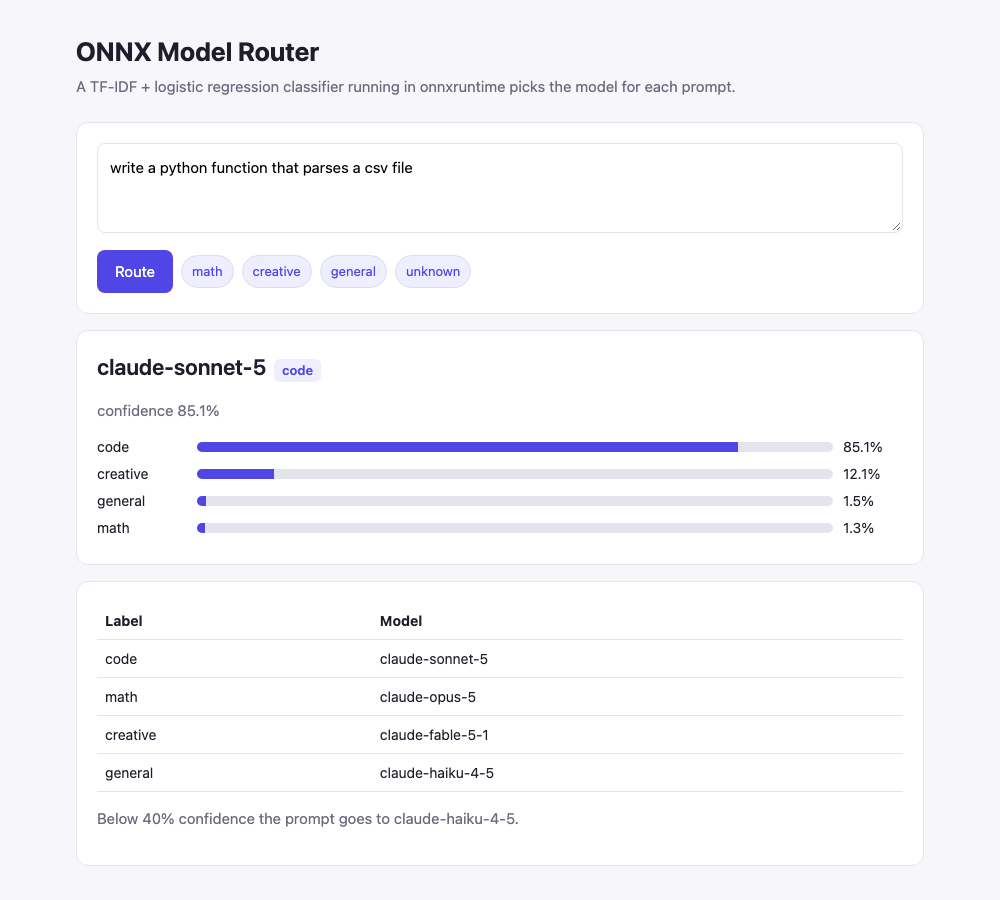
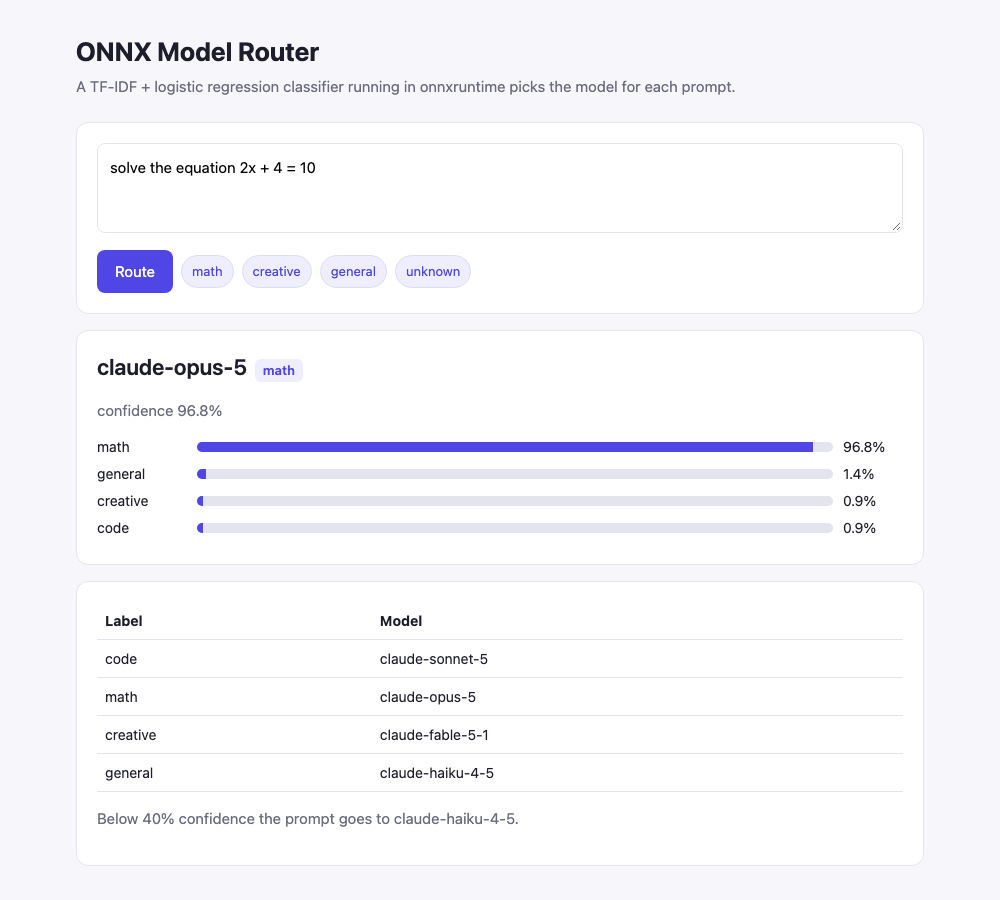
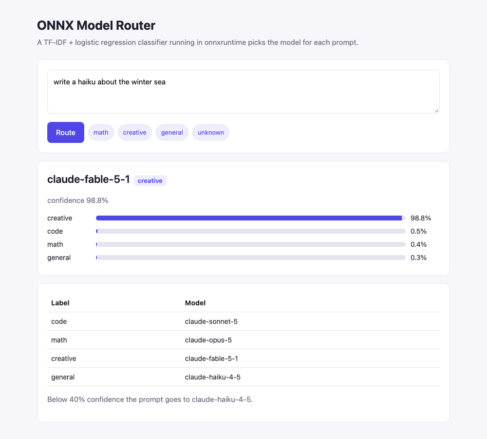
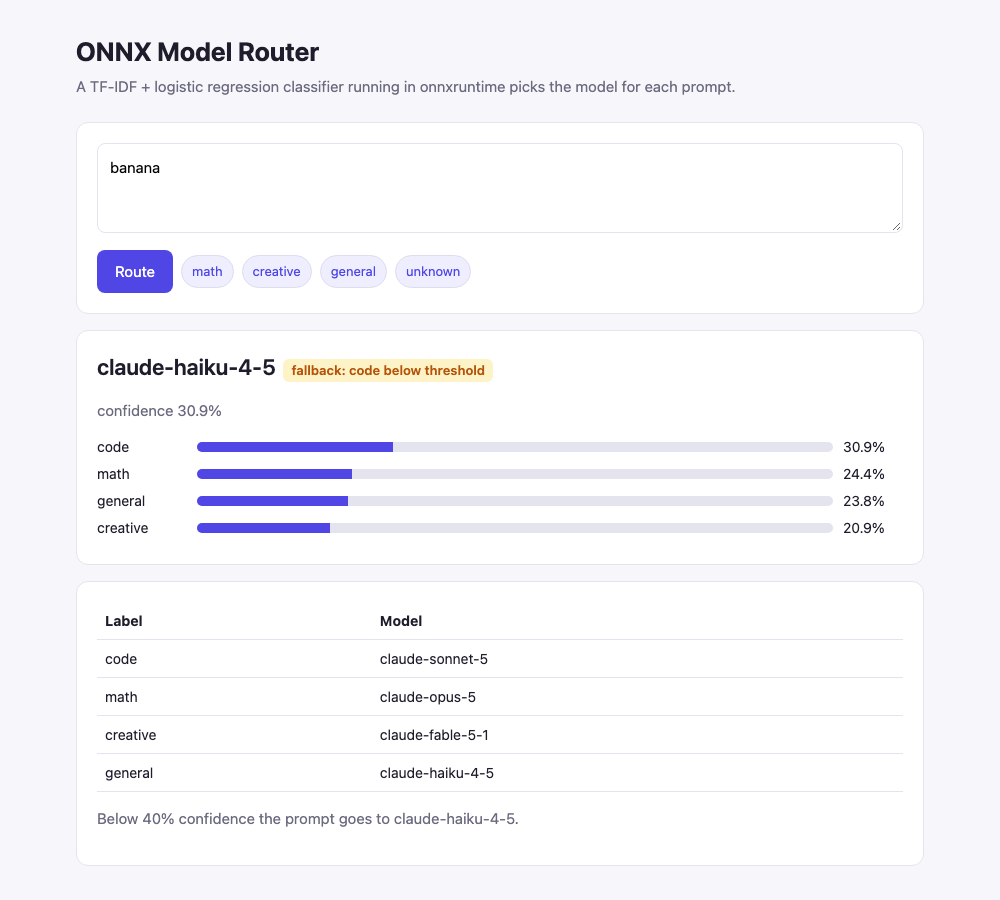

# onmx-classifier

A proof of concept of an LLM **model router** driven by an [ONNX](https://onnx.ai) text classifier.
Each prompt is classified as `code`, `math`, `creative` or `general` by a small TF-IDF + logistic
regression model that runs in `onnxruntime`, and the router picks the model that owns that category.
When the classifier is not confident, the prompt falls back to the cheapest model.

## How it Works?

1. `onnx-router-train` fits a scikit-learn pipeline (`TfidfVectorizer` 1-2 grams + `LogisticRegression`) on 96 labeled prompts in `dataset.py`.
2. `skl2onnx` converts the whole pipeline, tokenizer included, into `models/router.onnx` and stores the class names in the model metadata.
3. `server.py` loads the model once into an `onnxruntime.InferenceSession`. Serving needs no scikit-learn.
4. `POST /api/route` sends the raw string straight into the ONNX graph and gets back one probability per class.
5. If the top probability is at least `0.40`, the prompt goes to `ROUTES[label]`. Otherwise it goes to `DEFAULT_MODEL`.
6. The response is a `Decision` with the label, confidence, chosen model, fallback flag and all class scores.

## Architecture



## Features

* **Whole pipeline in ONNX** - tokenization, TF-IDF and the classifier all run inside the graph, so the service only sends raw text.
* **Training and serving split** - scikit-learn is a dev dependency. Runtime needs only `onnxruntime` and `numpy`.
* **Confidence fallback** - prompts with no clear signal go to a cheap default model instead of being guessed.
* **Parity test** - ONNX probabilities must match scikit-learn within `1e-4`, so a bad export fails the build.
* **Routing table as data** - `ROUTES` is a plain dict, so changing a target model is a one-line change.
* **Zero-dependency server and UI** - stdlib `http.server` plus one static HTML page.

## Stack

* **Python 3.14** - latest CPython. onnxruntime ships wheels for it.
* **uv** - dependency management, virtualenv and build backend.
* **onnxruntime** - fast CPU inference for the exported model.
* **scikit-learn** - trains the TF-IDF + logistic regression pipeline.
* **skl2onnx / onnx** - converts the fitted pipeline to an ONNX graph.
* **http.server** - stdlib HTTP server, so there is no web framework.
* **pytest** - router, parity and HTTP tests.
* **ruff** - linting and formatting.

## Contracts

| Method | Path | Body | Response |
|---|---|---|---|
| `GET` | `/` | - | UI page |
| `GET` | `/api/health` | - | `{"status": "up"}` |
| `GET` | `/api/routes` | - | `{"routes": {label: model}, "default": str, "threshold": float}` |
| `POST` | `/api/route` | `{"prompt": str}` | `Decision` or `400 {"error": str}` for an empty prompt or bad JSON |

```bash
curl -s -X POST http://localhost:8000/api/route -d '{"prompt":"what is the derivative of cos x"}'
```

```json
{"prompt": "what is the derivative of cos x", "label": "math", "confidence": 0.94,
 "model": "claude-opus-5", "fallback": false,
 "scores": {"code": 0.0029, "creative": 0.0029, "general": 0.0541, "math": 0.94}}
```

| Label | Model |
|---|---|
| `code` | `claude-sonnet-5` |
| `math` | `claude-opus-5` |
| `creative` | `claude-fable-5-1` |
| `general` | `claude-haiku-4-5` |
| fallback, below `0.40` | `claude-haiku-4-5` |

The router only picks a model. It does not call any LLM API.

## Key Data Structures and Design Decisions

* `Decision` is a frozen dataclass: `prompt, label, confidence, model, fallback, scores`.
* ONNX input is a `StringTensorType([None, 1])` named `text`. Outputs are the label and a probability tensor (`zipmap` disabled, so it is a plain array instead of a list of dicts).
* Class order is read from the model's `classes` metadata. The router never assumes it.
* `token_pattern=r"\b\w+\b"` keeps one-letter words. With the scikit-learn default, those words were dropped in Python but kept by the ONNX tokenizer. That changed the bigrams and moved scores by up to 0.12, and the parity test caught it.
* `C=100` and `threshold=0.40` were picked on the held-out prompts in the tests. The lowest known prompt scores about 0.48 and an unknown one like `banana` scores about 0.31. With only 96 training prompts, this margin is thin.
* `models/` is ignored by git. `setup.sh` trains the model, so the committed code is the only source of truth.

## How to Run

```bash
./scripts/setup.sh
./scripts/start-all.sh
./scripts/ui.sh
./scripts/test-all.sh
./scripts/stop-all.sh
```

## Printscreens

A code prompt goes to `claude-sonnet-5` with 85% confidence. The routing table and the fallback policy are shown below the result.



A math chip (`solve the equation 2x + 4 = 10`) goes to `claude-opus-5` with 97% confidence.



A creative chip (`write a haiku about the winter sea`) goes to `claude-fable-5-1` with 99% confidence.



`banana` has no signal. Every class scores between 20% and 31%, below the 40% threshold, so the router falls back to `claude-haiku-4-5` and flags it.



## Scripts

All scripts live in `scripts/` and run from any directory of the repository.

| Script | What it does |
|---|---|
| `./scripts/setup.sh` | Installs dependencies and trains `models/router.onnx` |
| `./scripts/start-all.sh` | Starts the router and prints the full link of each service |
| `./scripts/status.sh` | Shows every service port as UP or DOWN |
| `./scripts/test-all.sh` | Runs ruff and every pytest suite |
| `./scripts/ui.sh` | Opens the UI in the browser |
| `./scripts/stop-all.sh` | Stops every service |

Ports are declared in `scripts/ports.env` (`router=8000`).

```bash
./scripts/setup.sh
./scripts/start-all.sh
./scripts/status.sh
./scripts/ui.sh
./scripts/stop-all.sh
```
