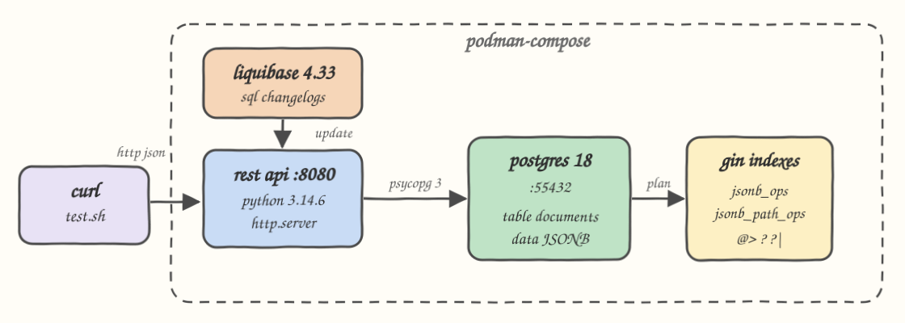

Lookups over a JSONB column in PostgreSQL 18, answered by GIN indexes and exposed
as a small REST API. The whole stack runs on podman-compose: PostgreSQL 18,
Liquibase applying the schema from plain SQL changelogs, and a Python 3.14.6 API.
50.003 seeded rows make the query planner choices real instead of theoretical.

## How it Works?

`start.sh` brings up PostgreSQL 18, waits until it accepts connections, then runs
Liquibase, which applies four SQL changelogs: the `documents` table, two GIN
indexes over the `data JSONB` column, the seed rows and an `ANALYZE`. Once the
schema is in place the API container starts.

The API turns query string parameters into JSONB operators. `contains` becomes
`data @> %s::jsonb`, `key` becomes `data ? %s`, `anyKey` becomes `data ?| %s`.
Those three operators are exactly what a GIN index on JSONB can serve, so the
same request that returns rows can also return its execution plan through
`/explain`, which reports which index the planner actually picked.

That last part is the point of the POC: you can see the GIN index being chosen
for a selective lookup, and see the planner correctly ignore it when a predicate
matches 5% of the table and a plain ordered scan is cheaper.

## What is a GIN Index?

GIN stands for Generalized Inverted Index. It is part of PostgreSQL core, not a
plugin and not an extension: there is nothing to `CREATE EXTENSION`, it has shipped
with the server since 8.2, and this POC runs it on PostgreSQL 18.6.

A B-tree indexes one value per row and answers `=` and `<`. An inverted index works
the other way around: it splits each row's value into many small items and keeps,
for each item, the sorted list of rows containing it. Same shape as the index at the
back of a book, term first and page numbers after. One JSONB document therefore
produces dozens of index entries, and a lookup reads the posting list for the term
being searched instead of reading the table.

What counts as an item is decided by the operator class:

- `jsonb_ops`, the default, extracts every key and every value as separate entries, which is why it can answer key existence (`?`, `?|`) on top of containment.
- `jsonb_path_ops` extracts one hash per value path, so it stores fewer and more selective entries. Smaller and faster, but it has no entry for a bare key and cannot answer `?` at all.

Two consequences run through the rest of this README. A GIN lookup yields row
locations rather than rows, so the plan is always a `Bitmap Index Scan` feeding a
`Bitmap Heap Scan` that visits the heap and rechecks the predicate. And its cost
scales with the size of the match set: a posting list of one row is nearly free,
while a posting list of 12.500 rows sends the heap scan across every page of the
table anyway, which is the same work the sequential scan was going to do.

## Architecture



The dashed box is what podman-compose owns. Liquibase is a one shot container: it
runs `update` against PostgreSQL and exits, so the API never starts against an
empty schema. The API talks to PostgreSQL over psycopg 3 with a small connection
pool and asks it for query plans on demand.

## Features

- **JSONB containment lookups** — `data @> {...}` matches a whole nested subtree, so filtering on `stock.warehouse` needs no extra column.
- **Key existence lookups** — `data ? key` and `data ?| [keys]` find documents by the presence of a field, which relational columns cannot express without a schema change.
- **Two GIN op classes** — `jsonb_ops` and `jsonb_path_ops` are both indexed, and the planner picks between them per query.
- **Plan introspection endpoint** — `/explain` returns `EXPLAIN (ANALYZE, BUFFERS)` plus the index names used, so index usage is proven, not assumed.
- **Schema as versioned SQL** — every table, index and seed is a Liquibase changeset, so a rerun of `start.sh` is a no-op instead of a re-create.
- **Writes are searchable immediately** — a document posted through the API is found by the GIN index in the next request, verified by `test.sh`.

## Stack

- **PostgreSQL 18** — the JSONB and GIN features under test.
- **Liquibase 4.33** — versioned schema, changesets written as plain formatted SQL rather than XML DDL.
- **Python 3.14.6** — the API runtime, matching the local interpreter.
- **psycopg 3** — the only Python dependency, with its connection pool extra.
- **http.server (stdlib)** — no web framework, the API is small enough that a framework would add more than it removes.
- **podman / podman-compose** — rootless containers for the database, migrations and API.

## Contracts / APIs

| Method | Route | Purpose |
| --- | --- | --- |
| GET | `/health` | Liveness plus current document count |
| GET | `/documents` | Search by JSONB filters |
| GET | `/documents/{id}` | Read one document |
| GET | `/explain` | Same filters, returns the execution plan and indexes used |
| POST | `/documents` | Insert `{"name": "...", "data": { ... }}` |

Query parameters for `/documents` and `/explain`:

| Parameter | Operator | Meaning |
| --- | --- | --- |
| `contains` | `@>` | JSON object the document must contain |
| `key` | `?` | Key that must exist at the top level |
| `anyKey` | `?\|` | Comma separated keys, at least one must exist |
| `limit` | | 1 to 1000, defaults to 10 |

Search by a nested subtree:

```bash
curl -s --get http://localhost:8080/documents \
  --data-urlencode 'contains={"category":"electronics","stock":{"warehouse":"wh-1"}}'
```

```json
{
  "count": 1,
  "documents": [
    {
      "id": 1,
      "name": "laptop-x1",
      "data": {
        "sku": "SKU-LAPTOP",
        "tags": ["portable", "work"],
        "brand": "acme",
        "price": 1999.99,
        "stock": {"qty": 7, "warehouse": "wh-1"},
        "category": "electronics"
      },
      "created_at": "2026-09-01T03:06:00.884526+00:00"
    }
  ]
}
```

Prove the index answered it:

```bash
curl -s --get http://localhost:8080/explain \
  --data-urlencode 'contains={"sku":"SKU-4242"}'
```

```json
{
  "indexes": ["idx_documents_data_path_gin"],
  "ginIndexUsed": true,
  "executionTimeMs": 0.03
}
```

Insert a document:

```bash
curl -s -X POST http://localhost:8080/documents \
  -H 'Content-Type: application/json' \
  -d '{"name":"mouse-m1","data":{"sku":"SKU-MOUSE","category":"electronics","tags":["wireless"]}}'
```

## Cost of Each Lookup

Every number here comes from the running stack against 50.005 rows, as
`EXPLAIN (ANALYZE, BUFFERS) SELECT count(*) FROM documents WHERE <predicate>`, best
of five with a warm cache. The forced column is the same query with
`enable_bitmapscan` and `enable_indexscan` off, so it shows what the index actually
bought. `count(*)` is used on purpose: the API adds `ORDER BY id LIMIT`, which gives
the planner a second escape route and hides the raw cost of the predicate.

| Lookup | Rows matched | Index chosen | With index | Forced seq scan | Use it |
| --- | --- | --- | --- | --- | --- |
| `contains={"sku":"SKU-4242"}` | 1 | `idx_documents_data_path_gin` | **0.06 ms**, 5 blocks | 8.00 ms, 1.562 blocks | freely |
| `key=discontinued` | 1 | `idx_documents_data_gin` | **0.06 ms**, 6 blocks | 4.19 ms, 1.562 blocks | freely |
| `anyKey=discontinued,nope` | 1 | `idx_documents_data_gin` | **0.05 ms**, 9 blocks | 7.18 ms, 1.562 blocks | freely |
| `contains={"tags":["gen-3"]}` | 5.000 | `idx_documents_data_path_gin` | 2.79 ms, 1.567 blocks | 7.73 ms, 1.562 blocks | with care |
| `contains={"stock":{"warehouse":"wh-1"}}` | 10.002 | `idx_documents_data_path_gin` | 4.39 ms, 1.569 blocks | 8.31 ms, 1.562 blocks | with care |
| `contains={"category":"tools"}` | 12.500 | `idx_documents_data_path_gin` | 4.77 ms, 1.569 blocks | 6.37 ms, 1.562 blocks | avoid |
| `key=sku` | 50.005 | none, planner refuses it | 10.11 ms, 1.562 blocks | 10.04 ms, 1.562 blocks | never |
| `anyKey=sku,brand` | 50.005 | none, planner refuses it | 10.18 ms, 1.562 blocks | 10.47 ms, 1.562 blocks | never |

The block counts tell the story better than the milliseconds. A single matching row
costs 5 to 9 blocks against 1.562 for the whole table, a factor of roughly 200. At
10% of the table the bitmap already touches 1.569 blocks, more than the sequential
scan, and the only remaining saving is the predicate evaluation. At 100% the planner
throws the index away without being asked, and it is right to.

So the shape of a safe query is a needle, not a slice. Under ~1% matched, use these
operators as much as you like. Between 1% and 10% they still win but the margin
shrinks with every row. Above ~10% the index is dead weight on reads while still
being paid for on every write.

### Where the Limits Are

| Careful with | Why | Measured cost |
| --- | --- | --- |
| `data->>'sku' = 'SKU-4242'` | `->>` is not a GIN operator, no op class extracts it | 5.65 ms seq scan, needs `CREATE INDEX ON documents ((data->>'sku'))` instead |
| Ranges, `<`, `>`, `BETWEEN` on a JSON field | GIN entries only answer equality and containment | full scan plus a cast per row |
| `ORDER BY data->>'price'` | GIN has no ordering, posting lists are row locations | full scan plus a sort |
| `LIKE` or prefix search on a value | needs the `pg_trgm` GIN op class over extracted text | not indexable by `jsonb_ops` or `jsonb_path_ops` |
| `?` and `?\|` against a nested key | only top-level keys become key entries | `data ? 'warehouse'` returns 0 rows although all 50.003 seeded rows have `stock.warehouse` |
| `?` and `?\|` when only `jsonb_path_ops` exists | that op class stores no bare-key entries | the index is not even a candidate, straight to seq scan |
| Write throughput | one index entry per extracted item, on both indexes | 50.000 inserts: 250 ms with no GIN, 713 ms with these two, ~2,9x |
| Disk | keys and values are stored again, per op class | 12 MB heap against 8.880 kB `jsonb_ops` plus 6.576 kB `jsonb_path_ops` |
| Large match sets under small `work_mem` | the bitmap goes lossy when it does not fit, here `work_mem` is 4 MB | the heap scan rechecks whole pages instead of single rows |

Two knobs are worth knowing before blaming the index. `gin_pending_list_limit`
(4 MB here) sizes the pending list that `fastupdate` writes new entries into, which
is what makes inserts survivable and what makes the first query after a write burst
pay to merge it. `gin_fuzzy_search_limit` (0, off) caps how many rows a GIN scan
returns, trading exactness for a bounded worst case on very broad predicates.

## Key Data Structures and Design Decisions

The table is deliberately thin: `id`, `name`, `data JSONB`, `created_at`. Every
attribute a query filters on lives inside `data`, so the index has to do the work.

```sql
CREATE INDEX idx_documents_data_gin ON documents USING gin (data);
CREATE INDEX idx_documents_data_path_gin ON documents USING gin (data jsonb_path_ops);
```

Both op classes are indexed on purpose. `jsonb_ops` indexes keys and values, so it
serves `?` and `?|`; `jsonb_path_ops` indexes only value paths, which makes it
smaller and faster but only usable for `@>`. Keeping both lets the planner choose,
and `/explain` shows the choice it made: key existence can only use
`idx_documents_data_gin`, while containment can use either, so which one appears
depends on the cost estimate for that query.

`ORDER BY id` on the search query is a deliberate trade. It makes results stable,
and it also means that for a broad predicate the planner walks the primary key
and stops at the limit instead of using GIN. `test.sh` prints that case as an INFO
line rather than hiding it: a GIN index is for selective lookups, and PostgreSQL
skipping it when 2.500 of 50.000 rows match is the planner being right.

The seed uses `generate_series` with deterministic values, so row counts and test
assertions do not drift between runs. `ANALYZE` is its own changeset marked
`runAlways:true` and `runInTransaction:false`, because without fresh statistics
the planner has no reason to trust any index.

There is no ORM and no web framework. `db.py` builds parameterized SQL, `api.py`
routes and validates, `main.py` starts a threading HTTP server. All filter values
are bound as parameters, never interpolated.

## How to run

Create the local virtualenv with psycopg, only needed to run the API outside a
container. It uses `python3.14`, override with `PYTHON=/path/to/python`:

```bash
./install-deps.sh
```

Build the API image and pull PostgreSQL and Liquibase:

```bash
./build.sh
```

Start the stack, apply the schema and wait for the API to answer:

```bash
./start.sh
```

Run the tests against the running stack:

```bash
./test.sh
```

Stop everything:

```bash
./stop.sh
```

To run the API on the host against the containerized database instead of in a
container, use `./run.sh`, which uses `.venv` and points at `localhost:55432`.
Stop the API container first, or give it another port with `API_PORT=8081 ./run.sh`
and point the tests at it with `BASE=http://localhost:8081 ./test.sh`.

## Test output

There is no UI in this POC, the surface is the REST API. `./test.sh` is the
executable proof, each check named after the behaviour it defends:

```
the api is up and can reach postgres
PASS health reports ok
PASS the liquibase seed rows are in the table

containment @> matches a nested jsonb subtree, not a string compare
PASS only the electronics item stored in wh-1 matches
PASS the matched document is the laptop

key existence ? finds documents by the presence of a field alone
PASS only the discontinued desk has that key
PASS the matched document is the desk

any key ?| matches when at least one of the keys exists
PASS an absent key does not widen the result

the gin index is what answers a selective containment query on 50k rows
PASS planner chose a gin index
     indexes=['idx_documents_data_path_gin'] time=0.045ms

a broad predicate is cheaper without the index, the planner is free to skip it
     INFO 2500 of 50000 rows match: indexes=['documents_pkey'] time=0.054ms

the gin index also answers key existence queries
PASS planner chose a gin index
     indexes=['idx_documents_data_gin'] time=0.032ms

a document written through the api is immediately searchable by the index
PASS post returns the stored id
PASS the new document is found by containment
PASS the new document is readable by id

bad input is rejected instead of reaching the database
PASS malformed contains is a 400
PASS missing document is a 404

PASS=14 FAIL=0
TESTS OK
```
