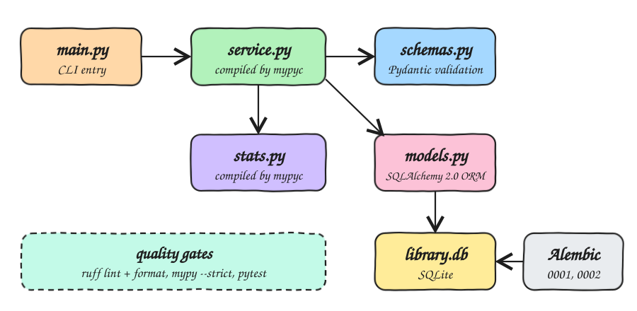

# python-3-mypy

A small typed book library CLI that is lint clean, passes `mypy --strict`, and ships its business
modules compiled to native C extensions with mypyc. Data lives in SQLite through the SQLAlchemy 2.0
typed ORM. Alembic manages the schema, and Pydantic validates every input and output.

## How it Works

1. `scripts/setup.sh` installs dependencies with `uv`, then type checks with `mypy --strict`.
2. `mypyc` compiles `library/service.py` and `library/stats.py` into `.so` extensions that sit next to the `.py` files.
3. Python imports the `.so` ahead of the `.py`, so the compiled code is what runs.
4. `alembic upgrade head` applies `0001` (authors) and `0002` (books) to `library.db`.
5. `library/main.py` validates the seed books with Pydantic, stores them through the service, and prints them as JSON.
6. The stats (total pages, average price, most expensive book) come from the compiled `stats` module.
7. The app prints whether each module came from mypyc, so you can confirm the native code ran.

## Architecture



## Features

* **mypyc compilation**: the typed modules run as native code, and mypyc checks their type annotations at runtime.
* **mypy --strict with the pydantic plugin**: every function is fully annotated, and field types are checked at build time.
* **ruff lint and format**: one fast tool enforces style, import order, pyupgrade and bugbear rules.
* **SQLAlchemy 2.0 `Mapped[...]` models**: the ORM columns are typed, so mypy understands queries and results.
* **Alembic migrations**: the schema is versioned. Tests build their database from migrations rather than `create_all`.
* **Pydantic schemas**: bad input (an empty title, zero pages, a negative price) is rejected before it can reach the database.
* **SQLite**: needs no server, and the whole app is a single file database.

## Stack

* Python 3.14: runtime.
* uv: fast dependency and virtualenv management.
* mypy + mypyc 2.3: static types and ahead-of-time compilation from those same types.
* ruff: linter and formatter.
* SQLAlchemy 2.0: typed ORM.
* Alembic: schema migrations.
* Pydantic 2: validation and serialization.
* pytest: tests.

## Contracts

The CLI prints one JSON line per `BookOut`, followed by one `LibraryStats` line:

```json
{"id":1,"title":"Fluent Python","pages":1014,"price":59.9,"author_id":1}
{"books":3,"total_pages":1698,"average_price":47.8,"most_expensive":"Fluent Python"}
```

| Schema | Fields | Rules |
|---|---|---|
| `AuthorIn` | `name` | 1 to 120 chars |
| `BookIn` | `title`, `pages`, `price`, `author` | title 1 to 200 chars, pages > 0, price >= 0 |
| `BookOut` | `id`, `title`, `pages`, `price`, `author_id` | built from the ORM row (`from_attributes`) |
| `LibraryStats` | `books`, `total_pages`, `average_price`, `most_expensive` | average rounded to cents |

The `LIBRARY_DB_URL` environment variable overrides the database URL. It defaults to `sqlite:///library.db`.

## Design Decisions

* **mypyc only compiles plain typed modules.** SQLAlchemy declarative classes and Pydantic models rely on
  metaclasses, which mypyc cannot compile. So `models.py` and `schemas.py` stay interpreted, while
  `service.py` and `stats.py` are compiled. Compiled code can call interpreted code freely.
* **`stats.py` takes plain lists** rather than ORM objects. This gives mypyc concrete `list[int]` and
  `list[float]` types to turn into native loops.
* **Runtime type enforcement.** A compiled function raises `TypeError` when called with the wrong type.
  `tests/test_stats.py` checks this, and the test skips when the module is not compiled.
* **Tests migrate a fresh temp database** with Alembic, so a broken migration fails the suite.
* `render_as_batch=True` in `migrations/env.py`, so future `ALTER` migrations work on SQLite.

## Layout

```
library/db.py            engine and session factory
library/models.py        SQLAlchemy ORM models
library/schemas.py       Pydantic schemas
library/service.py       business logic, compiled by mypyc
library/stats.py         pure computations, compiled by mypyc
library/main.py          CLI entry
migrations/versions/     Alembic migrations 0001, 0002
tests/                   pytest suites
```

## How to Run

```bash
./scripts/setup.sh
./scripts/start-all.sh
./scripts/test-all.sh
```

Running the app:

```
{"id":1,"title":"Fluent Python","pages":1014,"price":59.9,"author_id":1}
{"id":2,"title":"Robust Python","pages":380,"price":44.5,"author_id":2}
{"id":3,"title":"Architecture Patterns with Python","pages":304,"price":39.0,"author_id":3}
{"books":3,"total_pages":1698,"average_price":47.8,"most_expensive":"Fluent Python"}
service compiled by mypyc: True
stats compiled by mypyc: True
```

Running the tests:

```
ruff check        All checks passed!
ruff format       14 files already formatted
mypy --strict     Success: no issues found in 13 source files
pytest            11 passed
```

## Scripts

All scripts live in `scripts/` and run from any directory of the repository.

| Script | What it does |
|---|---|
| `./scripts/setup.sh` | Installs dependencies, type checks, compiles with mypyc, and runs the migrations |
| `./scripts/start-all.sh` | Migrates, runs the app, and prints the database link |
| `./scripts/status.sh` | Shows the venv, the compiled module count, the database, and the migration revision |
| `./scripts/test-all.sh` | Runs ruff lint, ruff format check, mypy strict and pytest |
| `./scripts/sql-console.sh` | Opens a sqlite3 console on `library.db` |

This is a CLI with no network services, so there is no `ports.env`, `ui.sh` or `stop-all.sh`.

```bash
./scripts/setup.sh
./scripts/start-all.sh
./scripts/status.sh
./scripts/sql-console.sh
```
