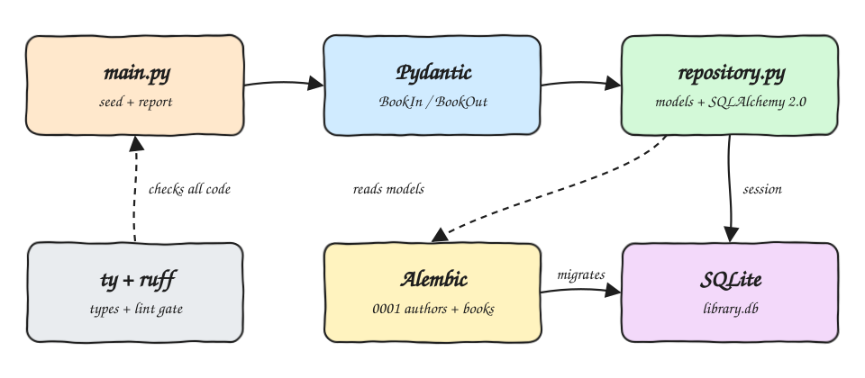

# python-3-ty

A proof of concept of [ty](https://github.com/astral-sh/ty), the Astral type checker, together with the
`ruff` linter, on a fully typed Python 3.14.7 app that stores books and authors in SQLite with
SQLAlchemy 2.0, evolves the schema with Alembic and validates every input and output with Pydantic v2.

## How it Works?

1. `alembic upgrade head` runs migration `0001`, which creates the `authors` and `books` tables in `library.db`.
2. `library` (the `main.py` entry point) seeds three books once, then prints every book as JSON and the books of one author.
3. Input goes through `BookIn` (Pydantic): title length, year range and ISBN pattern are validated before any SQL runs.
4. `repository.py` uses typed SQLAlchemy 2.0 models (`Mapped[...]`) and returns `BookOut` Pydantic models, never ORM rows.
5. `ty check` type checks `src/`, `tests/` and `migrations/`; `ruff` lints and formats them.
6. `broken/wrong_types.py` holds deliberate type bugs; the test gate requires ty to reject it, proving ty is really checking.

## Architecture



## Features

* **Typed ORM** - `Mapped[int]`, `Mapped[str | None]` and typed relationships let ty see column types end to end.
* **Validated boundaries** - Pydantic rejects bad data before it reaches the database.
* **Versioned schema** - Alembic migration autogenerated from the models, with upgrade and downgrade tested.
* **Type gate that can fail** - `broken/` must produce ty errors, so a misconfigured ty never silently passes.
* **Idempotent seed** - running the app twice does not duplicate rows.
* **Isolated tests** - every test migrates its own temporary SQLite file.

## Stack

* **Python 3.14.7** - pinned in `.python-version` and `requires-python`.
* **uv** - dependency management, virtualenv and build backend.
* **ty** - fast Rust-based type checker from Astral.
* **ruff** - linter and formatter from Astral.
* **SQLAlchemy 2.0** - typed ORM with native `Mapped` annotations.
* **SQLite** - zero setup file database.
* **Alembic** - schema migrations for SQLAlchemy.
* **Pydantic v2** - input validation and output serialization.
* **pytest** - tests.

## Contracts

There is no HTTP API. The contracts are the Pydantic models in `src/library/schemas.py`:

| Model | Fields |
|---|---|
| `BookIn` | `title: str (1-200)`, `year: int (1450-2100)`, `author: str (1-120)`, `isbn: str \| None (10-20 digits or dashes)` |
| `BookOut` | `id: int`, `title: str`, `year: int`, `isbn: str \| None`, `author_name: str` |

Repository functions in `src/library/repository.py`:

| Function | Signature |
|---|---|
| `add_book` | `(Session, BookIn) -> BookOut` |
| `list_books` | `(Session) -> list[BookOut]` |
| `books_by_author` | `(Session, str) -> list[BookOut]` |

## Key Data Structures and Design Decisions

* `authors (id, name unique)` 1..N `books (id, title, year, isbn unique nullable, author_id fk)`.
* ORM objects never leave the repository; callers only get `BookOut`, so session lifetime cannot leak.
* `session_scope` wraps one transaction: commit on success, rollback on error.
* The database URL comes from `LIBRARY_DB_URL` (default `sqlite:///library.db`), which the tests override.
* ty reports on `broken/wrong_types.py`:

```
error[invalid-return-type]: Return type does not match returned value
error[invalid-return-type]: Return type does not match returned value
error[missing-argument]: No argument provided for required parameter `data` of function `add_book`
error[invalid-argument-type]: Argument to function `add_book` is incorrect
Found 4 diagnostics
```

## How to run

```bash
./scripts/setup.sh
./scripts/start-all.sh
./scripts/test-all.sh
```

Output of `./scripts/start-all.sh`:

```
All books:
{"id":1,"title":"Dune","year":1965,"isbn":"978-0441172719","author_name":"Frank Herbert"}
{"id":2,"title":"Children of Dune","year":1976,"isbn":null,"author_name":"Frank Herbert"}
{"id":3,"title":"Neuromancer","year":1984,"isbn":"978-0441569595","author_name":"William Gibson"}
Books by Frank Herbert:
1965 Dune
1976 Children of Dune
database: sqlite:///library.db
```

Output of `./scripts/test-all.sh`:

```
ruff format
11 files already formatted
ruff lint
All checks passed!
ty check
All checks passed!
ty must reject broken/
ty rejected broken/ as expected
pytest
........                                                                 [100%]
8 passed
```

## Scripts

All scripts live in `scripts/` and run from any directory of the repository.

| Script | What it does |
|---|---|
| `./scripts/setup.sh` | Checks Python 3.14.7, installs dependencies and runs the migrations |
| `./scripts/start-all.sh` | Runs the migrations and the app, then prints the database link |
| `./scripts/status.sh` | Shows the SQLite database as UP or DOWN with its migration revision and book count |
| `./scripts/test-all.sh` | Runs ruff format, ruff lint, ty, the broken/ ty gate and pytest |
| `./scripts/sql-console.sh` | Opens a sqlite3 console on the database |

The app is a CLI with a file database, so it has no ports, no UI and no background process to stop.

```bash
./scripts/setup.sh
./scripts/start-all.sh
./scripts/status.sh
./scripts/sql-console.sh
```
