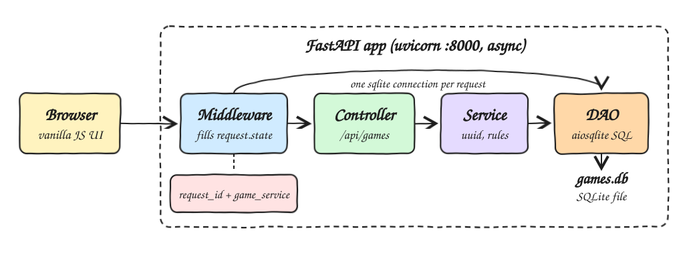
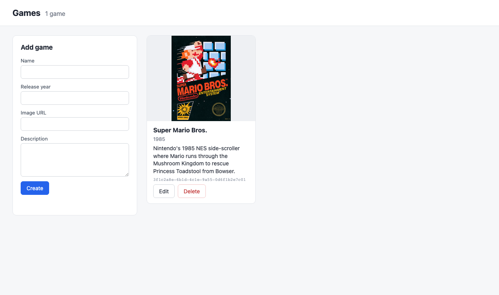
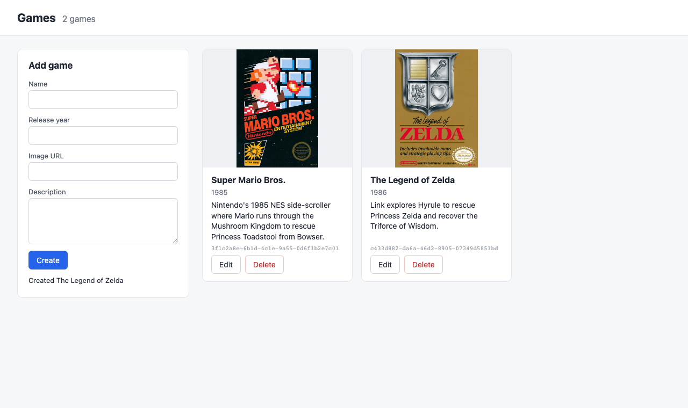
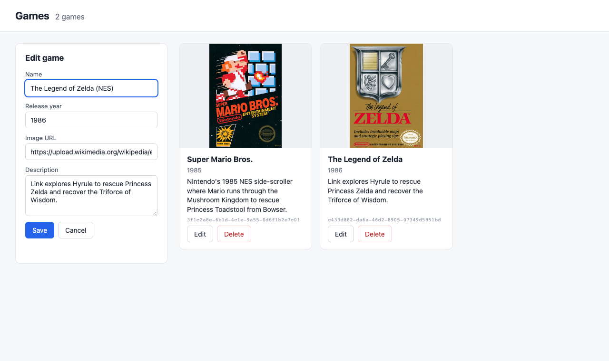
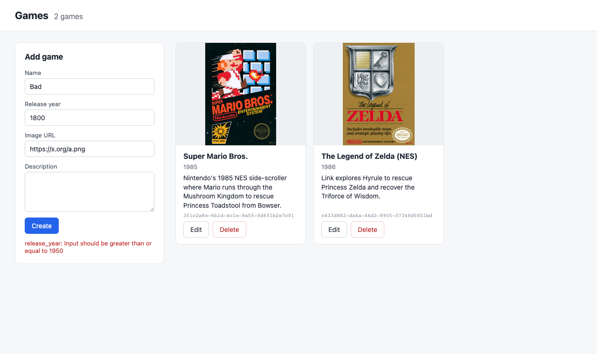

# Games CRUD with request.state

A small async CRUD for video games built with FastAPI and SQLite. Every game has a UUID, name,
description, release year and an image URL. It ships with Super Mario Bros. already in the database
and a vanilla JS page to list, create, edit and delete games.

## How it Works

1. `uvicorn` starts the app through the `create_app` factory; the lifespan hook creates `games.db`
   and seeds Super Mario Bros. only the first time the table is created.
2. For every request an HTTP middleware generates a `request_id`, opens one `aiosqlite` connection
   and puts `request.state.request_id` and `request.state.game_service` on the request.
3. The controller reads the service from `request.state` and calls it; the service builds the
   `Game` (server side UUID) and calls the DAO, which runs the SQL.
4. When the response returns the middleware closes the connection and adds the `X-Request-ID` header.
5. A missing game raises `GameNotFound` in the service, turned into a 404 carrying the same `request_id`.
6. The same app serves `static/` at `/`, so the UI and API share one port.

## Architecture



## Features

| Feature | Why |
|---|---|
| Full CRUD on `/api/games` | List, get, create, update and delete games from the UI or any HTTP client. |
| Super Mario Bros. seed | A fresh database is never empty, and a deleted seed does not come back on restart. |
| `request.state` wiring | Per request data (id, connection backed service) travels with the request, no globals. |
| `X-Request-ID` header | Every response, and every 404 body, can be correlated with the request that produced it. |
| Validation | Pydantic rejects blank names, years outside 1950-2100 and non http(s) image URLs with 422. |
| Vanilla JS UI | Card grid with cover images plus a create and edit form, no build step. |

## Stack

| Tech | Why |
|---|---|
| Python 3.14 | Modern type hints like `str \| None` and `list[Game]`. |
| FastAPI | Async routes, typed request and response models, OpenAPI for free. |
| uvicorn | ASGI server to run the async app. |
| aiosqlite | Async access to SQLite so the whole stack stays non blocking. |
| SQLite | Single file database, nothing to install or run. |
| Vanilla JS, HTML, CSS | The UI needs no framework or bundler. |
| pytest + httpx | Service tests on a temp database and API tests through `TestClient`. |

## API

Swagger UI is at http://localhost:8000/docs.

| Method | Path | Body | Response |
|---|---|---|---|
| GET | `/api/games` | | `200` list of games ordered by release year |
| GET | `/api/games/{id}` | | `200` game, `404` not found, `422` id is not a UUID |
| POST | `/api/games` | `GameInput` | `201` created game with generated `id` |
| PUT | `/api/games/{id}` | `GameInput` | `200` updated game, `404` not found |
| DELETE | `/api/games/{id}` | | `204`, `404` not found |

```json
{
  "name": "Super Mario Bros.",
  "description": "Nintendo's 1985 NES side-scroller...",
  "release_year": 1985,
  "image_url": "https://upload.wikimedia.org/wikipedia/en/0/03/Super_Mario_Bros._box.png"
}
```

A 404 looks like `{"detail": "game <id> not found", "request_id": "<same as X-Request-ID>"}`.

## Design Decisions

* Layers: `controller.py` (HTTP only) -> `service.py` (UUID generation, not found rules) -> `dao.py` (SQL only).
* `middleware.py` is the only place that builds the service graph, so each request gets its own
  connection, DAO and service and nothing is shared across concurrent requests.
* `models.py` has two Pydantic models: `GameInput` for what clients send and `Game` (`GameInput` + `id`)
  for what is stored and returned.
* The UUID is generated by the service, never by the client.
* `create_app(db_path)` is a factory so tests run against a temp database instead of `games.db`.

## Project Layout

```
src/main.py         app factory, lifespan, 404 handler, static files
src/middleware.py   fills request.state
src/controller.py   routes
src/service.py      business rules
src/dao.py          SQL with aiosqlite
src/db.py           schema and Super Mario Bros. seed
src/models.py       GameInput and Game
static/             index.html, app.js, styles.css
tests/              service and API tests
```

## Screenshots

### Game list



The first load: the seeded Super Mario Bros. card with its NES box art, release year, description
and UUID, and the empty "Add game" form on the left.

### Create



The Legend of Zelda was submitted through the form. The API returned `201`, the grid reloaded with
two cards ordered by release year, and the form shows the confirmation.

### Edit



Clicking Edit on a card loads it into the form, the title switches to "Edit game", the button
to Save and a Cancel button appears. Saving sends a `PUT`.

### Validation



A release year of 1800 is rejected by the API with `422`, and the field error is shown in red under
the form.

## Scripts

All scripts live in `scripts/` and run from any directory of the repository.

| Script | What it does |
|---|---|
| `./scripts/setup.sh` | Creates `.venv` and installs dependencies |
| `./scripts/start-all.sh` | Starts the app and waits for its port |
| `./scripts/status.sh` | Shows the app port as UP or DOWN |
| `./scripts/test-all.sh` | Runs every test suite |
| `./scripts/ui.sh` | Opens the UI in the browser |
| `./scripts/stop-all.sh` | Stops the app |
| `./scripts/sql-console.sh` | Opens a sqlite3 console on `games.db` |

Ports are declared in `scripts/ports.env` (`backend=8000`, serving both the API and the UI).

```bash
./scripts/setup.sh
./scripts/start-all.sh
./scripts/status.sh
./scripts/ui.sh
./scripts/test-all.sh
./scripts/stop-all.sh
```
