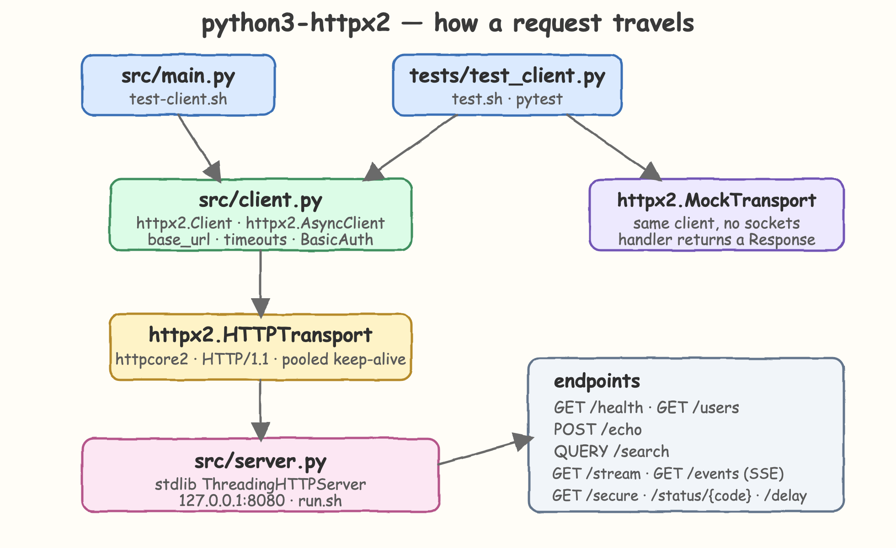
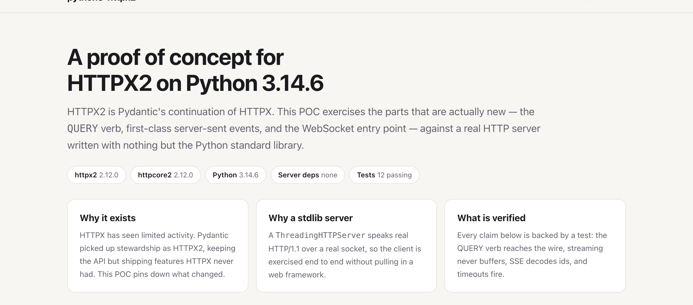
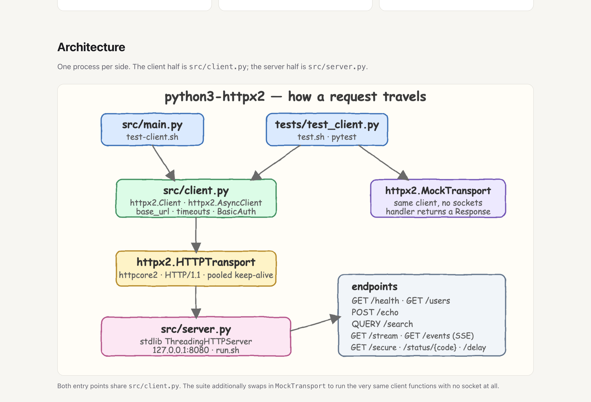
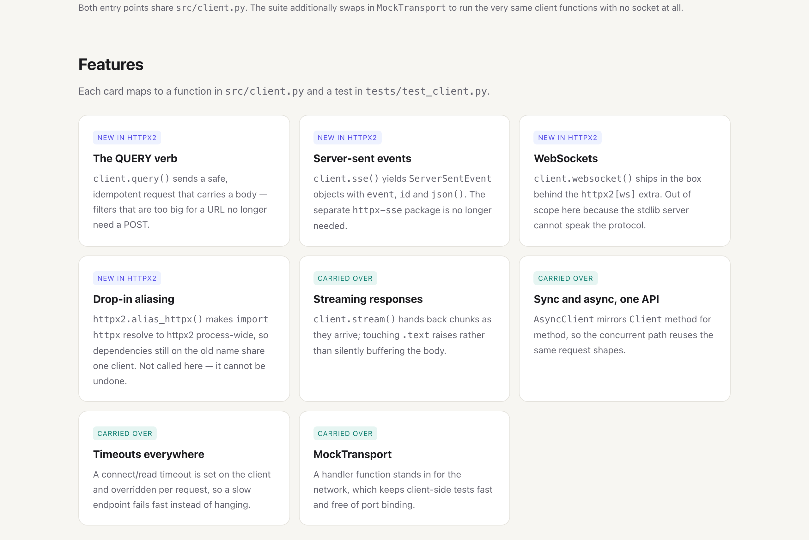
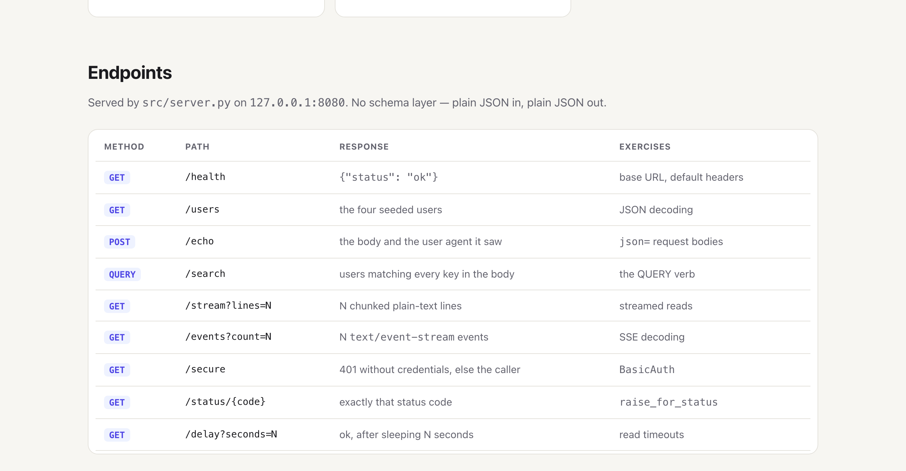
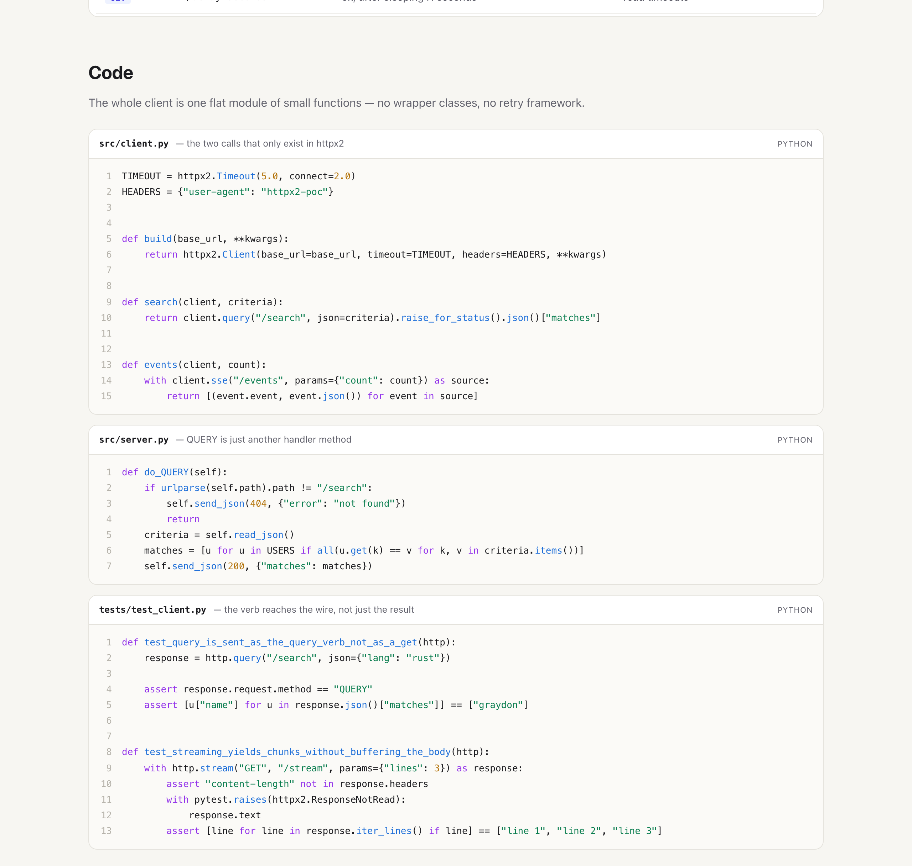
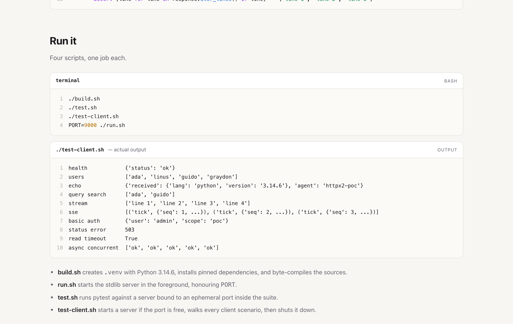

# python3-httpx2

A proof of concept for [HTTPX2](https://github.com/pydantic/httpx2) 2.12.0 on Python 3.14.6.

HTTPX2 is Pydantic's continuation of HTTPX: the same API, picked up and extended. This project exercises
the parts that are genuinely new — the `QUERY` verb, first-class server-sent events, the WebSocket entry
point, and `alias_httpx()` — plus the classics (streaming, async, auth, timeouts, mock transports) against
a real HTTP server written with nothing but the Python standard library.

## How It Works

`src/server.py` runs a `ThreadingHTTPServer` on `127.0.0.1:8080`. It answers plain JSON, emits chunked
bodies for streaming, emits `text/event-stream` for SSE, and implements `do_QUERY` so the new verb has
something real to talk to. No web framework is involved.

`src/client.py` is a flat module of small functions over `httpx2.Client` and `httpx2.AsyncClient`. Every
function is one call plus one assertion of shape — `health`, `users`, `echo`, `search`, `stream_lines`,
`events`, `secure`, `status_error`, `read_timeout`, `concurrent_health`.

Two entry points share that module. `src/main.py` walks every scenario in order and prints the result of
each, which is what `test-client.sh` runs. `tests/test_client.py` asserts the same behavior against a server
bound to an ephemeral port, and additionally swaps in `httpx2.MockTransport` to run the client with no
socket at all.

## Architecture



Both entry points go through the same `src/client.py`. The real path descends through `httpx2.HTTPTransport`
and `httpcore2` to a pooled HTTP/1.1 connection. The test suite can short-circuit that with `MockTransport`,
where a handler function returns a `Response` directly and no socket is ever opened.

## Features

- **The `QUERY` verb** — `client.query()` sends a safe, idempotent request that carries a body, so a filter too large for a URL no longer has to become a POST.
- **Server-sent events** — `client.sse()` yields `ServerSentEvent` objects with `event`, `id` and `json()`; the separate `httpx-sse` package is no longer needed.
- **WebSockets** — `client.websocket()` ships in the box behind the `httpx2[ws]` extra. Left out of this POC because the stdlib server cannot speak the protocol.
- **Drop-in aliasing** — `httpx2.alias_httpx()` makes `import httpx` resolve to httpx2 process-wide, so dependencies still importing the old name share one client. Not called here, because it cannot be undone once a test process has run it.
- **Streaming reads** — `client.stream()` hands back chunks as they arrive, and touching `.text` raises rather than silently buffering the whole body.
- **Sync and async, one API** — `AsyncClient` mirrors `Client` method for method, so the concurrent path reuses the same request shapes.
- **Timeouts everywhere** — a connect/read timeout is set on the client and overridden per request, so a slow endpoint fails fast instead of hanging.
- **Mock transport** — a handler function stands in for the network, keeping client-side tests fast and free of port binding.

## Stack

- **Python 3.14.6** — the target runtime; also the version where `zstd` decoding comes from the standard library rather than an extra.
- **httpx2 2.12.0** — the library under test.
- **httpcore2 2.12.0** — its transport layer, pulled in automatically.
- **`http.server` (stdlib)** — the server side, so the POC adds no web framework.
- **pytest 8.4.2** — the only development dependency.

## API

Served by `src/server.py`. Plain JSON in, plain JSON out — no schema layer, so no Swagger.

| Method | Path | Response | Exercises |
| --- | --- | --- | --- |
| `GET` | `/health` | `{"status": "ok"}` | base URL, default headers |
| `GET` | `/users` | the four seeded users | JSON decoding |
| `POST` | `/echo` | the body and the user agent it saw | `json=` request bodies |
| `QUERY` | `/search` | users matching every key in the body | the `QUERY` verb |
| `GET` | `/stream?lines=N` | N chunked plain-text lines | streamed reads |
| `GET` | `/events?count=N` | N `text/event-stream` events | SSE decoding |
| `GET` | `/secure` | 401 without credentials, else the caller | `BasicAuth` |
| `GET` | `/status/{code}` | exactly that status code | `raise_for_status` |
| `GET` | `/delay?seconds=N` | ok, after sleeping N seconds | read timeouts |

## Key Data Structures and Design Decisions

`USERS` in `src/server.py` is a four-row list of dicts. `do_QUERY` filters it by matching every key in the
request body, which is enough to prove the verb carries a body and to give the test a result worth asserting.

Three decisions shape the rest:

- **A real socket, not an ASGI shim.** `ASGITransport` would have been less code, but it bypasses the
  transport layer. A stdlib `ThreadingHTTPServer` costs nothing in dependencies and exercises real HTTP/1.1,
  chunked framing included.
- **Functions, not a client class.** Each client function is a single call. Wrapping `httpx2.Client` in a
  class of our own would hide the very API this POC exists to show.
- **Tests assert the mechanism, not just the value.** `test_query_is_sent_as_the_query_verb_not_as_a_get`
  checks `response.request.method`, and the streaming test asserts there is no `content-length` and that
  `.text` raises `ResponseNotRead` — so the tests fail if the library silently falls back to a buffered GET.

## How to Run

```bash
./build.sh          # create .venv on Python 3.14.6 and install pinned deps
./test.sh           # run the 12-test suite
./test-client.sh    # start a server, walk every client scenario, shut it down
./run.sh            # start the server in the foreground (PORT=9000 ./run.sh to move it)
```

`./test-client.sh` prints:

```
health            {'status': 'ok'}
users             ['ada', 'linus', 'guido', 'graydon']
echo              {'received': {'lang': 'python', 'version': '3.14.6'}, 'agent': 'httpx2-poc'}
query search      ['ada', 'guido']
stream            ['line 1', 'line 2', 'line 3', 'line 4']
sse               [('tick', {'seq': 1, ...}), ('tick', {'seq': 2, ...}), ('tick', {'seq': 3, ...})]
basic auth        {'user': 'admin', 'scope': 'poc'}
status error      503
read timeout      True
async concurrent  ['ok', 'ok', 'ok', 'ok', 'ok']
```

## UI

`index.html` is a self-contained page documenting the POC. Open it directly in a browser — no server needed.

### Overview



The landing section states what the POC is and pins the versions it was verified against: httpx2 2.12.0,
httpcore2 2.12.0, Python 3.14.6, zero server dependencies, 12 passing tests. The three cards answer why
HTTPX2 exists, why the server is stdlib-only, and what the suite actually proves.

### Architecture



The same hand-drawn diagram as above, with the caption spelling out the split: both entry points share
`src/client.py`, and the suite can swap the transport underneath it.

### Features



Eight cards, tagged so the split is obvious at a glance — purple **new in httpx2** for `QUERY`, SSE,
WebSockets and aliasing; teal **carried over** for streaming, async, timeouts and `MockTransport`.

### Endpoints



The endpoint table, with the method badge, the path, the response shape, and the client behavior each
route exists to exercise. `QUERY /search` is the row that has no equivalent in HTTPX.

### Code



Three line-numbered, syntax-highlighted snippets: the two client calls unique to httpx2, the seven-line
`do_QUERY` handler that serves them, and the tests that check the verb reached the wire and that streaming
never buffered the body.

### Run



The four commands, the real output of `./test-client.sh`, and one line per script saying what it does.
