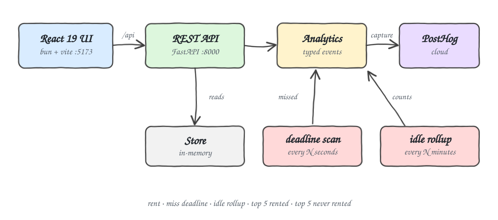
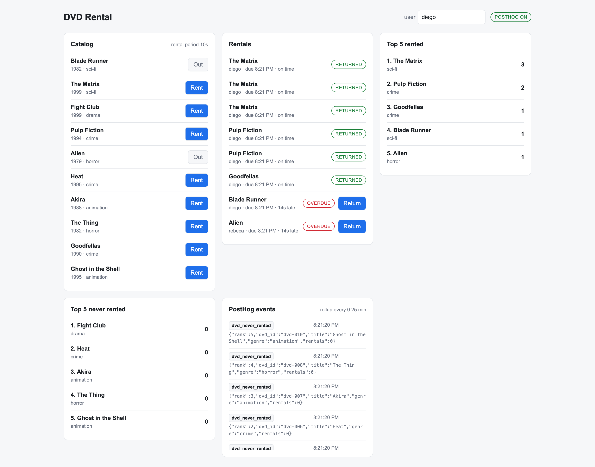
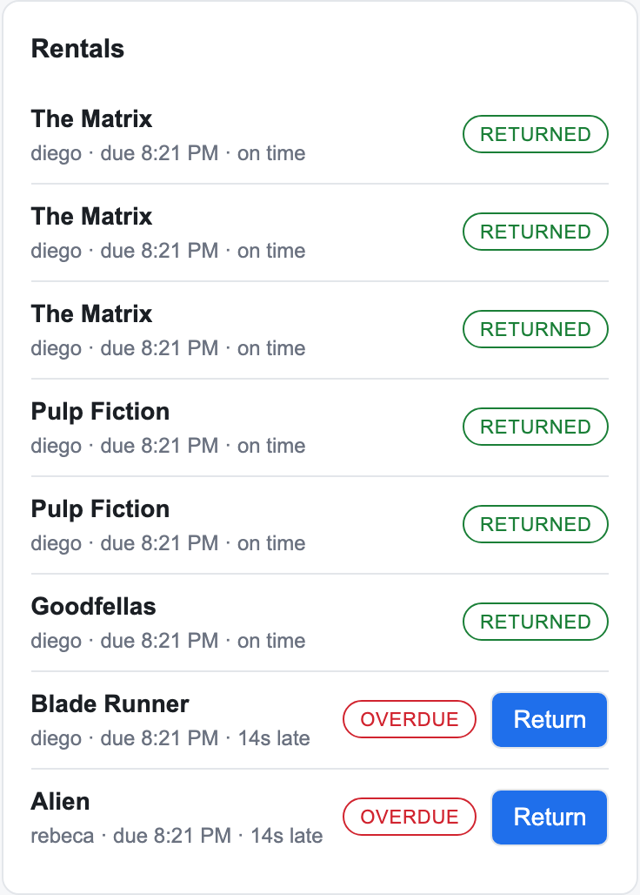
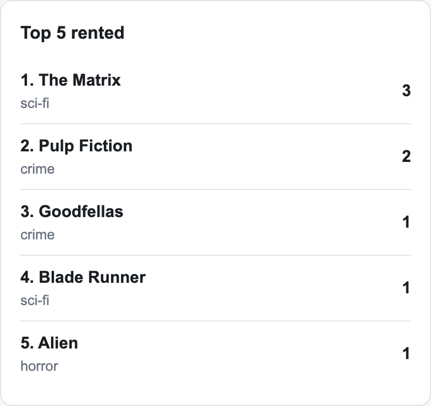
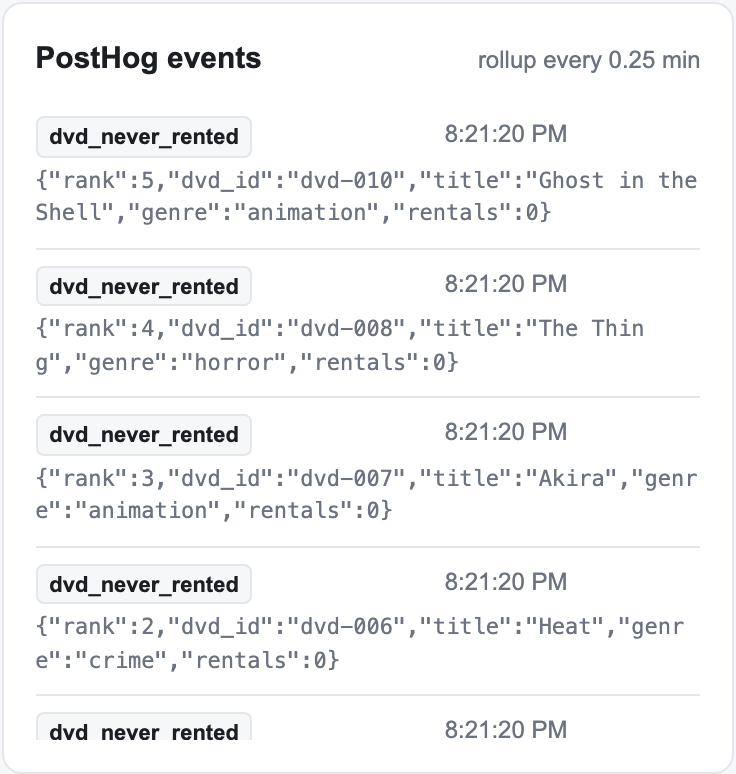

# DVD Rental + PostHog

A DVD rental POC where the REST API is the source of truth for product metrics. Every rental,
every missed deadline and every idle-catalog rollup is captured as a typed PostHog event, and a
React dashboard shows the same numbers live so you can watch the counters move while you click.

## How it Works

1. The React UI calls the FastAPI backend through the Vite dev proxy under `/api`.
2. Renting a DVD creates a `Rental` with a deadline built from `RENTAL_PERIOD_HOURS` plus
   `RENTAL_PERIOD_SECONDS`, and captures `dvd_rented`.
3. A background worker scans for passed deadlines every `DEADLINE_SCAN_SECONDS` and captures
   `dvd_deadline_missed` exactly once per rental, carrying the lateness in seconds, minutes and hours.
4. A second worker runs every `ROLLUP_INTERVAL_MINUTES` and captures `dvds_idle_rollup` with how
   many titles saw no rental in that window, plus the ranked `dvd_top_rented` and `dvd_never_rented`
   counters.
5. Every captured event is also kept in a small in-memory ring buffer and served at `/events`, so
   the UI can show exactly what was sent to PostHog without opening the PostHog console.

Because the deadline and rollup windows are configurable down to seconds and fractional minutes,
the slow real-world metrics are testable in under a minute.

## Architecture



## Features

| Feature | Why |
|---|---|
| `dvd_rented` counter | The base signal every rental ranking is derived from, carrying title and genre so PostHog can group by them. |
| `dvd_deadline_missed` counter | Late returns are the money metric; the event ships lateness in seconds, minutes and hours so short test windows stay readable. |
| `dvds_idle_rollup` counter | Answers how much of the catalog earned nothing in a window, reported in both minutes and hours. |
| `dvd_top_rented` ranking | The top 5 busiest titles, emitted with an explicit rank so no PostHog insight is needed to see it. |
| `dvd_never_rented` ranking | The 5 titles nobody touched, the inventory you should stop buying. |
| Live event feed | `/events` mirrors everything sent to PostHog, so a metric can be verified without leaving the app. |
| Tunable clocks | Rental period, deadline scan and rollup window are environment variables, so hour-scale behavior is testable in seconds. |

## Stack

| Choice | Why |
|---|---|
| Python 3.14 | Required for the backend; the code uses `X \| None` unions, `StrEnum` and slotted dataclasses. |
| FastAPI + uvicorn | Typed request and response models with a generated OpenAPI schema, no hand-written validation. |
| posthog | The official SDK, batching and flushing events off the request path. |
| React 19 | The UI target; hooks-only, no state library needed for this size. |
| TypeScript 7 (`tsgo`) | The native-Go preview compiler, run as a build gate via `@typescript/native-preview`. |
| Vite + bun | Fast dev server and the `/api` proxy that removes CORS from the dev loop. |
| pytest | Backend tests, including the timing behavior of the deadline worker. |

## Contracts

Swagger UI is served at `http://localhost:8000/docs` and the schema at `/openapi.json`.

| Method | Path | What it does |
|---|---|---|
| `GET` | `/health` | Status, whether PostHog is configured, and the active timing knobs |
| `GET` | `/dvds` | Catalog with an `available` flag per title |
| `POST` | `/rentals` | Rents a DVD. Body `{"dvd_id": "dvd-002", "user_id": "diego"}`. `409` if already out, `404` if unknown |
| `POST` | `/rentals/{rental_id}/return` | Returns a rental. `404` if unknown |
| `GET` | `/rentals` | Every rental with status and current lateness |
| `GET` | `/stats/top-rented` | Top 5 most rented titles, ranked |
| `GET` | `/stats/never-rented` | Top 5 titles never rented |
| `GET` | `/events` | The events captured to PostHog, newest first |

### Events sent to PostHog

| Event | Distinct id | Key properties |
|---|---|---|
| `dvd_rented` | user | `dvd_id`, `title`, `genre`, `year`, `rented_at`, `due_at` |
| `dvd_deadline_missed` | user | `dvd_id`, `title`, `due_at`, `overdue_seconds`, `overdue_minutes`, `overdue_hours` |
| `dvds_idle_rollup` | `dvd-rental-backend` | `window_minutes`, `window_hours`, `idle_count`, `rented_count`, `catalog_size` |
| `dvd_top_rented` | `dvd-rental-backend` | `rank`, `dvd_id`, `title`, `rentals` |
| `dvd_never_rented` | `dvd-rental-backend` | `rank`, `dvd_id`, `title`, `rentals` |

## Design Decisions

* **`Store` owns the lock, not the service.** Renting checks availability and inserts the rental in
  one critical section (`start_rental`), so two concurrent requests cannot both rent the same disc.
* **Deadlines are claimed, not polled.** `claim_missed_deadlines` flips `deadline_reported` under the
  lock and returns only newly-late rentals, so a counter is emitted once no matter how often the
  worker runs or how long the disc stays out.
* **Analytics is one module with one `_emit`.** Every event goes through a single typed method, which
  is what keeps the property names stable across five different counters.
* **The PostHog client is injectable.** `create_app(posthog=None)` is how the test suite runs without
  writing into a real project.
* **Derived units come from one rounded value.** `overdue_minutes` and `overdue_hours` are computed
  from the already-rounded `overdue_seconds`, so the three properties never disagree.
* **State is in memory on purpose.** This is a metrics POC; a restart is a clean slate and no
  database is needed to exercise any of the five counters.

## Configuration

`.env` holds the PostHog credentials and is git-ignored. `.env.example` shows the shape.

| Variable | Default | What it does |
|---|---|---|
| `POSTHOG_PROJECT_TOKEN` | — | PostHog project token. Without it the app runs and the UI shows `posthog off` |
| `POSTHOG_HOST` | — | PostHog host |
| `RENTAL_PERIOD_HOURS` | `0` | Hours added to a rental deadline |
| `RENTAL_PERIOD_SECONDS` | `30` | Seconds added to a rental deadline |
| `DEADLINE_SCAN_SECONDS` | `5` | How often late rentals are detected |
| `ROLLUP_INTERVAL_MINUTES` | `1` | Idle rollup window, accepts fractions such as `0.25` |
| `TOP_LIMIT` | `5` | Size of both leaderboards |
| `API_PORT` | `8000` | Backend port |

To watch a deadline miss immediately:

```bash
RENTAL_PERIOD_SECONDS=5 DEADLINE_SCAN_SECONDS=1 ROLLUP_INTERVAL_MINUTES=0.25 ./scripts/start-all.sh
```

## Scripts

All scripts live in `scripts/` and run from any directory of the repository.

| Script | What it does |
|---|---|
| `./scripts/setup.sh` | Installs dependencies and prepares the app |
| `./scripts/start-all.sh` | Starts every service and waits for its port |
| `./scripts/status.sh` | Shows every service port as UP or DOWN |
| `./scripts/test-all.sh` | Runs every test suite |
| `./scripts/ui.sh` | Opens the UI in the browser |
| `./scripts/stop-all.sh` | Stops every service |
| `./scripts/set-posthog-key.sh` | Stores your PostHog personal API key, prompting with hidden input |
| `./scripts/posthog-dashboard.sh` | Creates the five metric insights on the PostHog dashboard |

Ports are declared in `scripts/ports.env`.

### PostHog dashboard

`posthog-dashboard.sh` builds the dashboard from the events this app emits. It validates every
query against the live API first and creates nothing unless `--apply` is passed, and it matches
insights by name so re-running updates them instead of duplicating them.

```bash
./scripts/set-posthog-key.sh
./scripts/posthog-dashboard.sh
./scripts/posthog-dashboard.sh --apply
```

The key needs the `project:read`, `dashboard:write`, `insight:write` and `query:read` scopes.
`POSTHOG_PROJECT_ID`, `POSTHOG_DASHBOARD_ID` and `POSTHOG_DASHBOARD_NAME` override the targets.

```bash
./scripts/setup.sh
./scripts/start-all.sh
./scripts/status.sh
./scripts/ui.sh
./scripts/stop-all.sh
```

## How to run the tests

```bash
./scripts/test-all.sh
```

Runs the backend suite with pytest and gates the frontend on a TypeScript 7 typecheck plus a
production Vite build. The backend tests never write to PostHog.

## Screenshots

### Dashboard



The whole app in one view. **Catalog** shows the ten titles, with `Out` on the two that are
currently rented. **Rentals** lists every rental; the five returned on time carry a green badge,
while Blade Runner and Alien are past their 10 second deadline and show a red `OVERDUE` badge with
`14s late`. **Top 5 rented** ranks The Matrix at 3 rentals ahead of Pulp Fiction at 2.
**Top 5 never rented** lists the five titles nobody touched. **PostHog events** streams what was
captured, newest first. The header confirms `POSTHOG ON`.

### Rentals and deadlines



The deadline counter in action. Each row shows the renter, the due time and how late it is. Lateness
is rendered in hours, minutes and seconds, dropping the units that are zero, which is the same
breakdown shipped on the `dvd_deadline_missed` event, so what you read here is what PostHog receives.

### Leaderboards



The top 5 most rented titles with their rental counts. The ranking is computed from the same rental
history that produces the `dvd_top_rented` events, so the panel and the PostHog counter cannot drift.

### PostHog event feed



Every captured event with its timestamp and full property payload. Here the last rollup emitted the
`dvd_never_rented` counters, each carrying its `rank`, `dvd_id`, `title`, `genre` and `rentals: 0`.
This panel is the fastest way to confirm a metric fires before going to look at PostHog.
