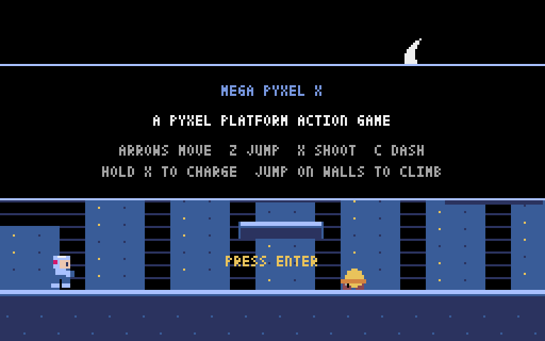
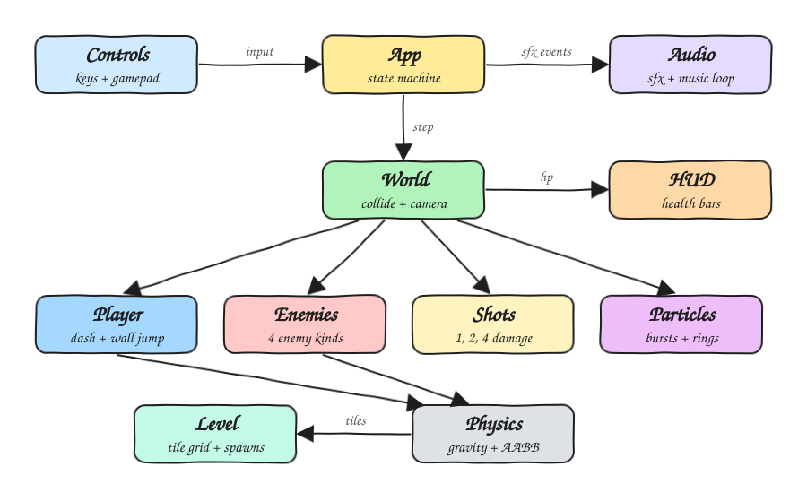
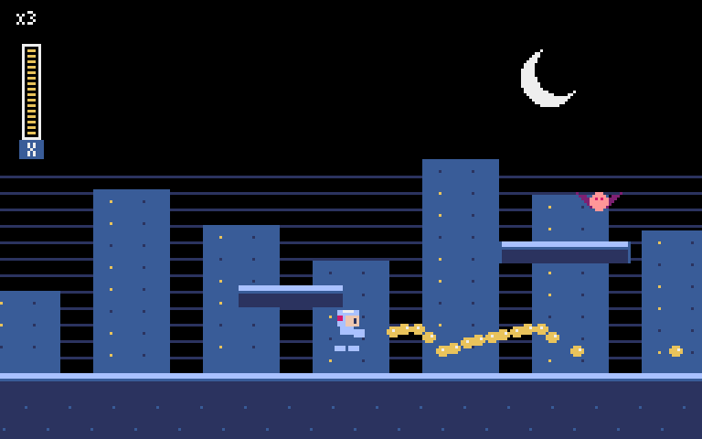
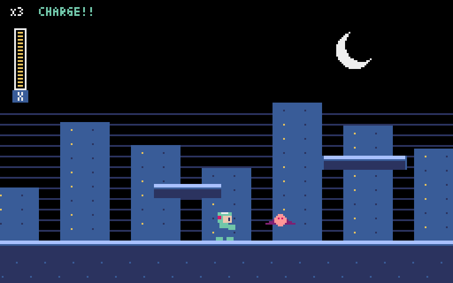
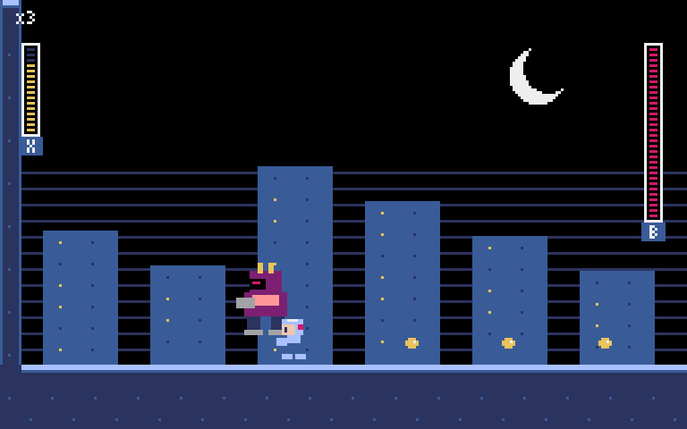
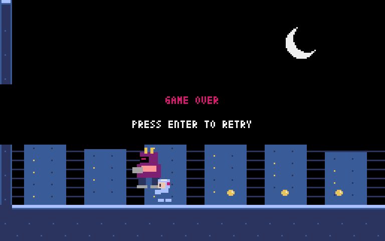

# Mega Pyxel X



Mega Pyxel X is a small side-scrolling action platformer in the style of Mega Man X1. It is written in typed Python 3.14 on top of [Pyxel](https://github.com/kitao/pyxel), the retro game engine. You run, dash, wall-jump and charge the buster through a night highway stage, then fight a boss in a locked arena.

## How it Works

1. `main.py` opens a 256x160 Pyxel window at 60 FPS and hands control to `App`.
2. `App` is a state machine (`TITLE`, `PLAY`, `WIN`, `OVER`) that reads input once per frame into an immutable `Controls` value.
3. `World.update` advances the player, the enemies near the camera, shots and particles, then resolves collisions.
4. Every moving body is an axis-aligned box. `physics.move` moves it on X and then on Y against the tile grid, snapping it flush to tiles.
5. The level is built from a list of blocks and markers in `layout.py`. Markers become spawns for the player, enemies, checkpoints, the arena gate and the boss.
6. Entities only queue sound events. `App` plays them, so all game logic runs without a window or an audio device.
7. Crossing into the arena closes the gate with solid tiles and locks the camera. Beating the boss wins the game.

## Architecture



## Features

* Dash and dash-jump: hold `C` to dash on the ground, and jump during a dash to carry the dash speed through the air.
* Wall slide and wall jump: hold toward a wall in the air to slide down it, then press jump to kick off it. This is how you climb the tall wall in the middle of the stage.
* Charged X-Buster: a tap fires a 1-damage shot, and holding `X` charges a 2-damage shot or a 4-damage shot that keeps going through enemies it destroys.
* Variable jump height: releasing jump early cuts the jump short, for precise platforming.
* Four enemy kinds: walkers patrol ledges, flyers chase you, turrets shoot at you, and the boss cycles jump, spread-shot and dash attacks. It gets faster below half health.
* Spike pits and falls kill instantly, like in the original game.
* Checkpoints and lives: you get 3 lives and respawn at the last checkpoint you reached.
* Boss arena: the gate closes behind you, the camera locks to the arena, and a boss health bar appears.
* Chiptune music and sound effects built with Pyxel's sound API, no audio files needed.
* Parallax city background and MMX-style vertical health bars.

## Stack

* Python 3.14: PEP 695 `type` aliases, PEP 649 lazy annotations, `match` statements and slotted dataclasses.
* Pyxel 2.9.9: one dependency for the window, input, drawing and sound.
* mypy `--strict`: the game, tests and scripts all type-check with no `Any` leaks.
* unittest from the standard library: no test framework to install.

## Contracts

Controls (`src/game/controls.py`)

| Key | Gamepad | Action |
|-----|---------|--------|
| Left / Right | D-pad | Move |
| Z / Space | A | Jump, wall jump |
| X | B | Shoot, hold to charge |
| C | X | Dash |
| Enter | Start | Start or retry |
| Esc | | Quit |

Level markers (`src/game/layout.py`)

| Char | Meaning |
|------|---------|
| `#` | Solid tile |
| `^` | Spikes |
| `P` | Player start |
| `C` | Checkpoint |
| `A` | Arena gate column |
| `W` / `F` / `T` | Walker / Flyer / Turret |
| `B` | Boss |

## Key Data Structures and Design Decisions

* `Body` is a slotted dataclass with position, size, velocity, `on_ground` and `wall` (-1, 0 or 1). Player, enemies and shots all share it, so a single collision routine covers them all.
* `Controls` is a frozen dataclass. `read_controls()` is the only code that touches the keyboard, which lets tests drive the player with scripted inputs.
* `Level` is a mutable grid of characters. Outside the left and right edges counts as solid, and below the bottom is open, so falling is a death.
* `Enemy` is an abstract base class with `act` and `render` hooks. The base class handles hit flash and timers, and the boss is a subclass with a small `Move` enum state machine.
* Flicker effects use each entity's own timers instead of the global frame counter. This keeps rendering deterministic, which is how the headless screenshots are made.
* Enemies only update while they are near the camera, so turrets don't fire from off-screen.

## How to Run

```bash
./scripts/setup.sh
./scripts/start-all.sh
```

Tests (mypy strict, then 31 unit tests):

```bash
./scripts/test-all.sh
```

Regenerate the printscreens (headless Pyxel, captures only the game screen):

```bash
./scripts/screenshots.sh
```

## Printscreens

### Title


The stage scrolls behind the title banner with the controls listed. Press Enter to start.

### Running and shooting



X runs right while tapping the buster. The yellow shots stream toward a flyer, the player health bar is on the left and the lives counter is at the top.

### Full charge



Holding `X` turns the armor green and shows `CHARGE!!` in the HUD. Releasing it now fires the 4-damage piercing shot.

### Boss fight



The gate on the left has closed and the boss health bar has appeared on the right. The boss is mid-jump over X, who keeps firing at it.

### Game over



When the last life is gone the game over banner appears, and Enter starts a new run.


## Scripts

All scripts live in `scripts/` and run from any directory of the repository. The game is a desktop window, so there are no ports, no browser UI and no database.

| Script | What it does |
|---|---|
| `./scripts/setup.sh` | Creates the Python 3.14 `.venv` and installs dependencies |
| `./scripts/start-all.sh` | Starts the game window in the background, pid in `.run/`, log in `.run/logs/` |
| `./scripts/status.sh` | Shows the game window as UP or DOWN with its pid |
| `./scripts/test-all.sh` | Runs mypy strict and every unit test |
| `./scripts/stop-all.sh` | Stops the game window |
| `./scripts/screenshots.sh` | Regenerates the printscreens headlessly |

```bash
./scripts/setup.sh
./scripts/start-all.sh
./scripts/status.sh
./scripts/stop-all.sh
```
