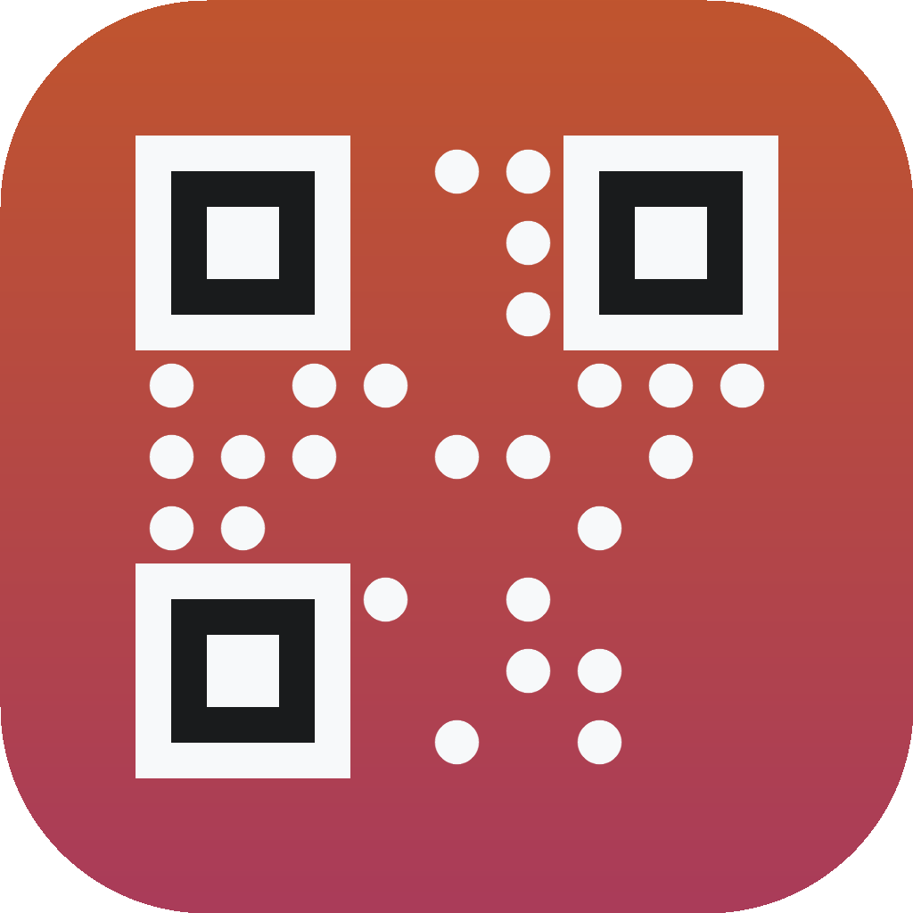
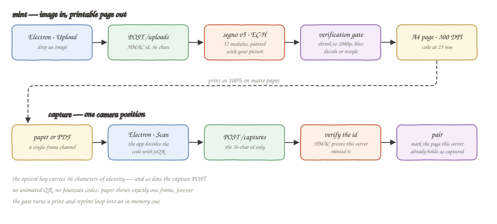
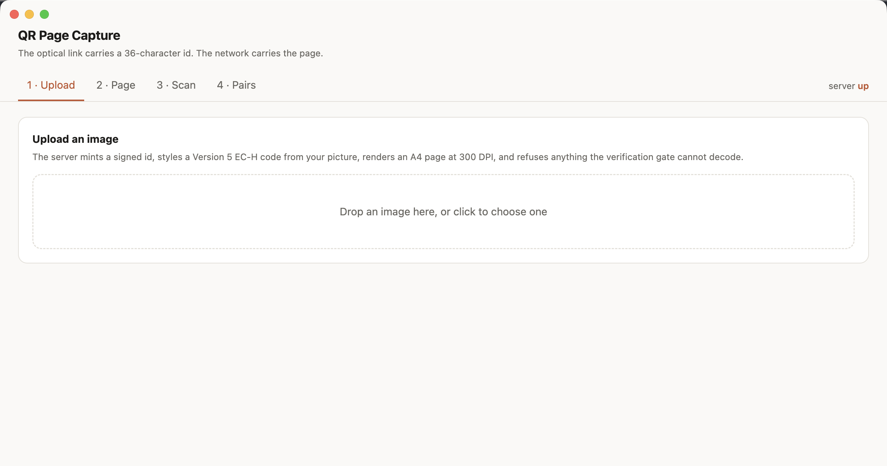
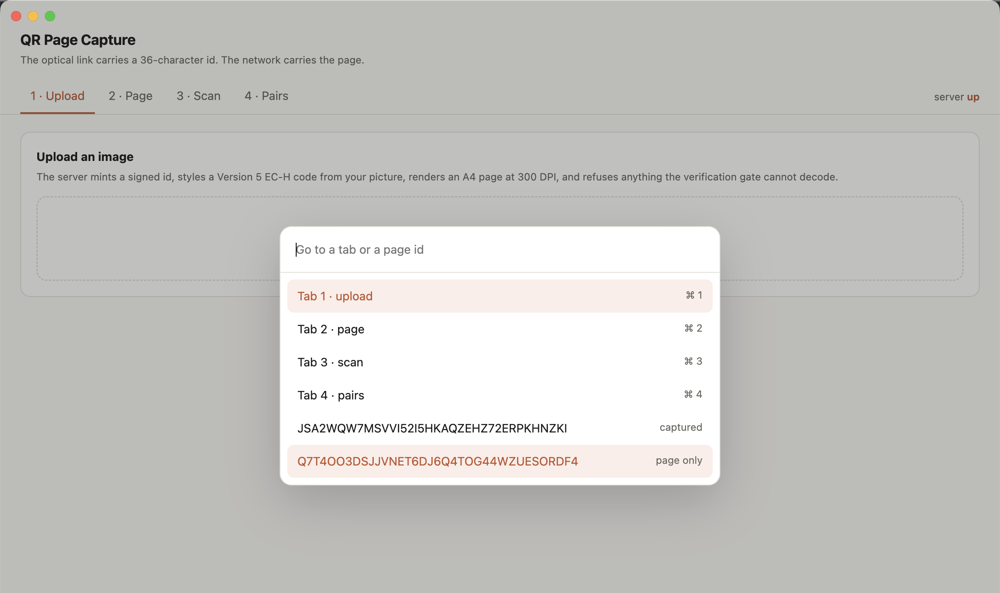
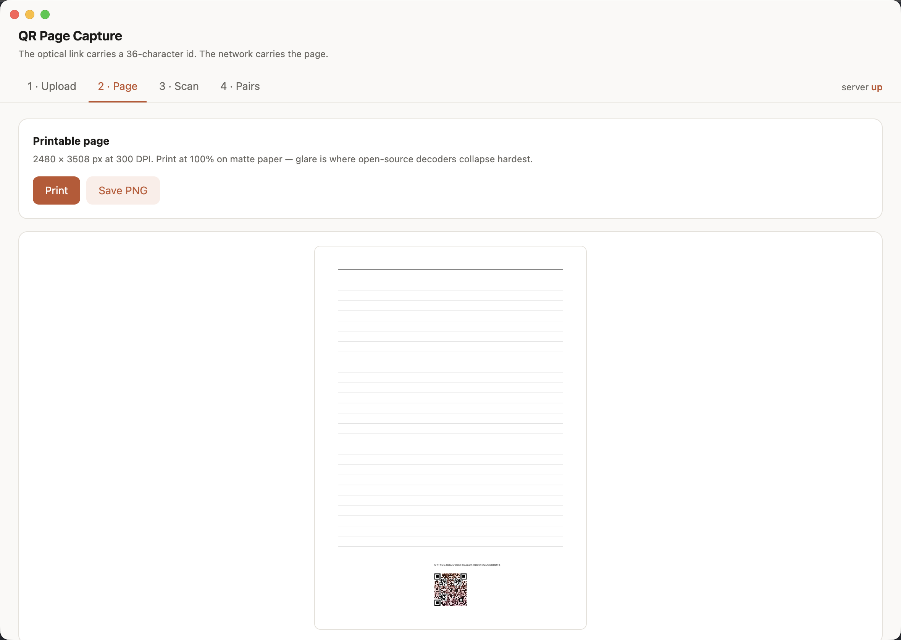
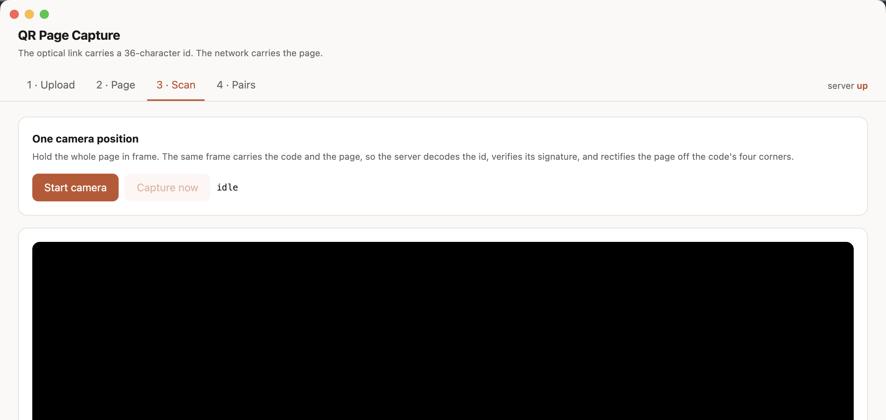
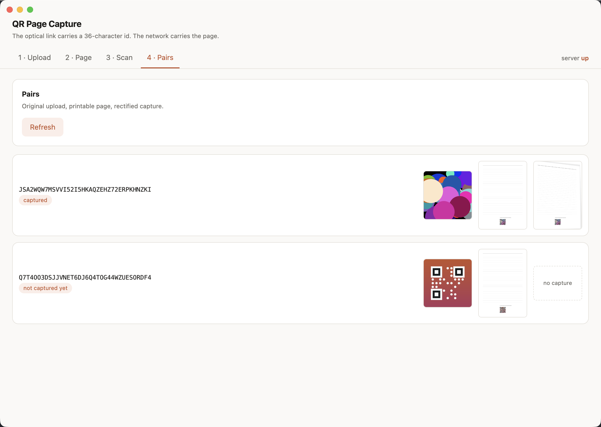
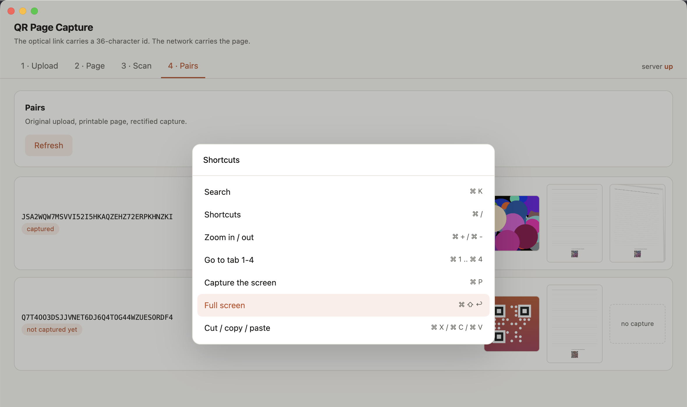

# QR Page Capture

Upload an image and get back a printable A4 page whose QR code is painted with that image. Print it into a notebook. Later, point a camera at the page once: the same frame carries both the code and the page, so the server reads the id, proves it signed it, rectifies the page off the code's four corners, and pairs the capture with the original upload.

This is an implementation of the *Notebook PoC Plan* from [qr-image-qrt-screen-to-camera-poc-09-2026](../../html-research/qr-image-qrt-screen-to-camera-poc-09-2026.html), with the phone replaced by a macOS desktop app.

## How It Works

The optical channel carries **identity, not data**. A 36-character signed id fits a Version 5 EC-H code with room to spare, and HTTPS carries the megabytes.

1. You drop an image. The server mints a 36-character HMAC-signed id.
2. `segno` encodes that id at Version 5, error correction H — 37 modules across.
3. The image is composited over the code: every module is biased toward its true value, then a solid dot is stamped at each module centre. Function patterns stay untouched.
4. The **verification gate** shrinks the rendered page to a 1080p framing, blurs it, tilts it three ways, and decodes. Anything that fails is restyled with less image and a bigger dot, up to a plain code.
5. The survivor is drawn onto an A4 page at 300 DPI with the code at 25 mm.
6. You photograph the page. One frame, one position.
7. The server decodes the id, rejects it unless the signature checks out, and uses the code's four corners as fiducials for a single `getPerspectiveTransform` that rectifies the whole page.

QRT, animated QR and fountain codes are all deliberately absent: paper displays exactly one frame forever, and a machine that can upload already has a network.

## Architecture



## Features

- **One camera position.** The frame that reads the code is the frame that photographs the page, so there is no move-close-then-pull-back mode switch.
- **Verification gate before styling.** Nothing ships that a simulated camera cannot decode, which turns a print-and-reprint loop into an in-memory one.
- **Adaptive styling.** Four strength levels, escalating only when the gate refuses, so each page keeps as much picture as it can afford.
- **Signed ids.** The server verifies its own HMAC rather than trusting a client's claim about what it scanned.
- **Deskew off the QR.** The code is a square of known geometry, so page rectification falls out of the thing already being decoded — no document-scanner SDK.
- **Desktop app with real macOS manners.** Single instance, remembered window position, ⌘K search, ⌘/ shortcuts, ⌘1–4 tabs, zoom, screen capture, full screen.

## Stack

| Layer | Choice | Why |
|---|---|---|
| API | FastAPI + uvicorn | Two endpoints; multipart parsing and validation for free |
| QR generation | segno | Pure Python, zero dependencies, exposes the raw module matrix |
| Styling, gate, deskew | OpenCV + numpy | One library covers compositing, decoding and the homography |
| Desktop app | Electron | The camera, the print dialog and the file save are all one runtime |
| Packaging | electron-packager | Produces a `.app` the install script drops into `/Applications` |

Six Python dependencies and two app dev-dependencies. No Pillow (OpenCV does the pixels), no PDF library (a 300 DPI PNG prints), no QR library in the app (the server decodes the frame it already receives).

### Two deviations from the plan

- **`cv2.QRCodeDetector` instead of `pyzbar`.** It removes the `brew install zbar` native dependency, and it returns the four corners the deskew needs anyway. `pyzbar` is the more tolerant decoder, so this trades a little decode robustness for one fewer moving part.
- **The client does not decode.** The plan has the phone read the id and post both. Here the app posts one frame and the server decodes it, which deletes the client-side decoder entirely and makes "one camera position" structural rather than a UX rule.

## API

| Method | Path | Body | Returns |
|---|---|---|---|
| `POST` | `/uploads` | multipart `image` | `{id, style_attempt, image_strength, code_mm, captured}` |
| `POST` | `/captures` | multipart `frame` | the same entry, now `captured: true` |
| `GET` | `/pairs` | — | every entry, sorted by id |
| `GET` | `/pairs/{id}` | — | one entry |
| `GET` | `/pages/{id}.png` | — | the 2480 × 3508 printable page |
| `GET` | `/originals/{id}.png` | — | the uploaded image |
| `GET` | `/captures/{id}.png` | — | the rectified capture |

`POST /uploads` answers `422` when no styling survives the gate. `POST /captures` answers `422` for a frame with no code, an id whose signature fails, or an id this server never minted. Uploads over 12 MB get `413`; anything OpenCV cannot decode gets `415`.

Interactive docs are at `http://127.0.0.1:8000/docs` while the server runs.

## Key Data Structures And Decisions

**The id.** 12 random bytes plus a 10-byte HMAC-SHA256 tag, base32 without padding: 20 + 16 = 36 characters. Base32 is uppercase alphanumeric, so the code uses QR's alphanumeric mode, where Version 5 EC-H holds 64 characters. The payload is comfortably inside the smallest version that still looks like a picture.

**The module matrix.** `segno` exposes the raw 37 × 37 matrix. A separate boolean mask marks the function patterns — finder squares with separators and format information, both timing lines, and the alignment pattern — and those modules are always rendered solid. Only the data and error-correction modules form the styling budget.

**Styling as two layers.** Rather than pasting a logo over part of the code, every module is blended toward its true black or white by a bias factor, and a filled dot of 32% module radius is stamped at each centre. The picture survives in the gaps. Escalation raises both the bias and the dot radius together; the last step is an unstyled code that always decodes.

**The gate defines the envelope.** It checks a straight 1080p framing plus three tilt directions with extra blur. That is what the system guarantees. Photographs from angles steeper than that envelope are not promised to pair — and a test pins down that when they fail, they fail cleanly rather than pairing the wrong page.

**Deskew is extrapolation.** The homography is fitted on a 25 mm square and applied to a 297 mm page, so error at the far edge is amplified. It is free and dependency-less, and it is measurably worse than a purpose-built document scanner.

## How To Run

```bash
./install-deps.sh     # .venv + python deps, then npm install for the app
./run.sh              # FastAPI on http://127.0.0.1:8000
./run-tests.sh        # 9 tests
./app/install.sh      # build and install "QR Page Capture.app" into /Applications
./app/uninstall.sh    # remove it, and its saved window state
```

`install.sh` always uninstalls first, so exactly one version is ever installed. Start the server before the app — the header shows `server up` or `server down`.

```
Ran 9 tests in 1.5s

OK
```

The tests encode the two things that must not break: the gate must reject styling a simulated camera cannot read (and must be *able* to fail, which is asserted directly), and a forged or tampered id must never reach the store. The round trip renders a page, photographs it through a tilt inside the gate's envelope, and asserts the rectified page agrees with the printed one on more than 90% of modules.

## The UI

### 1 · Upload



The drop zone takes a file by drag or by click. On success a result card appears with the minted id, which styling attempt survived the gate, and the printed code size — so you can see immediately whether your picture cost the code any margin.

### ⌘K · Search



The search modal lists the four tabs with their shortcuts, then every page id with its state — `captured` or `page only`. Enter on a tab goes there; Enter on an id loads that page into the Page tab.

### 2 · Page



The printable page: A4 at 300 DPI, a ruled notebook body, the id printed in small grey type, and the styled code at 25 mm centred at the bottom. **Print** opens the macOS print dialog; **Save PNG** writes the full-resolution file.

### 3 · Scan



Start the camera and hold the whole page in frame. The app posts a frame every 700 ms with an in-flight guard so a visible code cannot produce a pile of duplicate uploads, and stops the moment the server pairs one. **Capture now** forces a single attempt and surfaces the server's reason when it refuses.

### 4 · Pairs



Every page, with its three artefacts side by side: the original upload, the printable page, and the rectified capture. The first row here is paired — note the deskewed capture on the right, straightened from a tilted photograph. The second row shows `not captured yet` and a placeholder in the third slot.

### ⌘/ · Shortcuts



Every binding the app answers to: ⌘K search, ⌘/ this list, ⌘+ and ⌘- zoom, ⌘1–4 tabs, ⌘P screen capture to the Desktop, ⌘⇧↩ full screen, and the standard cut, copy and paste.

## What This Is Not

No image bytes cross the optical channel — a single QR caps at 2,953 bytes. There is no offline mode, because a machine that can upload has a network. There is no handwriting OCR, and no page identity across a reusable notebook, which is where Rocketbook's real complexity lives and why their timeline is quarters and this one is days.
