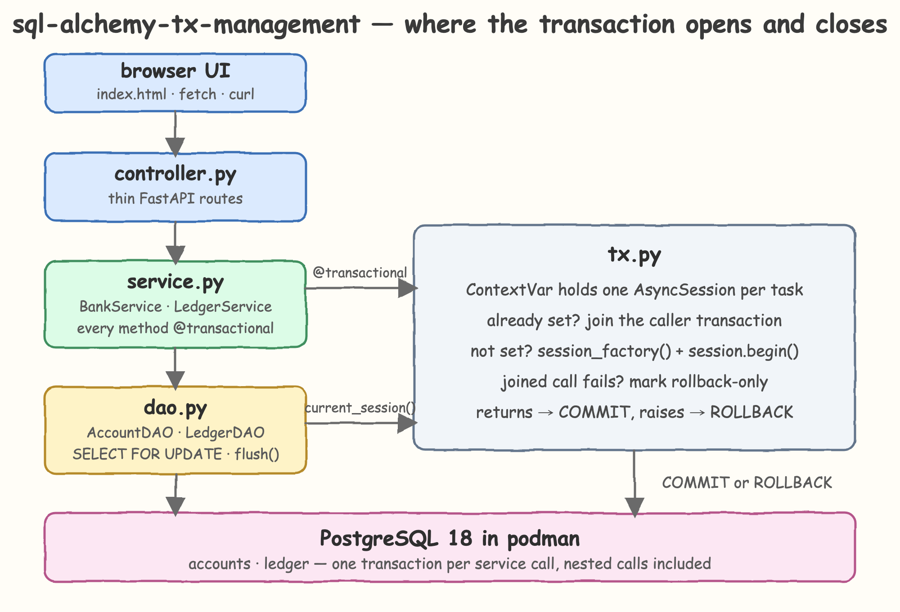
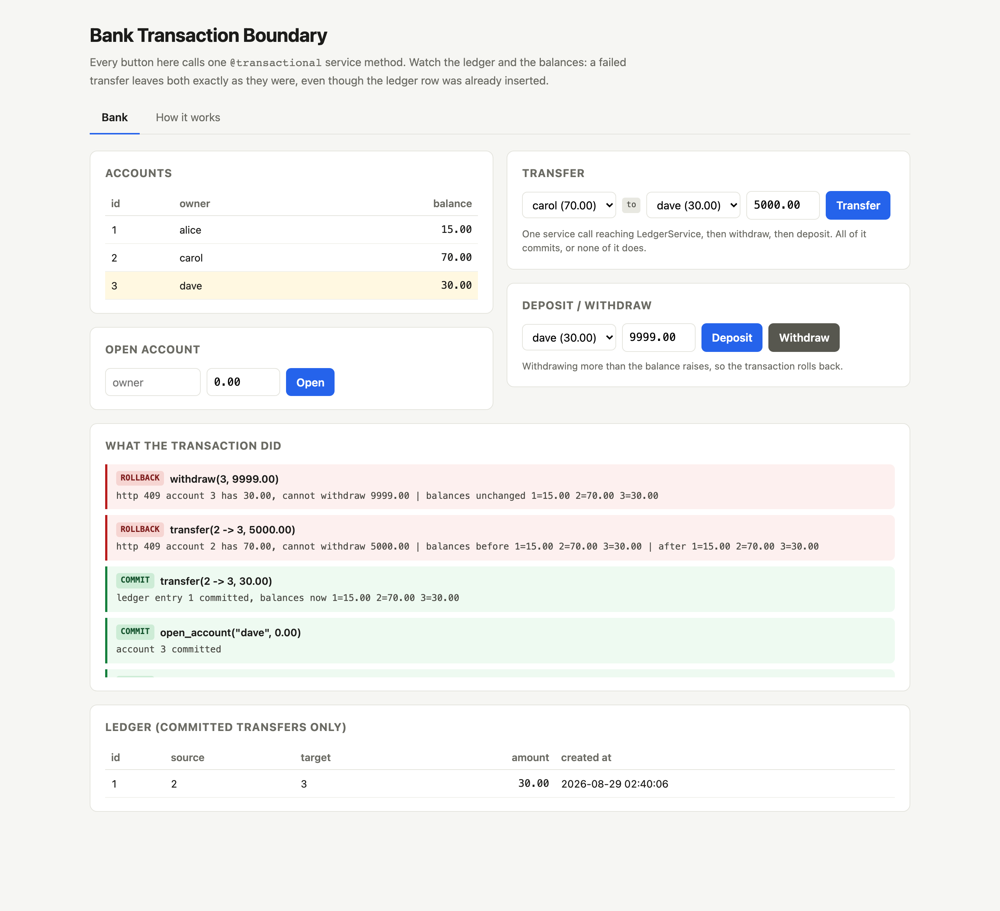
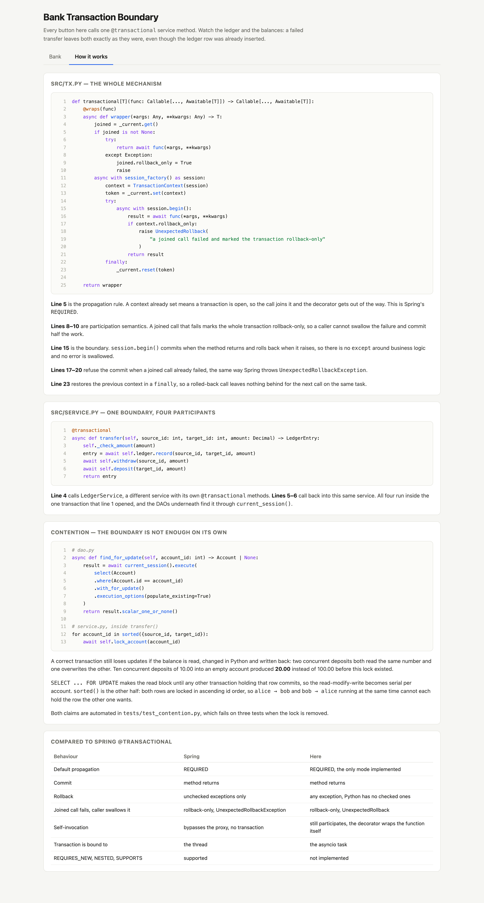
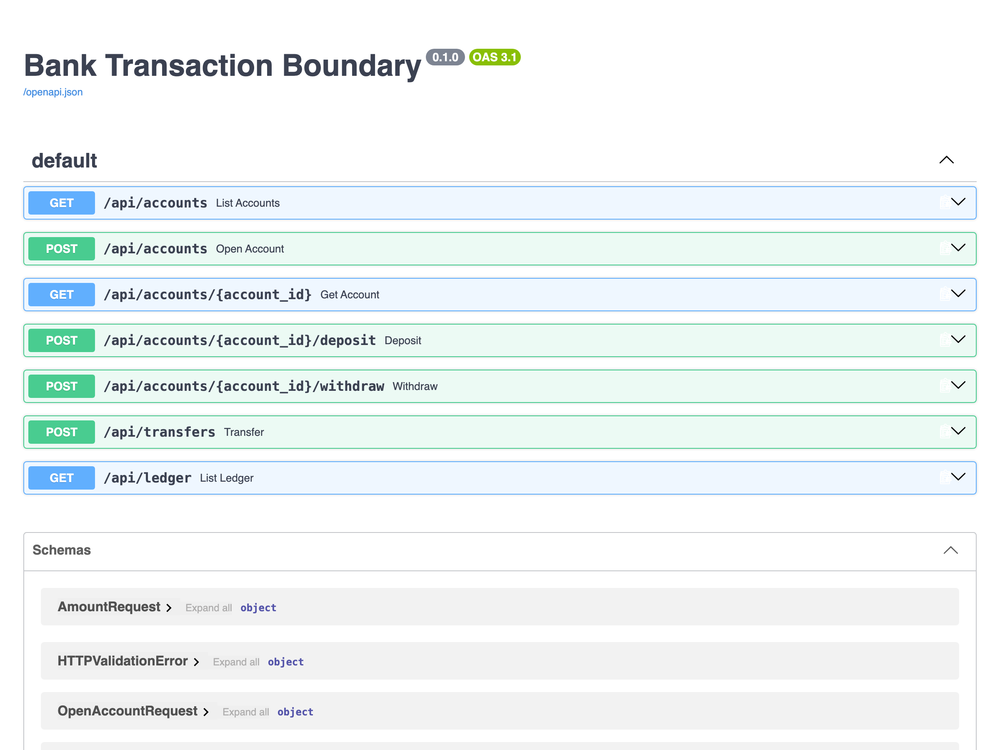

# SQLAlchemy Async Transaction Management

A small bank running on Python 3.14.6 where the transaction boundary is a single decorator. `Controller -> Service -> DAO`,
all `async`/`await`, and `@transactional` on the service methods. If the method returns, the transaction commits. If it
raises, the whole thing rolls back — for every failure the boundary can see, which is every one but a cancellation that
arrives while the COMMIT is already in flight, listed with the other limits below. Nothing in the controller, the DAO or
the models knows a session exists.

## Table of Contents

- [Architecture](#architecture)
- [Is this the same as Spring @Transactional?](#is-this-the-same-as-spring-transactional)
- [Printscreens](#printscreens)
- [How it Works?](#how-it-works-1)
- [Features](#features)
- [Stack](#stack)
- [APIs](#apis)
- [Race Conditions and Contention](#race-conditions-and-contention)
- [Key Design Decisions](#key-design-decisions)
- [How to Run](#how-to-run)
- [Swagger](#swagger)
- [How to Run the Tests](#how-to-run-the-tests)

## Architecture



## Is this the same as Spring @Transactional?

For the default Spring settings, yes on everything that matters. The differences are listed honestly below.

| Behaviour | Spring | Here |
| --- | --- | --- |
| Default propagation | `REQUIRED` | `REQUIRED`, the only mode implemented |
| Commit | method returns | method returns |
| Rollback | unchecked exceptions only | any exception; Python has no checked exceptions |
| Joined call fails, caller swallows it and returns | rollback-only, then `UnexpectedRollbackException` | rollback-only, then `UnexpectedRollback` |
| Joined call fails, caller swallows it and then raises something else | the later exception propagates, the first is lost | `UnexpectedRollback`; the first is the `__cause__`, the later one the `__context__` |
| Nested call opens a second transaction | no, it joins | no, it joins |
| Self-invocation | bypasses the proxy, so no transaction at all | still participates; the decorator wraps the function itself |
| Transaction is bound to | the thread (`ThreadLocal`) | the asyncio task (`ContextVar`) |
| Joined call cancelled, caller swallows it | rollback-only | rollback-only, `CancelledError` is not an `Exception` but is still caught |
| Statement cancelled inside a DAO call, caller swallows it | no equivalent; a thread interrupt is not a rollback signal | rollback-only, the session records the `CancelledError` |
| Transaction reused from another thread/task | `ThreadLocal`, so a new thread simply has none | `CrossTaskTransaction`, a spawned task or `to_thread()` worker is refused the inherited session, and refused the captured one |
| Database error swallowed without crossing a proxy | commit fails, the caller is told | `UnexpectedRollback`, the session recorded the `DBAPIError` that poisoned it |
| Business code commits the connection itself | possible, the boundary cannot stop it | `TransactionNotYours` on every session name that could, `run_sync`, `_proxied`, `object_session`, `_proxy_objects`, `get_bind` and `bind` included, on reads, assignments and deletions alike, and on what an allowed name carries: `no_autoflush` hands out a wrapper rather than the sync `Session` it yields; a commit through the `Connection` a result object carries is caught at the end as `UnexpectedRollback`, by identity and not merely by "some transaction is open", and one made on psycopg's own connection under it, or as a raw `COMMIT` or `ROLLBACK` string, is caught by asking the driver, which the boundary marks its transaction with so that a string ending one transaction and opening another in its place cannot pass for the first; reaching around it through `_session` or `_context`, or onto a second connection, still works |
| `REQUIRES_NEW`, `NESTED`, `SUPPORTS`, `MANDATORY` | supported | not implemented |
| `readOnly`, `isolation`, `timeout` | supported | not implemented |

Four of those deserve a sentence.

**Self-invocation is where this beats Spring.** Spring's `@Transactional` is a proxy, so `this.withdraw()` inside
`transfer()` never reaches it, which is the framework's most famous gotcha. Here the decorator wraps the function object,
so a self-call participates like any other call. With `REQUIRED` the observable result is the same whenever the outer
method is itself transactional, and strictly safer when it is not.

**Participation makes get-or-create impossible, and that is Spring too.** Writing
`try: await bank.get_account(id) except AccountNotFound: await bank.open_account(...)` inside a boundary raises
`UnexpectedRollback`, even though `AccountNotFound` never reached the database and nothing was left in a state that
could not be committed. The joined call raised, so the transaction is rollback-only, and Spring's `REQUIRED` does
exactly this to a caught `RuntimeException`. It is the most surprising consequence of the rule and the first thing a
reader will trip over, so it is worth saying out loud: an exception used as control flow across a `@transactional`
call is still a failure of that transaction. The fix here is the one it is in Spring — do not cross the boundary for
the lookup. `await self.accounts.find(id)` is a DAO call inside the transaction already open, it joins nothing, and a
`None` back from it is not an exception at all.

**Rollback rules are simpler on purpose.** Spring distinguishes checked from unchecked exceptions because Java has both.
Python does not, so every exception rolls back, which is what `rollbackFor = Exception.class` gives you in Java anyway.

**A poisoned transaction reports the poison, not the symptom.** If a joined call fails, the caller swallows it, and the
caller then hits a second error, Spring propagates the second one and the first is gone. Here the first is the
`__cause__` of the `UnexpectedRollback` and the second is its `__context__`, so the traceback shows both and the one
that actually made the transaction unusable is the headline. This is a deliberate divergence, not an accident, and
`test_unexpected_rollback_names_the_exception_that_poisoned_it` pins it.

The propagation claims are not assertions in prose; they are what `tests/test_transaction_boundary.py` checks by
capturing the session object at each layer and comparing identities.

## Printscreens

### Bank



Four service calls, top to bottom in the log. `open_account("dave", 0.00)` and `transfer(6 -> 7, 30.00)` committed, so
carol is down to 70.00 and dave holds 30.00. Then `transfer(6 -> 7, 5000.00)` failed on insufficient funds: the log
prints the balances before and after and they are identical, and no ledger row appeared even though one had already been
inserted and flushed. `withdraw(7, 9999.00)` failed the same way. The account table is the state Postgres actually holds,
re-read after every call.

### How it works



The decorator and the `transfer()` method with line numbers, annotated line by line: where propagation is decided, where
rollback-only is set, where the boundary opens, and where the commit is refused. Below them the contention card shows
the `FOR UPDATE` lock and the ascending lock order with the numbers from the failing run, and the last card is the
Spring comparison table above.

## How it Works?

`tx.py` keeps an `AsyncSession` in a `ContextVar`. When a `@transactional` method is called and the context variable is
empty, the decorator opens a session, enters `session.begin()` and stores it. When a `@transactional` method is called and
the context variable is already set, the decorator does nothing and the call joins the transaction that is already open.
That is the whole propagation rule, and it is why `BankService.transfer()` calling `LedgerService.record()` and then its
own `withdraw()` and `deposit()` produces one transaction instead of four.

A joined call that raises also marks the transaction rollback-only, so a caller that catches the exception still cannot
commit half the work. That is Spring's participation behaviour, and it is what `UnexpectedRollback` is for. The catch is
`except BaseException`, not `except Exception`, because `asyncio.CancelledError` is not an `Exception`: a joined call
killed by `asyncio.timeout()` has to poison the transaction like any other failure, or a swallowed `TimeoutError` commits
half a transfer. The context remembers the exception that poisoned it, so `UnexpectedRollback.__cause__` names the
original failure, and an exception that is simply propagating out of the boundary is re-raised untouched instead of
being masked. When a caller swallows a joined failure and then trips over something else, the poisoning failure is the
one reported and the later one stays reachable as `__context__`; Spring propagates the later one instead, which loses
the first. That is the one place the two disagree on purpose.

The DAOs never receive a session as an argument. They call `current_session()`, which reads the same context variable and
raises if there is no transaction open, so a DAO can never quietly write outside a boundary. `ContextVar` is per-task, so
two concurrent requests get two independent sessions with no locking and no globals.

Per-task is also enforced, not just assumed. A `ContextVar` is *copied* into every task spawned inside the boundary, so
an `asyncio.create_task()` or an `asyncio.gather()` of service calls would inherit the caller's `AsyncSession` and drive
it from two tasks at once, which SQLAlchemy does not allow. Each context therefore records the task that opened it, and a
lookup from any other task raises `CrossTaskTransaction` instead of corrupting the session or, worse, silently splitting
one transaction into several. `asyncio.to_thread()` copies the context too, and a worker thread has no running loop at
all, so the lookup answers "no task" there rather than letting a `RuntimeError` about the event loop stand in for the
real refusal.

Guarding the lookup alone was not enough, because the object it returns travels. A `BoundarySession` captured inside
the boundary and handed to a spawned task got past `current_session()` entirely: the task drove the session, and the
boundary committed its writes while the same task calling any `@transactional` method was being refused. So the
wrapper re-checks the task on every attribute it hands out, not only on the way in. The refusal has to live on the
object a DAO holds, because that object is what crosses the task boundary.

Checking the attribute *lookup* was not enough either, because what crosses does not have to be the wrapper. A bound
method taken off it is an ordinary object with no boundary in it at all, so `execute = current_session().execute`
handed to a spawned task drove the session and the boundary committed the row, one alias away from the capture the
lookup check had just closed. The same method kept past the boundary autobegan a second transaction on a closed
session and checked out a connection nothing ever returned — one leaked connection per call until the pool is empty
and every request is a `503`. And `asyncio.gather(session.execute(...), session.execute(...))`, which is the shape the
mistake actually takes, does the lookup on the right task and moves only the await, so no lookup check could ever have
seen it; it used to surface as an `IllegalStateChangeError` raised out of session teardown, which is an unhandled
`500` and another connection abandoned `INTRANS`. The check therefore runs inside the callable, on every call, not
only when the name is resolved. Methods that are not coroutines are wrapped for the same reason: `add()` and `expunge()`
stage work without an await, so handing them back untouched left the one route with no guard on it in any form.

Deciding what to wrap by `callable()` was itself a bug, and the wrong kind. A `@contextmanager` object is callable,
because a context manager doubles as a decorator, so `no_autoflush` came back wrapped in a plain function with no
`__enter__` and `with current_session().no_autoflush:` was a `TypeError`. The wrapper was silently breaking a session
API instead of guarding it or refusing it, which is the one thing this design is not allowed to do: every other route
it will not allow says so and names itself. Only routines are wrapped now.

Handing the context manager straight back was the deeper half of that bug, and it took an adversarial pass to find. A
`@contextmanager` yields, and what `no_autoflush` yields is the sync `Session` itself; the generator keeps the same
object in `gi_frame.f_locals`, so `current_session().no_autoflush.gen.gi_frame.f_locals["self"]` was a second way to
the same place. `run_sync`, `sync_session`, `_proxied`, `object_session` and `_proxy_objects` are all refused for
handing out that `Session`, and `await greenlet_spawn(session.commit)` through this sixth name is exactly what
`run_sync` would have done: it committed the first half of the boundary, that half survived the rollback meant to undo
it, and the boundary died on a raw `InvalidRequestError`. The audit that walks every session name could not see it,
because it follows dicts and weakrefs and a frame is neither. Refusing the name would break a session API the wrapper
exists to pass through, which is the one thing this design is not allowed to do, so the manager is wrapped instead:
entering and exiting cross the boundary, entering hands back the `BoundarySession` rather than whatever the manager
yielded, and every other name on it is refused. The audit now follows frames and enters what it can, so the next one is
a failing test rather than a paragraph. Everything else is on the block list, wrapped, or a value.

A `@transactional` frame is not the only thing that can poison the transaction, and it must not be. A database error
caught straight off a DAO never crosses one, but Postgres has already aborted that transaction, and committing an
aborted transaction is a silent no-op, so the boundary would return success for work the database threw away.
`BoundarySession` therefore records any `DBAPIError` it raises as the failure that poisoned the context, whoever
swallows it afterwards. It records an `asyncio.CancelledError` the same way, because a statement cancelled mid-flight
leaves the connection unusable without ever raising a database error, and a DAO call awaited directly never crosses a
`@transactional` frame either. Without that, a swallowed `TimeoutError` around a plain `execute()` let the boundary
reach `COMMIT` and fail there with a SQLAlchemy state error instead of naming the cancellation. That has to happen at
the session, not at the commit: SQLAlchemy deactivates its
`SessionTransaction` on a failed *flush* only, so after a failed `execute()` it still reports `is_active` true while
psycopg reports the connection `INERROR`. The liveness check before the return stays as the second net, for a
transaction that ended some other way. Nothing that reaches the database through a *method* the boundary handed out
can be discarded and still reported as success. Raw SQL is the one exception: a `COMMIT` or `ROLLBACK` string ends the
transaction where neither SQLAlchemy nor the boundary can see it. That limit is listed with the others below rather
than papered over.

The recorder only sees calls it awaits, which leaves exactly one hole: `stream()` and `stream_scalars()` open a
server-side cursor, so the statement fails while the *result* is iterated rather than inside the session call the
boundary wrapped. A swallowed failure there poisoned the transaction with nothing recording it, `is_active` stayed
true, and the boundary returned success for work Postgres had thrown away. Guarding it properly would mean proxying
the result object and everything it hands back, so the two methods are refused instead. That costs nothing here,
where nothing streams, and it keeps the guarantee absolute rather than almost. Asking `execute()` for the same cursor
with `stream_results` or `yield_per` is not a way around it: the `DECLARE` does reach Postgres, but SQLAlchemy closes
the cursor and raises `AsyncMethodRequired` before a row is read, so the transaction survives and the work either side
of it still commits.

`current_session()` hands back a `BoundarySession`, not the `AsyncSession` itself. Everything a DAO needs passes
straight through, but `commit`, `rollback`, `close`, `aclose`, `close_all`, `reset`, `invalidate`, `begin`,
`begin_nested`, `connection`, `get_bind`, `bind`, `get_transaction`, `get_nested_transaction`, `identity_map`,
`sync_session`, `object_session`, `run_sync`, `_proxied`, `_proxy_objects`, `stream` and `stream_scalars` raise
`TransactionNotYours`. Without that, a
single `await current_session().commit()` anywhere inside the boundary would
split it, and the half that ran before the call would survive the rollback of the half that ran after it.

`run_sync` is the one worth naming, because a block list that stops at `sync_session` looks complete and is not:
`run_sync` hands out the very `Session` that `sync_session` is refused for, so
`await current_session().run_sync(lambda s: s.commit())` committed the debit leg of a transfer, the boundary rolled
back the credit leg it could still see, and thirty units of money stopped existing. `_proxied` is the third name for
that same object — `AsyncSession`'s own alias for `sync_session` — and `object_session` is the fourth, which hands it
back from any entity a DAO has loaded, and `_proxy_objects` is the fifth: `AsyncSession` keeps a registry so it can map
a sync `Session` back to its async wrapper, and reading it hands the same `Session` out through a weakref. Blocking four
of the five blocked nothing; SQLAlchemy happens to refuse a sync call made from a running loop, but a block list that is
exhaustive by argument has to be exhaustive in fact. `get_bind` is in for a different reason: it hands out the `Engine`,
which is a way out of the boundary rather than a way to end it. `reset`, `invalidate` and
`close_all` end the transaction the same way `close` does; the liveness check already caught those, but a refusal that
names the call is an answer the caller can act on and a state error is not. The wrapper also goes dead when the boundary does, because
an `AsyncSession` autobegins on next use and a session kept past its boundary would otherwise open a second transaction
that nothing can ever commit.

`bind` is the sharpest name on the list, because it is not a method and it is the one that shows what a block list
costs. It is the same engine `get_bind` is refused for, assigned on the instance in `__init__` rather than declared on
the class, so it never appears in `dir(AsyncSession)` and an audit of the class does not see it. Inside a boundary,
`current_session().bind` opened a second connection, wrote through it and committed it, and the boundary then rolled
back around a write it could not see: a transfer whose debit was undone and whose credit was not, thirty units of money
created out of nothing. `identity_map` is in for a third reason again. It is not a route to the engine or to the sync
`Session`, it is the session's own live internal mapping, and a name that is not a method escapes the one check the
wrapper cannot repeat: a callable is re-checked inside every call, but a value is the value, and once it has crossed
into a spawned task or a worker thread there is nothing left to refuse. Since the list is only ever as good as the
audit that wrote it, `test_no_name_on_the_wrapper_hands_back_the_engine_or_the_sync_session` walks every name the
session actually has, follows the weakrefs and dicts that hid one of them, and fails on anything that still hands back
an engine or a `Session`. `get_nested_transaction` is on the list for the same reason `get_transaction` is, and it is
the one the audit nearly missed for the opposite reason: it only ever answers `None` while `begin_nested` is refused,
so a list written from what is reachable today would have left it off and the next feature would have opened it.

A block list on the *lookup* is a block list on half the routes. Nothing guarded an assignment, so
`current_session().autoflush = False` set the attribute on the wrapper and never reached the session — and because an
instance attribute shadows `__getattr__`, reading it back returned the value that had not been applied. The wrapper
reported the setting while the session went on flushing, which is the same silent change of meaning the `no_autoflush`
fix above exists to prevent: an assignment is a call. The sharper half is that it could switch the block list off.
`current_session().bind = ...` succeeded and put a value in the wrapper's own `__dict__`, which shadows `__getattr__`
entirely, so the very next read of `bind` handed back the assigned value instead of raising — a list is only as strong
as the code that never assigns to it. `__setattr__` now takes the same guard and the same block list `__getattr__`
does, and what it allows lands on the real session.

`__delattr__` is the third route, and it was open for the reason the second one was. A `del` through the wrapper landed
on the wrapper's own `__dict__` and never reached the session, so a deletion the caller believed had happened had not.
The sharper half is the same shape as before: `_session` and `_context` are the two names the wrapper really keeps
there, so deleting one of them left `__getattr__` looking itself up until Python gave up with a `RecursionError` — a
refusal that names nothing, in a wrapper whose whole argument is that every route it will not allow says what it is.
All three routes now run the same guard and the same list.

The special methods are the other half of that blind spot, and they were open in the opposite direction. Python
resolves `in` and `for` on the type, so `entity in current_session()` and `list(current_session())` never reached
`__getattr__`, never reached the session, and came back as a `TypeError` naming `BoundarySession` — the wrapper
silently breaking a session API rather than passing it through or refusing it by name, which is the one thing this
design is not allowed to do, and the same mistake the `no_autoflush` fix above exists to prevent. `__contains__` and
`__iter__` are defined on the wrapper now, they run the same guard every other route does, and
`test_every_special_method_the_session_defines_is_on_the_wrapper` walks the type rather than trusting the two that were
found, because the next one SQLAlchemy adds will be invisible to an audit that only walks names.

`async with session:` is the last route a list of names could not see, because Python looks `__aenter__` up on the type
and the name check never runs. It closes the session on the way out, which is `close()` reached through a syntax rather
than through a name. It was already impossible, but only by accident — a `TypeError` about a missing `__aexit__` — and
a refusal by accident is not an answer the caller can act on, so the wrapper defines both and names them.

It is a guard against a mistake, not a sandbox, and a list of names can only ever cover what lives on the session.
`_session` is still an attribute and raw `COMMIT` is still a string, so business code that means to break out of the
boundary can. Nothing in Python can stop that, and pretending otherwise would be the dishonest part. One route is worth
more than a mention, though, because it is public API arriving from the call every DAO makes.

`execute()` hands back a `CursorResult`, and `result.connection` is the very `Connection` the boundary is holding. No
block list reaches it: it is not a name on the session, and an audit that walks every session name cannot see what a
method *returns*. A commit through it split a transfer exactly the way `run_sync` did — the debit committed and the
boundary rolled back the credit around it — and SQLAlchemy's `SessionTransaction` still reported `is_active` true
afterwards, so the liveness check saw nothing and the boundary failed at `COMMIT` with a raw `InvalidRequestError`
instead. The connection knows what the session does not: `in_transaction()` is false. So the boundary asks the
connection as well, which is the third net and the only one that answers for the layer underneath. Asking whether *a*
transaction is open turned out not to be the same as asking whether it is *the* one, and the gap between them is a
single session call wide: anything the boundary does after the split autobegins a fresh transaction on the same
connection, `in_transaction()` answers true again, both earlier nets pass, and the raw `InvalidRequestError` this net
exists to replace comes back with the pre-split half committed. So the boundary records the connection's transaction
on the way into the first session call and compares identities at the end, which is the question that has
an answer in both shapes. It costs a method
that never touched the database nothing, because nothing is recorded until a session call is made, and a boundary that
made none has none to compare. Recording it on the way in rather than on the way out is also what keeps the identity
and the flag from ever disagreeing: they used to be set on opposite sides of the call, so a call that failed without
ever reaching Postgres left the flag saying the boundary had reached the database and the identity saying it had not,
and the net read a live transaction against nothing at all - an `UnexpectedRollback` for a boundary that split
nothing, which `test_a_session_call_that_never_reached_the_database_is_not_a_split` still pins. It does not
make the route impossible — the split already happened and half of it is committed — but a named `UnexpectedRollback`
is something the caller can act on and a SQLAlchemy state error is not. A raw `ROLLBACK` string gets past all three of
these, because it ends the transaction inside Postgres where neither the session nor the connection is told.

That used to be the end of it. Every net above asks SQLAlchemy, and
a raw `COMMIT` or `ROLLBACK` string is defined by going around SQLAlchemy: the transaction ends inside Postgres, the
`SessionTransaction` still reports `is_active`, the `Connection` still reports `in_transaction()`, the transaction
object is still the one the boundary recorded, and the boundary returned success over work the database had discarded.
libpq was told the whole time. psycopg exposes it as `info.transaction_status`, a local read of the socket's state with
no round trip, so the fourth net asks the driver whether Postgres is in a transaction at all. That answers for a
transaction Postgres aborted with nothing recording the error, and for a commit made straight on psycopg's own
connection through `result.connection.connection.dbapi_connection` — public API three attributes down from the call
every DAO makes, and invisible to every SQLAlchemy-level net above it.

A status is not an identity, though, and that is the whole difficulty. The status answers "is a transaction open",
which stops being the boundary's question the moment something opens a second one: after a `COMMIT` string psycopg
begins a fresh transaction for the next statement, and `COMMIT; BEGIN` does it inside a single string before the
boundary can look at all. Reading the status on both sides of every session call — which is what this net used to do —
narrows that window without closing it, and it made the net depend on the order the mistakes are made in. A raw
`COMMIT` as the *first* statement left the socket idle, so there was nothing to latch on; the next call opened a fresh
transaction, the net armed on that one, and every check at the end compared the replacement against itself.
`INSERT ...; COMMIT` in one string is the same window with money in it: the row survived the rollback that followed and
the boundary called it a success.

So the fifth net asks for *the* transaction rather than for a transaction. On the way into the first session call the
boundary marks its transaction with `SET LOCAL application_name`, which Postgres throws away when that transaction ends
— and, because `application_name` is one of the settings the server reports, it tells the client so without being
asked. Reading the mark back is `info.parameter_status()`, a local read of the same socket, so the net costs one round
trip the first time a boundary touches the database and nothing at the end. A mark that is gone means the transaction
that carried it is gone, whatever opened whatever came after it. That closes the raw string in both directions and in
either order, and it is the difference between a boundary that returns success for discarded work and one that names
it.

Commit and rollback themselves come from `async with session.begin()`. SQLAlchemy commits on a clean exit and rolls back
on any exception, so the decorator has no `try/except` around business logic and never swallows an error.

## Features

- **One decorator marks the boundary** — `@transactional` on a service method is the only transaction code in the project.
- **Automatic propagation** — a nested call, including a call into a different service, joins the caller's transaction instead of opening a second one.
- **Rollback-only participation** — a failed joined call poisons the transaction, so swallowing the exception cannot produce a half-committed transfer.
- **A returned boundary really committed** — five nets, not one. Any `DBAPIError` or `CancelledError` off the session poisons the transaction even if the caller swallows it; a deactivated `SessionTransaction` is caught before the commit; and the connection underneath is asked too, because a transaction ended there leaves the session still reporting `is_active`. The third net asks for the *identity* of the transaction it started, not merely whether one is open, because a single session call after a split autobegins another one and hides it. The fourth asks the driver, because everything above it asks SQLAlchemy and a raw `COMMIT` or `ROLLBACK` string is defined by going around SQLAlchemy: psycopg tracks the transaction status of the socket. And the fifth marks the transaction on the way in with a `SET LOCAL` that Postgres discards when that transaction ends and reports the discarding, because a status only ever answers whether *a* transaction is open — a raw `COMMIT` as the first statement, or a `COMMIT; BEGIN` in one string, leaves a replacement open for the status to find. The one call that could not be watched at all, `stream()`, is refused rather than left open as a hole.
- **The session is not the caller's to commit** — DAOs get a `BoundarySession`; `commit`, `rollback`, `close`, `reset`, `invalidate`, `connection`, `get_bind`, `bind`, `get_transaction`, `get_nested_transaction`, `identity_map`, `sync_session`, `run_sync`, `_proxied`, `_proxy_objects`, `object_session` and `stream` raise instead of splitting the boundary or hiding a failure, and the wrapper dies with its boundary. Every route runs the same list: the lookup, an assignment, and the session's own `async with`, because a name check that only covers reads leaves a write and a syntax open. The special methods the session really has are defined on the wrapper rather than left to `__getattr__`, which never sees them: `entity in session` and `list(session)` are resolved on the type, so both used to be a `TypeError` naming the wrapper — the wrapper breaking a session API instead of passing it through, which is the one thing this design is not allowed to do — and a test now walks every one the session defines. `run_sync`, `_proxied`, `object_session` and `_proxy_objects` are in that list because they are four more names for the same sync `Session` that `sync_session` is refused for, and `bind` because it is a second name for the `Engine` that `get_bind` is refused for — one that never appears in `dir()`, so an audit of the class misses it. A deletion runs the list too, because a read and a write are only two of the three ways at an attribute. The context managers the session hands out are wrapped rather than refused, because `no_autoflush` yields the sync `Session` and carries it in its generator frame — a sixth name for the object the other five are refused for, and one no list of session names can reach. A test walks every name the session really has, follows the frames and enters what it can, rather than trusting the list.
- **Contention handled with row locks** — `SELECT ... FOR UPDATE` serialises the read-modify-write per account, so concurrent deposits cannot lose updates.
- **Deadlock-free by lock ordering** — a transfer locks both accounts in ascending id order, and a ledger entry takes the same lock before its foreign keys do, so no two writers queue in opposite orders.
- **Money is money** — amounts finer than a cent, non-finite, or too large for `Numeric(18, 2)` are refused, and so is a deposit whose *resulting balance* would not fit, because rounding each leg of a transfer separately invents money. The size check is `copy_abs()` and not `abs()`, because `abs()` reads the decimal context and raises `Overflow` for an exponent past `Emax` instead of answering, which turned an amount the column obviously cannot hold into a `500`.
- **Invisible session** — controller, DAO and models never take, pass or close a session; `current_session()` finds it.
- **Rollback proven against real Postgres** — the ledger row is flushed before the money moves, so a failure rolls back a write that already reached the database.
- **The database enforces it too** — `CHECK (balance >= 0 and balance <> 'NaN')` and foreign keys from `ledger` to `accounts`, so a bug in the service cannot leave a negative balance or an orphan ledger row behind. The `NaN` half is not decoration: postgres orders `NaN` above every number, so `balance >= 0` is *true* for one and the check that looks like it covers the column did not. A balance the bank cannot compare is worse than a negative one — every read-then-write raises out of the decimal module instead of being refused by anything that names it.
- **Bounded waiting** — `lock_timeout` and `statement_timeout` are set on every connection, so a stalled transaction cannot block a hot account forever, and a request that cannot get a connection out of the pool gives up rather than queueing behind it. All three surface as `503` rather than a hang, and all three have a test that holds the resource and asks for it over HTTP; the pool one needs a handler of its own, because SQLAlchemy's `TimeoutError` is not an `OperationalError`.
- **Frozen views cross the boundary** — the service returns dataclasses, never ORM entities, so nothing detached ever reaches the controller.
- **Task-isolated context** — `ContextVar` gives every concurrent request its own session, and a task or thread spawned inside a boundary is refused that session rather than sharing it. The refusal is on the lookup, on the wrapper, on an assignment through it, on a deletion through it, and inside every call the wrapper hands out, so capturing the session, capturing one of its methods, setting a flag on it, or gathering two calls made on the right task are all refused rather than committed. A task that outlives the boundary gets a transaction of its own instead, because the lookup asks whether the transaction ended before it asks whose task this is.
- **Cancellation is a rollback** — a joined call killed by a timeout poisons the transaction, and so does a statement cancelled inside a plain DAO call, so a caller that swallows the `TimeoutError` still cannot commit either way.
- **Fails loud outside a boundary** — DAO access with no open transaction, or through a session kept past its boundary, raises `NoActiveTransaction` instead of auto-committing, and `@transactional` on a function that is not `async def` is a `TypeError` at import rather than a confusing one at call time.
- **UI that shows the boundary** — every action prints COMMIT or ROLLBACK with the balances before and after, and the page cannot drift away from the code it annotates: `tx.py`, `transfer()` and the locking DAO are all pinned to the real files by tests, every element the script reaches for has to be one the page declares, and every route it calls has to be one the app serves. The README is pinned the same way — its API table against the routing table, its test listing against the tests that exist.
- **Postgres 18 in podman** — the database starts, waits for readiness and stops from scripts, nothing installed on the host.

## Stack

| Piece | Why |
| --- | --- |
| Python 3.14.6 | Target runtime; the venv is built with `python3.14` explicitly. |
| SQLAlchemy 2.0 (asyncio) | Async ORM whose `session.begin()` already defines commit-or-rollback semantics. |
| psycopg 3 (binary) | Current Postgres driver with async support and wheels for 3.14. |
| `contextvars` | Standard library, task-local, the reason propagation needs no plumbing. |
| FastAPI + uvicorn | Thin async controller layer with request validation for free. |
| PostgreSQL 18 | Real transactional database; rollback has to be verified somewhere real. |
| podman + podman-compose | Runs the database without installing it. |
| pytest + pytest-asyncio | Async tests against the real database, no mocks. |
| Plain HTML, CSS and `fetch` | The UI is one self-contained file, no framework and no build step. |

## APIs

The UI is at `http://localhost:8000/` and Swagger UI at `http://localhost:8000/docs`.

| Method | Path | Body | Returns |
| --- | --- | --- | --- |
| `GET` | `/` | — | The UI. |
| `POST` | `/api/accounts` | `{"owner": str, "initial_balance": str}` | `201` and the account, `409` if the owner is taken, `400` if the owner is blank. |
| `GET` | `/api/accounts` | — | All accounts. |
| `GET` | `/api/accounts/{id}` | — | One account, `404` if unknown. |
| `POST` | `/api/accounts/{id}/deposit` | `{"amount": str}` | The updated account, `404` if unknown, `400` if the amount or the resulting balance is not money. |
| `POST` | `/api/accounts/{id}/withdraw` | `{"amount": str}` | The updated account, `404` if unknown, `409` if funds are short. |
| `POST` | `/api/transfers` | `{"source_id": int, "target_id": int, "amount": str}` | `201` and the ledger entry, `404` if either account is unknown, `409` if funds are short, `400` if the two ids are the same. |
| `GET` | `/api/ledger` | — | All committed ledger entries. |

An amount that is not money — zero, negative, finer than a cent, too large for the column, or large enough that the
resulting balance would not fit — is a `400`. Zero and a negative amount are values the request model has no reason to
refuse, so the service is the layer that can, the same way it is for a blank owner. That holds for every finite `Decimal` the request model will parse, which is a wider set
than it looks: `{"amount": "1E+999999999"}` is finite, and the size check has to answer for it rather than raise. It
did raise, because `abs()` is a decimal *context* operation and signals `Overflow` above `Emax`, so an
`ArithmeticError` nothing handles left as a `500` from all four routes that take money. `copy_abs()` is the
context-free spelling and the fix is that one word; `test_an_amount_past_the_decimal_contexts_exponent_limit_is_refused`
and its counterpart over HTTP pin it. A non-finite amount is a `422`, not a `400`, because the request model refuses `NaN` and
`Infinity` before the service ever sees them; `_check_money()` still refuses them for a caller that reaches the service
directly. An id or an owner outside what the schema can hold is a `422` from the request model too. An owner of nothing but
spaces is a `400` rather than a `422`: `min_length` refuses the empty string, but a string of spaces is a value the
schema can hold and an account nobody can name, so the service is the layer that has to refuse it, the same way it
re-checks an amount the model has already parsed. A wait longer than `lock_timeout` is a `503`, and so is a wait longer than the pool's `pool_timeout`:
SQLAlchemy raises its own `TimeoutError` for a full pool, which is not an `OperationalError`, so it needs a handler of
its own or a queue that is merely full reaches the caller as a `500`. No input reaches Postgres in a shape it has to
reject, so the `IntegrityError` and `DataError` handlers in the controller are there for the bug that gets past the
service, not for the normal path. `UnexpectedRollback`, `NoActiveTransaction`, `CrossTaskTransaction` and
`TransactionNotYours` are all `500`s: every one of them means the code is wrong rather than the request, and the
handler puts the exception and its `__cause__` in the body so the diagnosis the boundary worked to produce is not
thrown away behind an opaque "Internal Server Error". `ExceptionGroup` is handled for the same reason and was the hole
in it. A `TaskGroup` is how fan-out gets written now, and the `CrossTaskTransaction` its child raises arrives wrapped
in a group, which is not an instance of it, so the handler that exists to name the diagnosis never matched and the
caller got the opaque `500` anyway. The group handler flattens it and names every leaf. A group reaching the
controller at all means fan-out was started inside a boundary, which is misuse by construction here, so a `500` naming
the leaves is the answer rather than unwrapping the group and re-dispatching it to the handler the leaf would have had.
It has to be registered on `ExceptionGroup` and not `BaseExceptionGroup`, because Starlette asserts its handler keys
are `Exception` subclasses and `BaseExceptionGroup` is not one.

```bash
curl -X POST http://localhost:8000/api/transfers \
  -H 'Content-Type: application/json' \
  -d '{"source_id":1,"target_id":2,"amount":"30.00"}'
```

## Race Conditions and Contention

A correct transaction boundary does **not** make a bank safe. `withdraw()` reads the balance, changes it in Python and
writes it back, and two of those interleaving lose one of the writes. The boundary commits both, faithfully, and the
money is still wrong. This is what the contention suite is for, and it is worth seeing it fail. With the
`SELECT ... FOR UPDATE` removed and nothing else changed:

```
$ .venv/bin/python -m pytest tests/test_contention.py -q

FAILED test_concurrent_deposits_do_not_lose_updates
        assert Decimal('20.00') == Decimal('100.00')
FAILED test_transfers_in_opposite_directions_do_not_deadlock
        assert Decimal('240.00') == Decimal('200.00')
FAILED test_money_is_conserved_under_concurrent_transfers
FAILED test_recording_a_ledger_entry_does_not_deadlock_with_a_transfer

4 failed, 3 passed in 10.66s
```

The exact numbers move from run to run because the interleaving does; the four failures do not. In that run, ten
concurrent deposits of `10.00` into an empty account left `20.00` in it: eight writes were lost. Ten transfers
running in both directions between two accounts turned `200.00` into `240.00`: the bank invented money. The 10.66s
runtime is Postgres deadlock detection firing, because without a lock order `alice -> bob` and `bob -> alice` each hold
the row the other one wants. As shipped, the same file runs in 0.88s with seven passes.

Two changes fix it, both in the service and DAO, none in `tx.py`:

**`SELECT ... FOR UPDATE` on every read that is about to write.** `AccountDAO.find_for_update()` locks the row, so a
second transaction reading the same account blocks until the first one commits or rolls back, and then reads the value
that actually won. `populate_existing=True` makes SQLAlchemy overwrite whatever the identity map was holding, so the
locked row is the row the code reasons about.

**Ascending lock order in `transfer()`.** Before moving anything, `transfer()` locks both accounts in one
`WHERE id IN (...) ORDER BY id FOR UPDATE`. Postgres puts its `LockRows` node above the `Sort`, so the rows are locked
in ascending id order, and two opposite transfers queue on the same first row instead of grabbing one each and waiting
forever. Drop the `ORDER BY` and `LockRows` sits straight on the scan, which locks in heap order instead — and heap
order is not id order for long, because `owner` is indexed and a non-HOT update moves a row's tuple past its
neighbour. The contention tests cannot see that on two rows inserted in id order, so
`test_both_accounts_are_locked_in_ascending_id_order` reverses the heap first and then pins the order the DAO returns.

What the suite checks, all automated in `tests/test_contention.py`:

| Test | What would break without the fix |
| --- | --- |
| `test_concurrent_withdrawals_cannot_overdraw_the_account` | 10 concurrent full-balance withdrawals; exactly one wins, nine get `InsufficientFunds`, balance lands on `0.00`, never negative. |
| `test_concurrent_deposits_do_not_lose_updates` | 10 concurrent deposits must all land. Caught the lost update. |
| `test_transfers_in_opposite_directions_do_not_deadlock` | 10 transfers alternating direction between two accounts; no exception and the total is unchanged. Caught the deadlock and the invented money. |
| `test_money_is_conserved_under_concurrent_transfers` | 12 concurrent transfers around 4 accounts; the total is conserved, at least one commits, every refusal is `InsufficientFunds` and the ledger holds exactly one row per commit. |
| `test_propagation_holds_under_concurrency` | 4 concurrent transfers; every layer inside one transfer shares one session, and the 4 transfers use 4 different sessions. Propagation and isolation at the same time. |
| `test_recording_a_ledger_entry_does_not_deadlock_with_a_transfer` | 20 interleaved `record(high, low)` and `transfer(low, high)` calls. A ledger insert takes its foreign key locks in column order, not ascending, which deadlocks against a transfer. |
| `test_a_rolled_back_insert_really_reached_the_database` | `ledger_id_seq` advances on a failed transfer while the row count does not, proving Postgres rolled back a real write. |
| `test_money_is_conserved_around_a_cycle_of_accounts` | Twelve transfers around a ring of three accounts. Two accounts in opposite directions is the deadlock everybody writes a test for; a cycle of three is the one an ordering rule has to survive as well. |
| `test_concurrent_transfers_across_many_accounts_conserve_money` | 24 transfers picked at random over 6 accounts, all in flight. The lock order and the row locks under load at once, and the ledger holds exactly one row per commit. |
| `test_money_is_conserved_under_a_long_random_walk` | 120 sequential transfers of random amounts over 5 accounts. Every refusal has to be `InsufficientFunds`, because any other failure means a transfer died between its debit and its credit. |
| `test_concurrent_opens_of_one_owner_leave_exactly_one_account` | 10 concurrent opens of the same owner; the unique constraint decides, nine arrive as `IntegrityError` off a rolled-back transaction, and one account exists. |

Honest limits, since this is a POC and not a payment system:

- Isolation is Postgres' default `READ COMMITTED`. The row locks are what make the balance arithmetic safe, not the isolation level.
- The mark is a `SET LOCAL application_name`, which costs a round trip the first time a boundary touches the database and buys the only question with an answer in every shape: is Postgres still in the transaction this boundary opened. It errs toward the rollback in the one place it can be wrong. Business code that sets `application_name` itself inside the boundary takes the mark away without ending anything, and the boundary refuses a transaction Postgres would have committed — a named `UnexpectedRollback` rather than a silent commit, which is the same side the savepoint case errs on. `test_business_code_that_overwrites_the_mark_is_refused_not_ignored` pins that direction.
- Every `DBAPIError` is treated as poison, including the few that never reached Postgres. psycopg raises one for a parameter it cannot adapt, before anything is sent, so that transaction really was still committable and the boundary rolls it back anyway. Telling the two apart means asking the driver whether the statement left the process; guessing wrong in the other direction reports success for discarded work, so the rollback is the side to err on. It only costs anything when the caller swallows the error, because an error that propagates is the one the boundary re-raises unchanged.
- A hand-written savepoint is the sharpest consequence of treating every `DBAPIError` as poison. `SAVEPOINT s`, a failing statement, `ROLLBACK TO SAVEPOINT s` leaves a transaction Postgres would commit, and the boundary refuses it anyway: the recorder saw the error and nothing tells it a savepoint undid the damage. `NESTED` propagation is what would make that work and it is not implemented, so the choice is between refusing a boundary that recovered and committing the far more common one that did not. `test_a_savepoint_recovery_by_hand_is_still_a_rollback` pins which side this errs on.
- A swallowed database error is caught either way, but only as a diagnosis. Once Postgres aborts the transaction there is nothing left to continue with, because there are no savepoints the boundary knows about. Caught through a `@transactional` call it is rollback-only; caught straight off a DAO the session recorded it anyway. Both end as `UnexpectedRollback` rather than a confusing SQLAlchemy state error or, worse, a quiet success.
- `withdraw()` and `deposit()` re-lock the row they were handed, because both are callable on their own and have to be safe that way. A transfer therefore spends six round trips where four would do. The redundant locks are already held, so they cost latency and never risk.
- The lock is per account row, so unrelated accounts never block each other, but a hot account serialises every transfer that touches it. That is the intended trade: correctness first.
- The refusals in `BoundarySession` are a guard against a mistake, not a security boundary. The block list covers every session name that can end or split the transaction, hand out the sync `Session` under it or hand out the engine behind it — `run_sync`, `_proxied`, `_proxy_objects`, `get_bind`, `bind` and `get_nested_transaction` included — and it runs on assignments, on deletions and on `async with session:` as well as on reads, because a check that only covers the lookup leaves three routes open. A name that stays allowed is covered by what it hands back rather than by the list: `no_autoflush` yields the sync `Session` and carries it in its generator frame, so it comes back as a `BoundaryContext` that lets `with` in and refuses everything else. What none of that covers is anything that is not a name on the session and not something a name hands back: `_session`, `_context` — which carries the driver connection and the mark — and `BoundaryContext`'s own mangled `_BoundaryContext__manager`. A raw `COMMIT` or `ROLLBACK` string used to be on that list and no longer is — it ends the transaction inside Postgres, where neither SQLAlchemy nor its `Connection` is told, but libpq is, so the last two nets ask psycopg instead of asking SQLAlchemy about psycopg. `test_a_raw_rollback_string_is_caught_by_the_driver` and `test_a_raw_commit_string_is_caught_by_the_driver` pin both directions, `test_a_commit_through_the_driver_under_the_result_is_not_a_commit` pins the same commit made straight on psycopg's connection, and the three that pin the shapes a socket status alone could not see are `test_a_raw_commit_before_any_other_statement_is_caught`, `test_work_committed_by_a_raw_string_cannot_be_reported_as_success` and `test_a_raw_commit_that_opens_another_transaction_is_caught`. What still gets away is a write on a *second* connection, and `test_a_write_on_a_second_connection_is_the_limit_that_stays` is the one that pins a mistake nothing here can catch.
- `result.connection` is the escape worth naming on its own, because it is public API handed back by the call every DAO makes. The `CursorResult` from `execute()` carries the `Connection` the boundary is holding and the `Engine` behind it, and no list of session names reaches it — the audit that walks `dir(session)` cannot see what a method returns. It cannot be refused without proxying every result and everything a result hands back, which is the cost that got `stream()` refused, so it is caught instead: the boundary asks the connection, before it returns, whether it is still in *the* transaction it started — by identity, not by asking whether some transaction is open, because one more session call after the split autobegins another one and puts the raw `InvalidRequestError` back. A split arrives as `UnexpectedRollback` rather than as a SQLAlchemy state error at `COMMIT`, whether or not the boundary kept working afterwards. The split still happened and the half that ran before it is still committed; what the boundary can promise is that it will not call that success. The driver hanging off it, `result.connection.connection.dbapi_connection`, is the same route one level lower and invisible to every SQLAlchemy object above it, which is what the fourth net answers for. A write made on a *second* connection opened from `result.connection.engine` is a different thing again, and the same one `bind` is refused for: it commits itself on a connection the boundary never had, so it survives the rollback and nothing here can see it. That is the limit that stays.
- A task spawned inside a boundary is refused the session, and the refusal covers every route to it: the lookup, the wrapper object, an assignment through the wrapper, a method captured off the wrapper, and a call whose lookup happened on the right task and whose await did not — `asyncio.gather()` of two `session.execute()` calls is that last one. `asyncio.gather()` of two service calls, `asyncio.shield()`, a `TaskGroup`, an eager task factory that starts the child on the caller's own stack, a worker thread that runs a loop of its own, and any background work all raise `CrossTaskTransaction` from inside a boundary, and a fire-and-forget `create_task()` fails where nobody retrieves the exception while the boundary commits around it. Fan-out has to start outside the boundary, or run after it returns: a `ContextVar` is copied when the task is *created*, not when it runs, so a task started inside a boundary carries that context forever, and the lookup therefore asks whether the transaction has ended before it asks whose task this is. While the boundary is open the answer is still `CrossTaskTransaction`; once it has closed, the spawned task opens a transaction of its own rather than being told it belongs to somebody else's. What is still reachable is what is reachable everywhere: `_session`, and `sqlalchemy.orm.object_session()` on an entity a DAO loaded, are objects the boundary never handed out and cannot take back.
- The request model parses money with pydantic's `Decimal`, which is Python's `Decimal` and therefore accepts a little more than JSON numbers do: `{"amount": "1_000"}` is one thousand and `{"amount": " 5 "}` is five. Both are values the schema can hold and money the service is happy to move, so nothing here refuses them; a payment system would pin the accepted spelling at the edge rather than leave it to the parser.
- A cancellation that lands after the method returned races the COMMIT already on its way to Postgres, and the server decides that one. `If it raises, the whole thing rolls back` holds for every failure the boundary can see; it does not hold for a `CancelledError` that arrives while the commit is in flight, because by then there is nothing left to roll back and no way to ask. The caller can therefore be told a transfer was cancelled that committed - never the reverse, and never half of one. `test_a_cancellation_racing_the_commit_cannot_split_a_transfer` pins both directions: the ledger row count is the money that moved, and a boundary that returned always committed. Shielding the commit would trade an unknown outcome for a known one rather than close the window, and it would put the commit outside the timeout that bounds everything else, so the window is named here instead.
- Streaming is refused rather than guarded. `stream()` and `stream_scalars()` are the only session calls whose failure the boundary cannot observe, so a project that needs server-side cursors has to proxy the result object before it can have both.
- The schema is `create_all`, not migrations. The constraints are DDL, so a database created before them keeps the old shape; `podman-compose down -v` once is what applies them to an existing volume.

## Key Design Decisions

**The decorator, in full.** This is the entire mechanism, plus the wrapper that keeps the session from being committed
out from under it and records the database error that would otherwise be swallowed:

```python
def _running_task() -> asyncio.Task[Any] | None:
    try:
        return asyncio.current_task()
    except RuntimeError:
        return None


def _check_task(context: "TransactionContext") -> None:
    if context.task is not _running_task():
        raise CrossTaskTransaction(
            "the transaction belongs to the task that opened it, an AsyncSession "
            "cannot be driven from anywhere else"
        )


def _driver_of(connection: Any) -> Any:
    return connection.sync_connection.connection.dbapi_connection


def _in_transaction(driver: Any) -> bool:
    return driver.info.transaction_status == TransactionStatus.INTRANS


def _mark_of(driver: Any) -> str:
    return driver.info.parameter_status(MARK)


def _is_context_manager(value: Any) -> bool:
    kind = type(value)
    return hasattr(kind, "__enter__") and hasattr(kind, "__exit__")


class BoundaryContext:
    def __init__(self, manager: Any, boundary: "BoundarySession") -> None:
        self.__manager = manager
        self.__boundary = boundary

    def __enter__(self) -> Any:
        self.__boundary._guard()
        entered = self.__manager.__enter__()
        if isinstance(entered, (Session, AsyncSession)):
            return self.__boundary
        return entered

    def __exit__(self, *unused: Any) -> Any:
        return self.__manager.__exit__(*unused)

    def __getattr__(self, name: str) -> Any:
        raise TransactionNotYours(f"{name} is not yours to reach, {NOT_YOURS_TO_HOLD}")


class BoundarySession:
    def __init__(self, session: AsyncSession, context: "TransactionContext") -> None:
        self._session = session
        self._context = context

    def _guard(self) -> None:
        if self._context.closed:
            raise NoActiveTransaction(
                "the transaction this session belonged to has already ended"
            )
        _check_task(self._context)

    def _refuse(self, name: str) -> None:
        if name in OWNED_BY_THE_BOUNDARY:
            raise TransactionNotYours(
                f"{name} belongs to @transactional, not to the code inside it"
            )
        if name in UNGUARDABLE:
            raise TransactionNotYours(
                f"{name}() raises from the cursor while the result is iterated, where "
                "the boundary cannot see it; use execute() so a failure poisons the "
                "transaction instead of being committed over"
            )

    async def _open(self) -> None:
        context = self._context
        if context.driver is not None:
            return
        connection = await self._session.connection()
        mark = f"boundary-{next(_boundaries)}"
        await connection.exec_driver_sql(f"set local {MARK} = '{mark}'")
        context.transaction = connection.get_transaction()
        context.driver = _driver_of(connection)
        context.mark = mark

    async def __aenter__(self) -> "BoundarySession":
        raise TransactionNotYours(NOT_YOURS_TO_CLOSE)

    async def __aexit__(self, *unused: Any) -> None:
        raise TransactionNotYours(NOT_YOURS_TO_CLOSE)

    def __contains__(self, instance: Any) -> bool:
        self._guard()
        return instance in self._session

    def __iter__(self) -> Any:
        self._guard()
        return iter(self._session)

    def __setattr__(self, name: str, value: Any) -> None:
        if name in THE_WRAPPERS_OWN:
            object.__setattr__(self, name, value)
            return
        self._guard()
        self._refuse(name)
        setattr(self._session, name, value)

    def __delattr__(self, name: str) -> None:
        self._guard()
        self._refuse(name)
        delattr(self._session, name)

    def __getattr__(self, name: str) -> Any:
        self._guard()
        self._refuse(name)
        attribute = getattr(self._session, name)
        if not inspect.isroutine(attribute):
            if _is_context_manager(attribute):
                return BoundaryContext(attribute, self)
            return attribute
        if not inspect.iscoroutinefunction(attribute):

            @wraps(attribute)
            def checked(*args: Any, **kwargs: Any) -> Any:
                self._guard()
                return attribute(*args, **kwargs)

            return checked

        @wraps(attribute)
        async def guarded(*args: Any, **kwargs: Any) -> Any:
            self._guard()
            try:
                await self._open()
                answer = await attribute(*args, **kwargs)
            except (DBAPIError, asyncio.CancelledError) as error:
                if self._context.failure is None:
                    self._context.failure = error
                raise
            return answer

        return guarded
```

```python
def transactional[T](func: Callable[..., Awaitable[T]]) -> Callable[..., Awaitable[T]]:
    if not inspect.iscoroutinefunction(func):
        raise TypeError(f"@transactional needs an async def, {func.__name__} is not one")

    @wraps(func)
    async def wrapper(*args: Any, **kwargs: Any) -> T:
        joined = _active()
        if joined is not None:
            try:
                return await func(*args, **kwargs)
            except BaseException as error:
                if joined.failure is None:
                    joined.failure = error
                raise
        async with session_factory() as session:
            context = TransactionContext(asyncio.current_task())
            context.session = BoundarySession(session, context)
            token = _current.set(context)
            try:
                async with session.begin():
                    try:
                        result = await func(*args, **kwargs)
                    except BaseException as error:
                        if context.failure is not None and error is not context.failure:
                            raise UnexpectedRollback(ROLLBACK_ONLY) from context.failure
                        raise
                    if context.failure is not None:
                        raise UnexpectedRollback(ROLLBACK_ONLY) from context.failure
                    transaction = session.get_transaction()
                    if transaction is None or not transaction.is_active:
                        raise UnexpectedRollback(LOST_TRANSACTION)
                    if context.driver is not None:
                        connection = await session.connection()
                        if not connection.in_transaction():
                            raise UnexpectedRollback(LOST_CONNECTION)
                        if connection.get_transaction() is not context.transaction:
                            raise UnexpectedRollback(SPLIT_CONNECTION)
                        driver = _driver_of(connection)
                        if driver is not context.driver or not _in_transaction(driver):
                            raise UnexpectedRollback(DISCARDED_BY_POSTGRES)
                        if _mark_of(driver) != context.mark:
                            raise UnexpectedRollback(LOST_MARK)
                    return result
            finally:
                context.closed = True
                _current.reset(token)

    return wrapper
```

**`ContextVar`, not a global or an argument.** A module-level session would be shared by every concurrent request. A
session argument would have to be threaded through the controller and every DAO call, which is exactly the plumbing this
POC removes. `ContextVar` is copied per asyncio task, so isolation is free.

**`reset(token)` in a `finally`.** The context variable is restored even when the body raises, so a rolled-back call
leaves nothing behind for the next call on the same task.

**Two services, one boundary.** `BankService.transfer()` calls `LedgerService.record()`, a different class with its own
`@transactional` methods. Called on its own, `LedgerService.record()` opens and commits its own transaction. Called from
`transfer()`, it joins. Neither service knows which of the two is happening, which is the point.

**The ledger row is written before the money moves, on purpose.** `transfer()` locks both accounts, records the ledger
entry, then withdraws and deposits, and every DAO write ends in `flush()`. So a failed transfer has already sent
`INSERT` and `UPDATE` to Postgres before it raises, and the rollback that follows is a real database rollback, not a
discarded in-memory session. The locks come first because they are what proves both accounts exist: a missing account
has to fail as `AccountNotFound` and a `404`, not as a foreign key violation. The sequence proves
it — after one committed transfer and two failed ones:

```
select last_value from ledger_id_seq;  -> 3
select count(*) from ledger;           -> 1
```

Three inserts reached the database, one survived.

**Balances are `Numeric(18, 2)`, and the scale is enforced, not assumed.** Money in floats is a bug, and psycopg maps
`numeric` to `Decimal` in both directions. `Decimal` alone is not enough: the column rounds to two places on write, and
a transfer rounds its debit and its credit independently. Moving `0.125` takes `0.12` from one account and gives `0.13`
to the other, so twenty of them mint a cent each and `CHECK (balance >= 0)` never notices, because the invariant broken
is conservation, not sign. `_check_money()` refuses anything non-finite, too large for the column — asked with
`copy_abs()`, because `abs()` consults the decimal context and raises `Overflow` past `Emax` instead of answering — or
that survives a
`quantize()` to two places with a different value — testing the value and not the exponent, so `10.00000` and `1E+1`
are both accepted as the same ten. `_check_balance()` then refuses a deposit whose *sum* would overflow the column,
because an amount that fits is not the same as a balance that fits. The size check is `>=`, so the last value that
works is `9999999999999999.99` and `test_the_largest_amount_the_column_can_hold_is_accepted` puts it in and reads it
back. `_check_amount()` refuses zero and anything negative on top of that, and the test for it walks all four routes:
a negative deposit is a withdrawal with no funds check behind it, a negative withdrawal is a deposit with no overflow
check, and zero is a ledger row saying an account moved nothing while holding both locks to say it. `-0.00` is refused
too, because `Decimal` keeps the sign of a zero and it is the one spelling of nothing that reads as signed. `LedgerService.record()` runs the same checks as
`BankService`: the README calls it a boundary of its own, so it cannot lean on `transfer()` having validated first.
That covers the ids as well as the amount — `set()` collapses a pair of equal ids to a single lock and both foreign
keys are satisfied, so without the check `record()` would write a row saying an account paid itself. It takes the same
existence-proving lock a transfer takes, for the same reason: leaving a missing account to the foreign key turned a
`404` into an `IntegrityError`, which the controller reports as a `409` conflict over a row that was never there.
The views quantize, so the `Decimal` a caller gets back is the one the row holds.

**Views cross the boundary, entities do not.** A service method returns a frozen `AccountView` or `LedgerView` built
while the transaction is still open, not the ORM entity. An entity handed to the controller is detached the moment the
session closes, and because `expire_on_commit` is left at its default the commit expires every attribute first, so
reading *any* column off it raises `DetachedInstanceError` — not only the relationship nobody has added yet. The trap
is live today. The reads all happen inside the boundary, so `expire_on_commit` never had to be switched off to paper
over the problem.

**No retry, and that is the decision, not the gap.** A transaction Postgres aborts surfaces to the caller instead of
being replayed, for three reasons.

*Retry belongs above the boundary, never inside it.* An aborted transaction cannot be resumed, only re-run from the
top: the session, its identity map and every row already read are dead. Putting a retry loop inside `@transactional`
would therefore silently re-execute the whole business method, including anything it did that Postgres cannot roll
back — an email, an HTTP call, a message on a queue. The decorator manages one transaction; it does not replay your
method behind your back. A retry that re-invokes a service method from the outside is honest about that, and it is the
caller who knows whether the method is safe to run twice.

*Only two error classes may be replayed.* Deadlock detected (`40P01`) and serialization failure (`40001`) are transient
and worth another attempt. `InsufficientFunds`, a unique violation on `owner`, a `CHECK` violation, a foreign key
violation and a `lock_timeout` are all deterministic: retrying turns one clear error into the same error N times plus
the latency. A retry decorator is only ever correct with an explicit list of what it catches, and that list is
application knowledge, not transaction-manager knowledge.

*Here there is nothing left to catch.* Serialization failures come from `REPEATABLE READ` and `SERIALIZABLE`; this runs
at `READ COMMITTED`, where `SELECT ... FOR UPDATE` blocks and re-reads instead of aborting. Deadlock is not retried
away either, it is designed away, by taking both row locks in one statement in ascending id order — the property
`test_transfers_in_opposite_directions_do_not_deadlock` exists to hold. So a retry loop added today would be dead code
guarding a path this design does not produce. It becomes necessary the moment someone raises the isolation level or
adds a write path that touches rows in a different order, and at that point it goes around the service call, not
inside `tx.py`.

**`lock_timeout` and `statement_timeout` on every connection.** Row locks make a hot account serialise, which is the
intended trade, but without a timeout a single stalled transaction blocks every transfer touching that account
indefinitely. Five seconds to acquire a lock and fifteen for a statement turn that into an error the caller can see.

## How to Run

```bash
./build.sh         # venv with python3.14 and dependencies
./start.sh         # postgres 18 in podman, then the app on http://localhost:8000
./test-client.sh   # a commit and two rollbacks over HTTP, with balances after each
./test.sh          # 155 tests against a real postgres, in a separate database
./stop.sh          # app down, postgres down
```

## Swagger



Swagger UI at `/docs`, generated from the controller. Every route here is exactly one `@transactional` service call.

## How to Run the Tests

```bash
./test.sh
```

`test.sh` starts Postgres and runs pytest against it. There are no mocks: the point under test is what the database does
on commit and on rollback.

The listing below is checked against the tests that exist, so adding one fails `test_the_readme_lists_the_tests_that_run`
until it is pasted in. Regenerating it is one line:

```bash
.venv/bin/python -m pytest -q --collect-only | grep '::test_' | sed 's/$/ PASSED/'
```

The suite drops and recreates the schema between tests, so it runs against `bank_test_db`, a second database that
`db-start.sh` creates next to `bank_db`. Running the tests therefore never touches the data the app is holding. `tests/conftest.py`
sets that URL before importing anything, and `TEST_DATABASE_URL` overrides it.

```
tests/test_api.py::test_a_blank_owner_is_refused_by_the_layer_that_can_see_it PASSED
tests/test_api.py::test_a_duplicate_owner_is_a_conflict_not_a_crash PASSED
tests/test_api.py::test_a_non_finite_amount_is_rejected_by_the_request_model PASSED
tests/test_api.py::test_a_poisoned_transaction_reaching_the_controller_names_its_cause PASSED
tests/test_api.py::test_a_request_that_cannot_get_a_connection_is_unavailable_not_a_crash PASSED
tests/test_api.py::test_a_statement_past_its_timeout_is_unavailable_not_a_crash PASSED
tests/test_api.py::test_a_sub_cent_amount_is_rejected PASSED
tests/test_api.py::test_a_taskgroup_inside_a_boundary_names_its_refusal PASSED
tests/test_api.py::test_a_value_the_schema_cannot_hold_is_a_bad_request_not_a_crash PASSED
tests/test_api.py::test_a_wait_longer_than_lock_timeout_is_unavailable_not_a_crash PASSED
tests/test_api.py::test_an_account_id_outside_the_column_range_is_rejected PASSED
tests/test_api.py::test_an_amount_past_the_decimal_contexts_limit_is_a_bad_request PASSED
tests/test_api.py::test_an_amount_that_is_not_a_positive_number_is_a_bad_request PASSED
tests/test_api.py::test_an_amount_too_large_for_the_column_is_rejected PASSED
tests/test_api.py::test_an_owner_longer_than_the_column_is_rejected PASSED
tests/test_api.py::test_every_connection_carries_the_timeouts_the_app_configures PASSED
tests/test_api.py::test_failed_transfer_endpoint_leaves_the_database_untouched PASSED
tests/test_api.py::test_the_how_it_works_page_shows_the_decorator_that_ships PASSED
tests/test_api.py::test_the_readme_documents_every_route_the_api_has PASSED
tests/test_api.py::test_the_readme_lists_the_tests_that_run PASSED
tests/test_api.py::test_the_readme_shows_the_decorator_that_ships PASSED
tests/test_api.py::test_the_ui_code_blocks_show_the_service_and_dao_that_ship PASSED
tests/test_api.py::test_the_ui_only_calls_routes_the_api_really_has PASSED
tests/test_api.py::test_the_ui_only_touches_elements_the_page_declares PASSED
tests/test_api.py::test_transfer_endpoint_moves_money_and_records_the_ledger PASSED
tests/test_api.py::test_unknown_account_returns_not_found PASSED
tests/test_contention.py::test_a_rolled_back_insert_really_reached_the_database PASSED
tests/test_contention.py::test_concurrent_deposits_do_not_lose_updates PASSED
tests/test_contention.py::test_concurrent_opens_of_one_owner_leave_exactly_one_account PASSED
tests/test_contention.py::test_concurrent_transfers_across_many_accounts_conserve_money PASSED
tests/test_contention.py::test_concurrent_withdrawals_cannot_overdraw_the_account PASSED
tests/test_contention.py::test_money_is_conserved_around_a_cycle_of_accounts PASSED
tests/test_contention.py::test_money_is_conserved_under_a_long_random_walk PASSED
tests/test_contention.py::test_money_is_conserved_under_concurrent_transfers PASSED
tests/test_contention.py::test_propagation_holds_under_concurrency PASSED
tests/test_contention.py::test_recording_a_ledger_entry_does_not_deadlock_with_a_transfer PASSED
tests/test_contention.py::test_transfers_in_opposite_directions_do_not_deadlock PASSED
tests/test_money.py::test_a_deposit_that_would_overflow_the_column_is_refused PASSED
tests/test_money.py::test_a_negative_amount_is_refused PASSED
tests/test_money.py::test_a_non_finite_amount_is_refused PASSED
tests/test_money.py::test_a_sub_cent_deposit_is_refused PASSED
tests/test_money.py::test_a_sub_cent_opening_balance_is_refused PASSED
tests/test_money.py::test_a_sub_cent_transfer_cannot_invent_money PASSED
tests/test_money.py::test_a_transfer_of_the_whole_balance_leaves_the_account_at_zero PASSED
tests/test_money.py::test_a_transfer_that_would_overflow_the_target_moves_nothing PASSED
tests/test_money.py::test_a_zero_amount_is_refused PASSED
tests/test_money.py::test_an_amount_past_the_decimal_contexts_exponent_limit_is_refused PASSED
tests/test_money.py::test_an_amount_the_column_cannot_hold_is_refused PASSED
tests/test_money.py::test_an_amount_under_the_decimal_contexts_exponent_limit_is_refused PASSED
tests/test_money.py::test_negative_zero_is_not_a_way_past_the_sign_check PASSED
tests/test_money.py::test_the_largest_amount_the_column_can_hold_is_accepted PASSED
tests/test_money.py::test_the_ledger_refuses_a_transfer_to_the_same_account PASSED
tests/test_money.py::test_the_ledger_refuses_an_amount_the_bank_would_refuse PASSED
tests/test_money.py::test_the_returned_view_is_the_value_the_database_kept PASSED
tests/test_money.py::test_trailing_zeros_are_not_finer_than_a_cent PASSED
tests/test_transaction_boundary.py::test_a_blank_owner_is_refused PASSED
tests/test_transaction_boundary.py::test_a_boundary_that_only_stages_work_still_commits PASSED
tests/test_transaction_boundary.py::test_a_boundary_that_touches_nothing_never_asks_for_a_connection PASSED
tests/test_transaction_boundary.py::test_a_boundary_whose_only_session_call_failed_still_commits PASSED
tests/test_transaction_boundary.py::test_a_cancellation_racing_the_commit_cannot_split_a_transfer PASSED
tests/test_transaction_boundary.py::test_a_cancelled_boundary_gives_its_connection_back PASSED
tests/test_transaction_boundary.py::test_a_cancelled_joined_call_cannot_commit_its_partial_work PASSED
tests/test_transaction_boundary.py::test_a_captured_method_is_dead_outside_its_boundary PASSED
tests/test_transaction_boundary.py::test_a_captured_session_cannot_be_driven_from_a_spawned_task PASSED
tests/test_transaction_boundary.py::test_a_captured_session_cannot_be_driven_from_a_thread PASSED
tests/test_transaction_boundary.py::test_a_captured_session_method_cannot_be_driven_from_a_spawned_task PASSED
tests/test_transaction_boundary.py::test_a_captured_session_refuses_membership_from_a_spawned_task PASSED
tests/test_transaction_boundary.py::test_a_captured_sync_method_cannot_be_driven_from_a_thread PASSED
tests/test_transaction_boundary.py::test_a_closed_connection_under_the_boundary_is_named PASSED
tests/test_transaction_boundary.py::test_a_commit_through_a_context_managers_frame_is_refused PASSED
tests/test_transaction_boundary.py::test_a_commit_through_the_driver_under_the_result_is_not_a_commit PASSED
tests/test_transaction_boundary.py::test_a_commit_through_the_result_object_is_not_a_commit PASSED
tests/test_transaction_boundary.py::test_a_context_manager_attribute_is_not_turned_into_a_function PASSED
tests/test_transaction_boundary.py::test_a_context_manager_does_not_hand_the_sync_session_back PASSED
tests/test_transaction_boundary.py::test_a_database_error_that_never_reached_postgres_is_still_poison PASSED
tests/test_transaction_boundary.py::test_a_deletion_runs_the_same_block_list_as_a_read PASSED
tests/test_transaction_boundary.py::test_a_failure_swallowed_by_the_caller_still_rolls_the_transaction_back PASSED
tests/test_transaction_boundary.py::test_a_lock_helper_cannot_hand_an_entity_across_a_boundary PASSED
tests/test_transaction_boundary.py::test_a_missing_account_is_refused_even_when_the_ids_are_a_generator PASSED
tests/test_transaction_boundary.py::test_a_poisoned_boundary_gives_its_connection_back PASSED
tests/test_transaction_boundary.py::test_a_raw_commit_before_any_other_statement_is_caught PASSED
tests/test_transaction_boundary.py::test_a_raw_commit_string_is_caught_by_the_driver PASSED
tests/test_transaction_boundary.py::test_a_raw_commit_that_opens_another_transaction_is_caught PASSED
tests/test_transaction_boundary.py::test_a_raw_rollback_before_any_other_statement_is_caught PASSED
tests/test_transaction_boundary.py::test_a_raw_rollback_string_is_caught_by_the_driver PASSED
tests/test_transaction_boundary.py::test_a_refused_task_does_not_poison_the_boundary_that_spawned_it PASSED
tests/test_transaction_boundary.py::test_a_rollback_through_the_result_object_is_not_a_commit PASSED
tests/test_transaction_boundary.py::test_a_savepoint_recovery_by_hand_is_still_a_rollback PASSED
tests/test_transaction_boundary.py::test_a_server_side_cursor_asked_for_by_yield_per_is_refused_too PASSED
tests/test_transaction_boundary.py::test_a_session_call_that_never_reached_the_database_is_not_a_split PASSED
tests/test_transaction_boundary.py::test_a_session_call_that_sends_no_sql_is_not_a_split PASSED
tests/test_transaction_boundary.py::test_a_session_captured_inside_a_boundary_is_dead_outside_it PASSED
tests/test_transaction_boundary.py::test_a_spawned_task_cannot_borrow_the_callers_session PASSED
tests/test_transaction_boundary.py::test_a_spawned_task_cannot_write_through_a_captured_method PASSED
tests/test_transaction_boundary.py::test_a_spawned_task_cannot_write_through_a_captured_session PASSED
tests/test_transaction_boundary.py::test_a_split_the_boundary_kept_working_after_is_still_not_a_commit PASSED
tests/test_transaction_boundary.py::test_a_streamed_error_cannot_be_committed_over PASSED
tests/test_transaction_boundary.py::test_a_swallowed_argument_error_after_real_work_still_commits PASSED
tests/test_transaction_boundary.py::test_a_swallowed_cancellation_at_the_session_cannot_be_committed_over PASSED
tests/test_transaction_boundary.py::test_a_swallowed_dao_error_cannot_be_reported_as_success PASSED
tests/test_transaction_boundary.py::test_a_swallowed_database_error_cannot_be_committed_over PASSED
tests/test_transaction_boundary.py::test_a_swallowed_select_error_cannot_be_reported_as_success PASSED
tests/test_transaction_boundary.py::test_a_task_still_cannot_borrow_a_boundary_that_is_open PASSED
tests/test_transaction_boundary.py::test_a_terminated_backend_is_not_reported_as_a_commit PASSED
tests/test_transaction_boundary.py::test_a_thread_inside_a_boundary_cannot_borrow_the_session PASSED
tests/test_transaction_boundary.py::test_a_thread_running_its_own_loop_cannot_borrow_the_session PASSED
tests/test_transaction_boundary.py::test_a_transaction_ended_behind_the_boundarys_back_is_not_a_commit PASSED
tests/test_transaction_boundary.py::test_a_transfer_to_the_same_account_is_rejected PASSED
tests/test_transaction_boundary.py::test_a_write_on_a_second_connection_is_the_limit_that_stays PASSED
tests/test_transaction_boundary.py::test_an_assignment_cannot_switch_the_block_list_off PASSED
tests/test_transaction_boundary.py::test_an_assignment_is_refused_from_a_spawned_task PASSED
tests/test_transaction_boundary.py::test_an_assignment_lands_on_the_session_and_not_on_the_wrapper PASSED
tests/test_transaction_boundary.py::test_an_eager_task_cannot_borrow_the_session PASSED
tests/test_transaction_boundary.py::test_both_accounts_are_locked_in_ascending_id_order PASSED
tests/test_transaction_boundary.py::test_business_code_cannot_commit_the_boundarys_transaction PASSED
tests/test_transaction_boundary.py::test_business_code_cannot_reach_the_sync_session_and_commit PASSED
tests/test_transaction_boundary.py::test_business_code_that_overwrites_the_mark_is_refused_not_ignored PASSED
tests/test_transaction_boundary.py::test_call_into_another_service_joins_the_same_transaction PASSED
tests/test_transaction_boundary.py::test_committed_work_is_visible_to_the_next_transaction PASSED
tests/test_transaction_boundary.py::test_concurrent_transactions_do_not_share_a_session PASSED
tests/test_transaction_boundary.py::test_dao_access_without_a_transaction_is_rejected PASSED
tests/test_transaction_boundary.py::test_every_special_method_the_session_defines_is_on_the_wrapper PASSED
tests/test_transaction_boundary.py::test_every_way_of_ending_the_transaction_is_refused PASSED
tests/test_transaction_boundary.py::test_insufficient_funds_rolls_back_the_ledger_entry PASSED
tests/test_transaction_boundary.py::test_membership_and_iteration_reach_the_session PASSED
tests/test_transaction_boundary.py::test_missing_target_is_refused_before_any_row_is_written PASSED
tests/test_transaction_boundary.py::test_nested_service_calls_join_the_caller_transaction PASSED
tests/test_transaction_boundary.py::test_no_name_on_the_wrapper_hands_back_the_engine_or_the_sync_session PASSED
tests/test_transaction_boundary.py::test_no_name_the_wrapper_keeps_shadows_a_name_the_session_has PASSED
tests/test_transaction_boundary.py::test_object_session_is_a_fourth_name_for_the_sync_session PASSED
tests/test_transaction_boundary.py::test_rollback_leaves_no_open_transaction_behind PASSED
tests/test_transaction_boundary.py::test_rollback_only_does_not_leak_into_the_next_transaction PASSED
tests/test_transaction_boundary.py::test_separate_service_calls_get_separate_transactions PASSED
tests/test_transaction_boundary.py::test_statements_that_keep_the_transaction_open_are_not_splits PASSED
tests/test_transaction_boundary.py::test_the_decorator_applied_twice_is_still_one_transaction PASSED
tests/test_transaction_boundary.py::test_the_engine_is_refused_under_both_of_its_names PASSED
tests/test_transaction_boundary.py::test_the_identity_map_is_not_handed_out PASSED
tests/test_transaction_boundary.py::test_the_ledger_refuses_an_account_that_does_not_exist PASSED
tests/test_transaction_boundary.py::test_the_other_service_opens_its_own_transaction_when_called_alone PASSED
tests/test_transaction_boundary.py::test_the_proxy_registry_is_a_fifth_name_for_the_sync_session PASSED
tests/test_transaction_boundary.py::test_the_result_object_hands_back_the_connection_under_the_boundary PASSED
tests/test_transaction_boundary.py::test_the_schema_refuses_a_balance_that_is_not_a_number PASSED
tests/test_transaction_boundary.py::test_the_schema_refuses_a_negative_balance PASSED
tests/test_transaction_boundary.py::test_the_schema_refuses_an_orphan_ledger_row PASSED
tests/test_transaction_boundary.py::test_the_sessions_own_context_manager_is_refused PASSED
tests/test_transaction_boundary.py::test_the_stream_refusal_cannot_be_routed_around_through_execute PASSED
tests/test_transaction_boundary.py::test_the_three_names_for_the_sync_session_are_all_refused PASSED
tests/test_transaction_boundary.py::test_transaction_context_is_cleared_after_the_boundary_returns PASSED
tests/test_transaction_boundary.py::test_transactional_refuses_a_function_that_is_not_async PASSED
tests/test_transaction_boundary.py::test_transactional_refuses_an_async_generator PASSED
tests/test_transaction_boundary.py::test_transfer_commits_both_legs_and_the_ledger_together PASSED
tests/test_transaction_boundary.py::test_two_session_calls_cannot_be_gathered PASSED
tests/test_transaction_boundary.py::test_unexpected_rollback_names_the_exception_that_poisoned_it PASSED
tests/test_transaction_boundary.py::test_work_committed_by_a_raw_string_cannot_be_reported_as_success PASSED
tests/test_transaction_boundary.py::test_work_spawned_inside_a_boundary_opens_its_own_transaction_after_it_ends PASSED

155 passed
```
