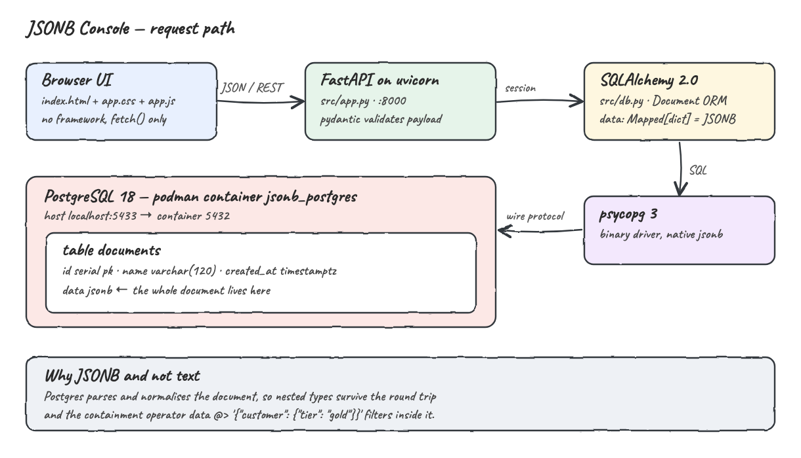
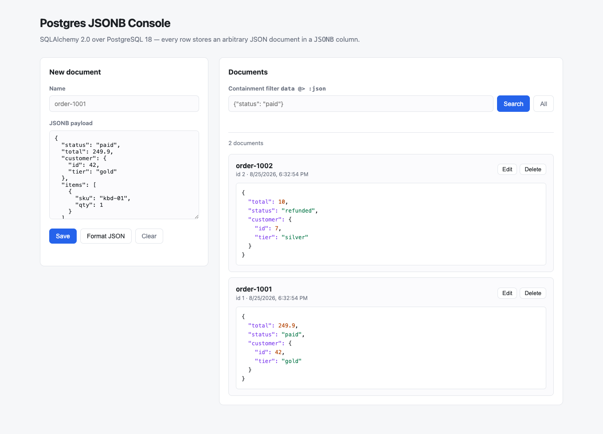
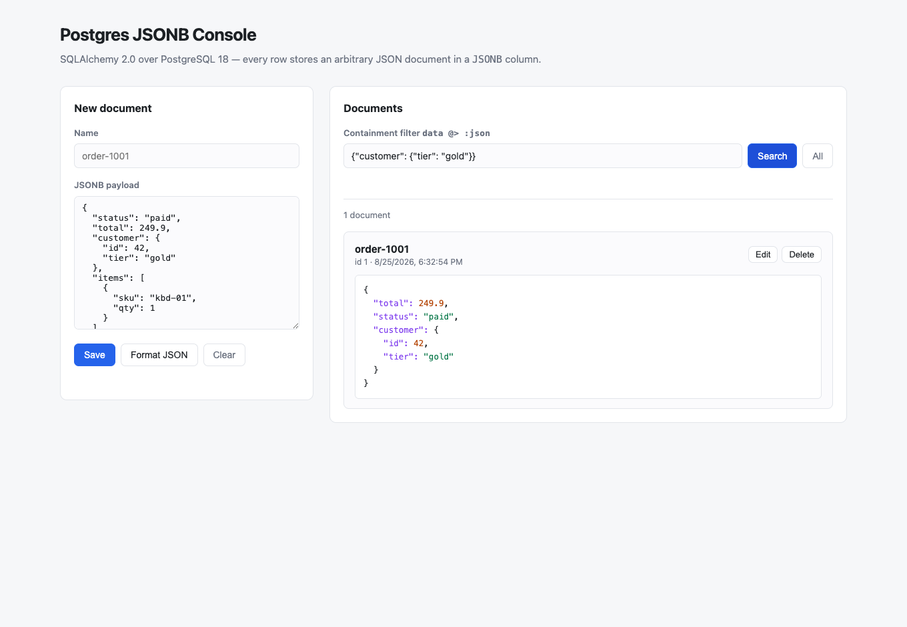
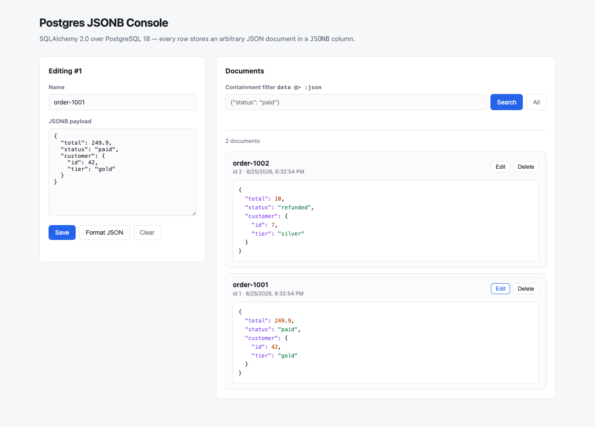
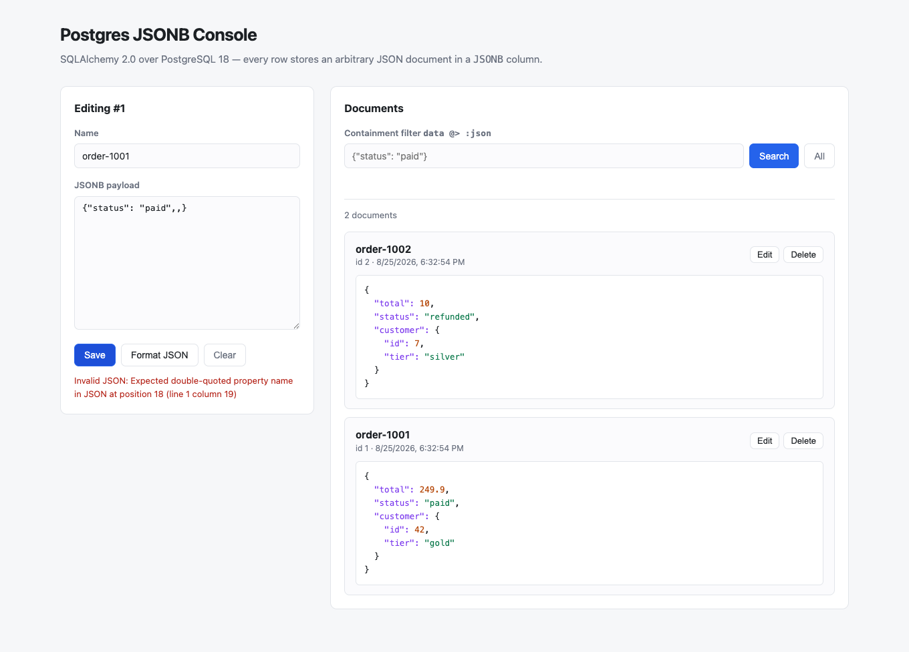

# SQLAlchemy + PostgreSQL JSONB

A small web console that stores arbitrary JSON documents in a single PostgreSQL `JSONB` column and queries
inside them with the containment operator. SQLAlchemy 2.0 maps the column, FastAPI exposes a REST API, and a
dependency-free browser UI reads and writes documents. PostgreSQL 18 runs in a podman container.

## How it Works?

Every row in `documents` has a `name` and a `data` column typed `JSONB`. The UI posts a JSON object, FastAPI
validates the envelope with pydantic, and SQLAlchemy hands the `dict` straight to psycopg, which sends it as
native `jsonb` — no manual serialisation anywhere. Postgres parses and normalises the document on the way in,
which is what makes the round trip type-safe: an `int` comes back an `int`, a nested object comes back nested.

Reading works the same way in reverse, plus one extra trick: the search box takes a JSON fragment and the API
turns it into `data @> :fragment`. Postgres then matches any row whose document *contains* that fragment at any
depth, so `{"customer": {"tier": "gold"}}` finds gold customers without the query knowing the rest of the shape.
That is the operator you cannot get from a `TEXT` column.

## Architecture



## Features

- **Arbitrary JSON documents per row** — the schema lives in the payload, not in a migration, so new fields need no DDL.
- **Containment search (`@>`)** — filter on nested keys from the UI without writing SQL or knowing the full document shape.
- **Full read/write UI** — create, edit, delete and inspect documents with JSON syntax highlighting.
- **Client and server validation** — the browser rejects malformed JSON before the request, pydantic rejects bad envelopes after it.
- **Podman-managed database** — `postgres:18` starts, waits for readiness and stops through scripts; no local Postgres install.
- **Tests against a real Postgres** — no mocks, because JSONB semantics are the thing under test.

## Stack

| Piece | Why |
| --- | --- |
| Python 3.14.6 | Target runtime; the venv is built with `python3.14` explicitly. |
| SQLAlchemy 2.0 | Typed `Mapped[]` ORM with a first-class `JSONB` column type and `@>` support. |
| psycopg 3 (binary) | Current Postgres driver; adapts `dict` to `jsonb` natively. |
| FastAPI + uvicorn | Minimal REST layer with pydantic validation for free. |
| PostgreSQL 18 | The actual feature under test — `JSONB` storage and containment queries. |
| podman + podman-compose | Runs the database without installing it on the host. |
| pytest + httpx2 | Drives the real API through `TestClient` against a real database. |

## API

Swagger UI is served at `http://localhost:8000/docs` once the app is running.

| Method | Path | Body | Returns |
| --- | --- | --- | --- |
| `GET` | `/` | — | The UI. |
| `GET` | `/api/documents` | — | All documents, newest first. |
| `GET` | `/api/documents?contains={json}` | — | Only documents whose `data` contains the given JSON object. |
| `POST` | `/api/documents` | `{"name": str, "data": object}` | `201` and the created document. |
| `PUT` | `/api/documents/{id}` | `{"name": str, "data": object}` | `200` and the updated document. |
| `DELETE` | `/api/documents/{id}` | — | `204`, or `404` if it does not exist. |

```bash
curl -X POST http://localhost:8000/api/documents \
  -H 'Content-Type: application/json' \
  -d '{"name":"order-1001","data":{"status":"paid","total":249.9,"customer":{"id":42,"tier":"gold"}}}'

curl -G http://localhost:8000/api/documents \
  --data-urlencode 'contains={"customer": {"tier": "gold"}}'
```

## Key Data Structures and Design Decisions

The whole model is one table:

```python
class Document(Base):
    __tablename__ = "documents"

    id: Mapped[int] = mapped_column(primary_key=True)
    name: Mapped[str] = mapped_column(String(120), nullable=False)
    data: Mapped[dict[str, Any]] = mapped_column(JSONB, nullable=False)
    created_at: Mapped[datetime] = mapped_column(DateTime(timezone=True), server_default=func.now())
```

- **`JSONB`, not `JSON` or `TEXT`.** `JSONB` is stored decomposed and binary, so it supports `@>` and GIN
  indexing. `JSON` keeps the raw text and neither. A test asserts `information_schema` really reports `jsonb`.
- **`Document.data.contains(obj)` builds `@>`.** The filter is passed as a bound parameter, so an arbitrary
  user-supplied JSON fragment can never become SQL injection.
- **Key order is not preserved and duplicates collapse.** `JSONB` normalises on write, so documents come back
  with keys reordered. That is expected behaviour, not a bug.
- **`PUT` replaces the whole document** rather than deep-merging. Partial updates are ambiguous over arbitrary
  JSON, so a single explicit semantic beats a clever one.
- **Schema is created at app startup** via `Base.metadata.create_all`. There are no migrations here on purpose —
  Alembic is covered by its own project in this playground.
- **Port 5433 on the host** so this database can run alongside another Postgres already bound to 5432.

## How to Run

```bash
./build.sh      # create the 3.14 venv and install dependencies
./run.sh        # start postgres in podman, then the UI on http://localhost:8000
```

Then open http://localhost:8000.

### Tests

```bash
./test.sh       # starts postgres if needed, runs pytest against the real database
```

```
tests/test_jsonb.py::test_column_is_jsonb_not_text PASSED                [ 11%]
tests/test_jsonb.py::test_roundtrip_preserves_types_and_nesting PASSED   [ 22%]
tests/test_jsonb.py::test_containment_filter_selects_only_matching_documents PASSED [ 33%]
tests/test_jsonb.py::test_containment_matches_nested_subtree PASSED      [ 44%]
tests/test_jsonb.py::test_containment_ignores_unindexed_keys_and_returns_empty PASSED [ 55%]
tests/test_jsonb.py::test_invalid_containment_filter_is_rejected PASSED  [ 66%]
tests/test_jsonb.py::test_update_replaces_the_whole_document PASSED      [ 77%]
tests/test_jsonb.py::test_delete_removes_the_document PASSED             [ 88%]
tests/test_jsonb.py::test_rejects_document_without_a_name PASSED         [100%]

============================== 9 passed in 0.14s ===============================
```

### All Scripts

| Script | What it does |
| --- | --- |
| `./build.sh` | Creates `.venv` with Python 3.14 and installs `requirements.txt`. |
| `./run.sh` | Starts Postgres, waits for readiness, then starts the UI. |
| `./test.sh` | Ensures Postgres is up and runs the test suite. |
| `./db-start.sh` | Starts only the Postgres container and waits until it accepts connections. |
| `./ui-start.sh` | Starts uvicorn in the background; pid in `.ui.pid`, logs in `.ui.log`. |
| `./ui-stop.sh` | Stops the UI process. |
| `./stop.sh` | Stops Postgres, keeping the data volume. |
| `./stop-all.sh` | Stops the UI and Postgres and removes the data volume. |

### Database Access

```bash
podman exec -it jsonb_postgres psql -U jsonb_user -d jsonb_db
```

## UI

### Console



The main view. The left panel is the write path: a name and a free-form JSON payload, pre-filled with a sample
order so the shape is obvious. The right panel is the read path, listing every document newest first with its
`JSONB` content syntax-highlighted. Note the stored key order (`total`, `status`, `customer`) differs from the
order it was written in — that is Postgres normalising the document on write.

### Containment Filter



Searching for `{"customer": {"tier": "gold"}}` runs `data @> :fragment` in Postgres. The list drops from two
documents to one: it matched on a key nested two levels deep, without the filter mentioning `status`, `total`
or anything else in the document.

### Editing a Document



Clicking **Edit** loads the document back into the form, which switches to `Editing #1` and issues a `PUT` on
save. The payload is pretty-printed on the way into the textarea so nested documents stay readable.

### Invalid JSON



The payload is parsed in the browser before anything is sent. A malformed document surfaces the exact parser
error with its position and the request never leaves the page, so the database only ever sees valid JSON.
