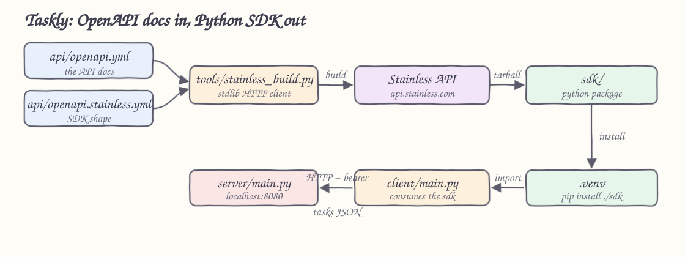

# stainless-poc

A proof of concept that generates a **Python SDK with [Stainless](https://www.stainless.com/)** from an OpenAPI
document, then proves the generated SDK works by calling a local server with it.

Everything in this repository is either the API docs (`api/openapi.yml`), the SDK shape
(`api/openapi.stainless.yml`), or plumbing around them. The SDK itself is never hand written: it is downloaded
from a Stainless build into `sdk/`.

Stainless generates on their servers only, so that lane needs an organization and an API key. Because sign-ups
are closed, the repository also ships an **offline lane** that generates a client from the same OpenAPI
document with `openapi-python-client`, on your machine, with no account. Both lanes end in the same place: a
generated package installed in `.venv` that drives the local server.

## How it Works

1. `api/openapi.yml` describes the Taskly API: status, create, retrieve, update, list and delete tasks.
2. `api/openapi.stainless.yml` tells Stainless how that spec becomes a Python client: resource tree, method
   names, client options, package name, edition.
3. `tools/stainless_build.py` posts both files to `https://api.stainless.com` as a build revision, polls the
   build until the `python` target commit completes, prints the diagnostics, and downloads the generated
   sources into `sdk/`.
4. `generate-sdk.sh` installs `sdk/` into the local `.venv`, so `import taskly` works.
5. `server/main.py` implements the same OpenAPI document with the Python standard library on port 8080.
6. `client/main.py` imports the generated `Taskly` client and exercises every endpoint against that server.

The offline lane replaces steps 3 and 4: `generate-sdk-offline.sh` runs `openapi-python-client` against the
same `api/openapi.yml`, writes `sdk-offline/` and installs it, and `client/main_offline.py` drives it.
`run-client.sh` picks whichever of the two packages is installed.

The spec is the contract on both ends: the SDK is generated from it and the server implements it, so the client
run is a real check that generation matched the documentation.

## Architecture



## Features

- **SDK generated from docs** — the OpenAPI document is the only description of the API; no client code is written by hand.
- **Reproducible builds** — `tools/stainless_build.py` creates the Stainless project when missing, so a fresh account reaches a build with one command.
- **Build feedback surfaced** — diagnostics and the build conclusion are printed, and a failing conclusion stops the script.
- **Runnable target API** — a standard library server implements the spec so the generated client has something real to call.
- **Full round trip** — `run-all.sh` boots the server, waits for `/status`, and runs the client end to end.
- **Pinned runtime** — Python 3.14.6 is required and checked before the venv is created.
- **Offline lane** — the same spec generates a working client with no account, so the round trip is runnable today.

## Stack

- **Python 3.14.6** — the runtime for the tooling, the server and the client.
- **Stainless** — the SDK generator; it turns the OpenAPI document plus config into an idiomatic Python package.
- **OpenAPI 3.1** — the API contract format Stainless reads.
- **Python standard library** — `urllib`, `tarfile` and `http.server` cover the build client and the target API, so the project has no dependencies of its own.
- **openapi-python-client** — the offline generator; it reads the same OpenAPI document and generates locally.
- **Bash** — one script per task, no build tool.

## Contracts / APIs

Full contract: [`api/openapi.yml`](api/openapi.yml). Every path except `/status` needs `Authorization: Bearer <token>`.

| Method | Path | SDK call | Description |
| --- | --- | --- | --- |
| GET | `/status` | `client.status()` | Reachability check, no auth |
| POST | `/tasks` | `client.tasks.create(title=..., details=..., state=...)` | Create a task, returns 201 |
| GET | `/tasks/{task_id}` | `client.tasks.retrieve(task_id)` | Retrieve one task |
| PUT | `/tasks/{task_id}` | `client.tasks.update(task_id, state=...)` | Update title, details or state |
| GET | `/tasks?state=` | `client.tasks.list(state=...)` | List tasks, optionally filtered |
| DELETE | `/tasks/{task_id}` | `client.tasks.delete(task_id)` | Delete a task, returns it |

A task is `{ id, title, details, state, created_at }` where `state` is one of `pending`, `doing`, `done`.

## Design decisions

- **`resources` in the Stainless config drives the SDK shape.** `tasks` becomes `client.tasks.*`, and `$client`
  lifts `get /status` to `client.status()`. Renaming a method there does not touch the OpenAPI document.
- **Enums stay open.** Stainless renders `state` as `Literal["pending", "doing", "done"]`, so a new server side
  state does not break an installed SDK.
- **Auth is a client option, not a header the caller builds.** `client_settings.opts.api_key` binds the bearer
  scheme to a constructor argument that also reads `TASKLY_API_KEY`.
- **The build tool uses `urllib` only.** It talks to four REST endpoints, so a dependency would buy nothing and
  the tooling stays installable on a bare interpreter.
- **Tasks live in a dict keyed by id.** The server exists to answer the generated client, so state is in memory
  and dies with the process.
- **`sdk/` is generated and git ignored.** Committing it would let a hand edit drift away from the spec.

## How to run

Prerequisites: Python 3.14.6. The Stainless lane also needs an account and an API key from your organization
settings at [app.stainless.com](https://app.stainless.com).

> Stainless generation is a hosted service and sign-ups are closed, so `./generate-sdk.sh` only runs if you
> already have an organization. Use the offline lane below to run everything without an account.

### Offline lane, no account

```bash
./install-deps.sh
./generate-sdk-offline.sh
./run-all.sh
```

### Stainless lane, needs an account

```bash
export STAINLESS_API_KEY=your-key
export STAINLESS_ORG=your-org

./install-deps.sh
./generate-sdk.sh
./run-all.sh
```

`run-all.sh` starts the server, runs the client against it and shuts the server down. To drive the two sides
yourself:

```bash
./run-server.sh
./run-client.sh
```

Both lanes print the same run:

```
using the offline sdk
status: taskly is up
created: 0f0f1f68-... wire the generated sdk pending
updated: 0f0f1f68-... doing
retrieved: 0f0f1f68-... wire the generated sdk call every endpoint of the taskly api
listed: ['wire the generated sdk']
deleted: 0f0f1f68-...
remaining: 0
```

### Environment variables

| Variable | Used by | Default |
| --- | --- | --- |
| `STAINLESS_API_KEY` | `generate-sdk.sh` | required |
| `STAINLESS_ORG` | `generate-sdk.sh` | required |
| `STAINLESS_PROJECT` | `generate-sdk.sh` | `taskly` |
| `STAINLESS_BRANCH` | `generate-sdk.sh` | `main` |
| `TASKLY_PORT` | server, `run-all.sh` | `8080` |
| `TASKLY_BASE_URL` | client | `http://localhost:8080` |
| `TASKLY_API_KEY` | client | `local-token` |

## Documentation

- [docs/stainless-workflow.md](docs/stainless-workflow.md) — what each Stainless API call does and how the config maps to the SDK.
- [docs/offline-lane.md](docs/offline-lane.md) — what the offline generator produces and how it differs from Stainless output.
- [docs/troubleshooting.md](docs/troubleshooting.md) — build conclusions, diagnostics and common failures.
