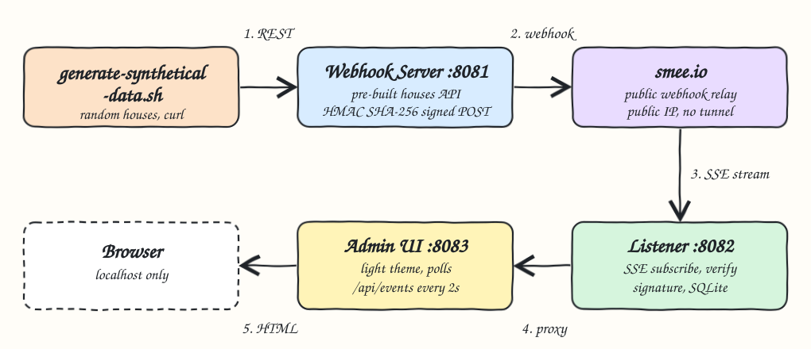
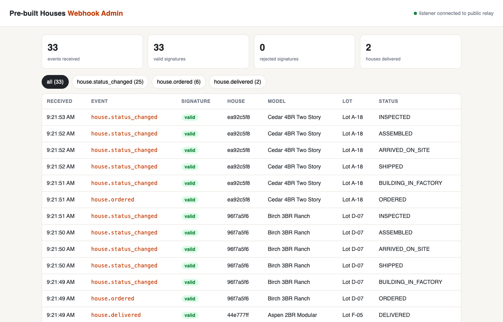
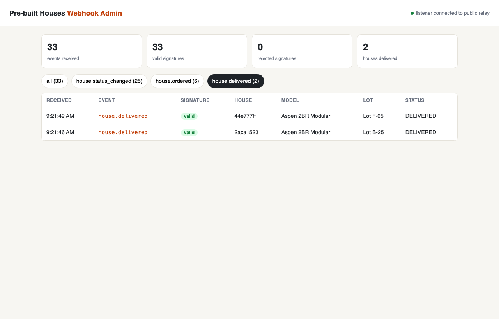
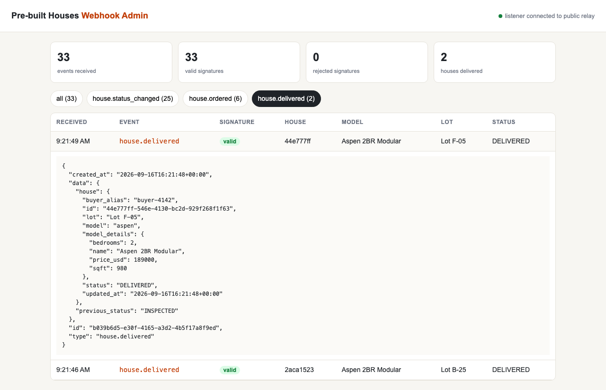

# Pre-built Houses Webhooks

A construction site that sells pre-built houses emits a signed webhook every time a house is ordered or
moves one construction stage. The webhooks go out to a public relay on the internet ([smee.io](https://smee.io)), a
listener subscribes to that relay, verifies every signature and stores the events, and a light themed
admin UI shows everything the listener got. Pure Python standard library, no third party packages.

## How it Works

1. `scripts/setup.sh` asks smee.io for a fresh random channel and generates a random webhook secret.
   Both go to `.run/relay.env` (git ignored, mode 600), never into the repository.
2. `scripts/start-all.sh` clears old events, starts the listener first and waits until it is subscribed to the channel
   (Server-Sent Events), then the webhook server and the admin UI.
3. `scripts/generate-synthetical-data.sh` orders random synthetic houses and advances each through some stages.
4. For every change the webhook server POSTs a JSON event to the public smee.io URL with
   `X-Correlation-ID`, `X-Webhook-Event`, `X-Webhook-Timestamp` and `X-Webhook-Signature` (HMAC SHA-256).
   The correlation id is created when the house is ordered and reused by every later webhook of that house.
5. smee.io pushes the event to the listener over its SSE stream.
6. The listener keeps the body and every header smee.io forwarded (IP, port and channel URL values are
   redacted), recomputes the signature, de-duplicates by event id and writes the event to SQLite.
7. The webhook server keeps the exact headers it sent for every delivery in memory.
8. The admin UI proxies `/api/events` to the listener and `/api/deliveries` to the webhook server and
   refreshes every 2 seconds.

## Using smee.io

[smee.io](https://smee.io) is a free public website that relays webhooks. No account and no signup.
`scripts/setup.sh` does steps 1 and 2 for you, the other steps are there to do it by hand or to check it.

1. Open https://smee.io/new, or run `curl -s -o /dev/null -w '%{redirect_url}' https://smee.io/new`.
   smee.io redirects to a new random channel like `https://smee.io/AbC123xYz`.
2. Keep the channel URL private. `setup.sh` writes it to `.run/relay.env` as `RELAY_URL`, next to `WEBHOOK_SECRET`.
3. To send a webhook, POST JSON to the channel URL.
4. To receive webhooks, open the channel URL with `Accept: text/event-stream`. smee.io sends a `ready`
   event, then one message per POST. The listener in `app/subscriber.py` does this.
5. To watch the traffic, open the channel URL in a browser. smee.io shows every webhook that reaches the
   channel while the page is open.
6. To start over with a new channel, delete `.run/relay.env` and run `./scripts/setup.sh` again.

## Architecture



## Features

| Feature | Why |
|---|---|
| Public relay (smee.io) | The webhook really crosses the internet through a public IP, no tunnel, no router config. |
| HMAC SHA-256 signature | The smee.io channel is public, so anyone could POST to it. Only events signed with the secret show as valid. |
| Timestamp in the signature | A captured signature cannot be replayed with another timestamp. |
| Header redaction | smee.io forwards `client-ip`, `x-forwarded-for`, `x-client-port` and `x-original-url`. Any header whose name looks like ip, forwarded, url, port, origin or referer, and any value that looks like an IP or a smee.io channel, is stored as `[redacted]`, so no IP or channel URL is stored or shown. |
| Correlation ID | One id per customer journey, from `house.ordered` to `house.delivered`. Sent as `X-Correlation-ID` and inside the signed payload, echoed on the API response, written to the webhook server and listener logs, and shown in the admin UI as a pill with its own light pastel color, where a click shows only that journey. |
| De-duplication | An SSE reconnect cannot store the same event twice. |
| Loud delivery failures | If the relay is down the server answers `502` instead of a silent success. |
| Construction lifecycle | `ORDERED -> BUILDING_IN_FACTORY -> SHIPPED -> ARRIVED_ON_SITE -> ASSEMBLED -> INSPECTED -> DELIVERED`, no skipping or going past delivered. |
| Admin UI | Counters, filters in lifecycle order `all`, `ordered -> in progress -> delivered`, click a row to see the flow `Webhook Server -> smee.io -> Webhook Listener` with the time of each hop, then the out headers (`Webhook Server -> smee.io`), the in headers (`smee.io -> Webhook Listener`) and the payload (`Webhook Server -> smee.io -> Webhook Listener`) collapsed with their counts; click one to open the full JSON, formatted with colors and line numbers. Rendered with `textContent`, so a hostile payload cannot inject HTML. |
| Synthetic data only | Models, lots (`Lot C-12`) and buyer aliases (`buyer-0042`) are generated, nothing personal. |

## Stack

| Tech | Why |
|---|---|
| Python 3.10+ standard library | `http.server`, `urllib`, `hmac`, `sqlite3`, `threading`: zero dependencies to install. |
| [smee.io](https://smee.io) | Free public webhook relay with an SSE stream, built exactly for receiving webhooks locally. |
| SQLite | Listener events live in a single file under `.run/data`, cleared by every `start-all.sh`. |
| Vanilla JS, HTML, CSS | The admin UI needs no framework or build step. |
| unittest | Tests run with the interpreter, nothing to install. |
| bash + curl | Operational scripts and the synthetic data generator. |

## APIs

Webhook server, http://localhost:8081

| Method | Path | Body | Response |
|---|---|---|---|
| GET | `/api/models` | | catalog of house models |
| GET | `/api/houses` | | all houses |
| POST | `/api/houses` | `{"model": "aspen", "lot": "Lot A-01", "buyer_alias": "buyer-0001"}`, optional header `X-Correlation-ID` | `201` house with `correlation_id`, sends `house.ordered`; `400` invalid; `502` relay down |
| POST | `/api/houses/{id}/advance` | | `200` sends `house.status_changed` or `house.delivered`; `404`; `409` already delivered |
| GET | `/api/deliveries` | | every webhook sent: event id, `correlation_id`, `sent_at`, `relay_status` and the exact headers sent |

Every house response carries the `X-Correlation-ID` header of the journey.

Listener, http://localhost:8082

| Method | Path | Response |
|---|---|---|
| GET | `/api/events` | stored events, newest first, with `correlation_id`, `relayed_at`, `received_at`, redacted `headers` and `payload` |
| GET | `/health` | `{"status": "UP", "relay_connected": true}` |

Admin UI, http://localhost:8083 serves the page, proxies `/api/events` and `/health` to the listener and
`/api/deliveries` to the webhook server.

Webhook sent to the relay:

```
POST https://smee.io/<random channel>
X-Correlation-ID: 8c1f0b7e-2d4a-4f5e-9b1c-3a6d7e8f9012
X-Webhook-Event: house.delivered
X-Webhook-Timestamp: 1789000000
X-Webhook-Signature: sha256=hex(hmac_sha256(secret, "<timestamp>.<canonical json body>"))
```

```json
{
  "id": "06d61902-edb7-479a-b2a6-3ec3c1d48a23",
  "correlation_id": "8c1f0b7e-2d4a-4f5e-9b1c-3a6d7e8f9012",
  "type": "house.delivered",
  "created_at": "2026-09-16T16:20:46.512+00:00",
  "data": {
    "previous_status": "INSPECTED",
    "house": {
      "id": "3fb68249-bf0f-4297-8042-6022f1d9ca27",
      "correlation_id": "8c1f0b7e-2d4a-4f5e-9b1c-3a6d7e8f9012",
      "model": "cedar",
      "model_details": {"name": "Cedar 4BR Two Story", "bedrooms": 4, "sqft": 2100, "price_usd": 348000},
      "lot": "Lot F-09",
      "buyer_alias": "buyer-1586",
      "status": "DELIVERED",
      "updated_at": "2026-09-16T16:20:46.512+00:00"
    }
  }
}
```

## Design Decisions

* The signature is computed over canonical JSON (sorted keys, no spaces). smee.io parses and
  re-serializes the body, so signing the raw bytes would break; the listener re-canonicalizes and compares
  with `hmac.compare_digest`. Payloads use integers only so number formatting cannot differ.
* The correlation id belongs to the house, not to a single request: it is born on the order, from the
  caller `X-Correlation-ID` when it is 1-64 of `A-Z a-z 0-9 . _ -`, otherwise a new UUID, so an unsafe value
  cannot reach headers or logs. The listener reads it from the signed payload, not from the header, so it
  cannot be changed on the public relay without breaking the signature.
* The listener stores events with signature `rejected` instead of dropping them, so forged traffic on the
  public channel is visible in the admin UI.
* The listener starts first and `start-all.sh` waits for the relay `ready` event, because smee.io does
  not buffer: a webhook sent before anyone subscribes is lost.
* The house store is in memory on purpose, and `start-all.sh` clears the listener database, so every run starts empty and the admin UI only shows data after `generate-synthetical-data.sh` runs.
* The channel URL and secret are never printed, logged or shown in the UI. Anyone with the channel URL
  can read the stream, which is fine only because every payload is synthetic.
* Layout: `app/houses.py` domain, `app/publisher.py` sends, `app/subscriber.py` receives,
  `app/event_store.py` SQL, `app/private_headers.py` redaction, `app/correlation.py` correlation id, `app/signing.py` shared by both sides,
  one small HTTP entry point per component.

## Privacy

smee.io, like any public service, sees the source IP of the machine that sends the webhook and of the
listener that subscribes. The project does not store or display it: the listener redacts IP, port and
channel URL headers before writing to SQLite, and no local path, user name or real data is sent: only
generated houses. The printscreens do not show the headers panels.

## Printscreens

All events received by the listener. The green dot says the listener is subscribed to the public relay,
the counters show 33 events, all with valid signatures, and each row is one webhook with its house,
model, lot and the stage it reached.



Filter chips by event type. Here only `house.delivered` is selected, the final webhook of the two houses
that went through every construction stage.



Clicking a row opens the raw signed payload exactly as it arrived through smee.io, with the previous
status and the model details.



## Scripts

All scripts live in `scripts/` and run from any directory of the repository.

| Script | What it does |
|---|---|
| `./scripts/setup.sh` | Checks python3, curl and lsof, creates the smee.io channel and webhook secret |
| `./scripts/start-all.sh` | Starts listener, webhook server and admin UI and prints the full link of each one |
| `./scripts/status.sh` | Shows every service port as UP or DOWN and whether the relay is connected |
| `./scripts/test-all.sh` | Runs every test suite |
| `./scripts/ui.sh` | Opens the admin UI in the browser |
| `./scripts/stop-all.sh` | Stops every service |
| `./scripts/generate-synthetical-data.sh [houses]` | Orders synthetic houses (default 5) and advances them, which sends the webhooks |

Ports are declared in `scripts/ports.env`: webhook_server 8081, listener 8082, admin_ui 8083.

```bash
./scripts/setup.sh
./scripts/start-all.sh
./scripts/generate-synthetical-data.sh 6
./scripts/ui.sh
./scripts/test-all.sh
./scripts/stop-all.sh
```
